# 文檔域導覽（docs-map）

> 生成物（`pnpm docs:generate`）、**非權威**——權威在各檔本身與 [總覽.md](總覽.md)。依 frontmatter `domain` 分組；「跨域」＝domain 空集合；決策檔僅計數（明細見 [decisions/INDEX.md](decisions/INDEX.md)）。

## 域關聯總圖

列＝引用來源、欄＝引用目標；數字是 current canon 文件間的有向連結數，歷史與決策檔不計。

| 來源 \ 目標 | [共識帳本](#共識帳本10-檔) | [經濟](#經濟8-檔) | [UGC版權](#ugc版權17-檔) | [材質](#材質2-檔) | [建模物理](#建模物理12-檔) | [比賽房間](#比賽房間25-檔) | [信譽仲裁](#信譽仲裁8-檔) | [版本部署](#版本部署18-檔) | [資安](#資安6-檔) | [前端主題](#前端主題35-檔) | [治理營運](#治理營運3-檔) | [跨域](#跨域16-檔) |
| --- | ---: | ---: | ---: | ---: | ---: | ---: | ---: | ---: | ---: | ---: | ---: | ---: |
| [共識帳本](#共識帳本10-檔) | — | 8 | 5 | 0 | 8 | 11 | 12 | 9 | 2 | 0 | 1 | 6 |
| [經濟](#經濟8-檔) | 13 | — | 6 | 0 | 4 | 4 | 1 | 3 | 0 | 1 | 2 | 3 |
| [UGC版權](#ugc版權17-檔) | 13 | 7 | — | 3 | 24 | 5 | 16 | 5 | 3 | 8 | 1 | 11 |
| [材質](#材質2-檔) | 2 | 0 | 2 | — | 5 | 2 | 0 | 3 | 0 | 1 | 0 | 0 |
| [建模物理](#建模物理12-檔) | 9 | 2 | 9 | 7 | — | 11 | 1 | 10 | 0 | 6 | 0 | 9 |
| [比賽房間](#比賽房間25-檔) | 18 | 4 | 3 | 2 | 17 | — | 12 | 14 | 10 | 9 | 0 | 13 |
| [信譽仲裁](#信譽仲裁8-檔) | 12 | 3 | 11 | 0 | 4 | 8 | — | 1 | 2 | 0 | 0 | 2 |
| [版本部署](#版本部署18-檔) | 10 | 5 | 1 | 2 | 3 | 13 | 6 | — | 10 | 6 | 1 | 8 |
| [資安](#資安6-檔) | 10 | 1 | 5 | 1 | 4 | 7 | 4 | 5 | — | 1 | 1 | 1 |
| [前端主題](#前端主題35-檔) | 2 | 2 | 11 | 2 | 23 | 9 | 0 | 17 | 3 | — | 0 | 15 |
| [治理營運](#治理營運3-檔) | 4 | 2 | 1 | 1 | 2 | 0 | 0 | 2 | 0 | 0 | — | 0 |
| [跨域](#跨域16-檔) | 16 | 6 | 24 | 2 | 15 | 40 | 12 | 31 | 13 | 31 | 1 | — |

## 共識帳本（10 檔）

| 檔案 | type | 說明 |
|---|---|---|
| [conformance/README.md](conformance/README.md) | index | 跨域 conformance 測試向量權威聲明＋家族索引 |
| [流程/比賽結算.md](流程/比賽結算.md) | flow | 名次／鑄幣／分潤／信譽／TrueSkill |
| [流程/比賽進行.md](流程/比賽進行.md) | flow | LockedStartPackage 二次驗證＋GO 前 race-ready 屏障＋Rollback＋回合唯一共識錨 |
| [程式參數/protocol.md](程式參數/protocol.md) | registry | 共識、物理、UGC、安全、帳本、配對與比賽參數 |
| [程式架構/ledger-admission.md](程式架構/ledger-admission.md) | impl | ledger 事件 wire、簽章、永久 entry admission 與 anti-spam 邊界 |
| [程式架構/ledger-checkpoint.md](程式架構/ledger-checkpoint.md) | impl | DerivedState、partition、帳本檢查點與 sync/fork resolution |
| [程式架構/ledger-settlement.md](程式架構/ledger-settlement.md) | impl | 比賽結果、經濟結算結構與簽章交換協議 |
| [程式架構/ledger.md](程式架構/ledger.md) | impl | 事件鏈／DerivedState／檢查點／partition／sync／fork resolution |
| [程式架構/程式流程/ledger.md](程式架構/程式流程/ledger.md) | impl-flow | 程式級流程圖：Checkpoint／Partition／Sync |
| [資料系統.md](資料系統.md) | canon | ledger／IPFS／canonical 序列化／治理事件 |

決策檔 38 筆——見 [decisions/INDEX.md](decisions/INDEX.md)。

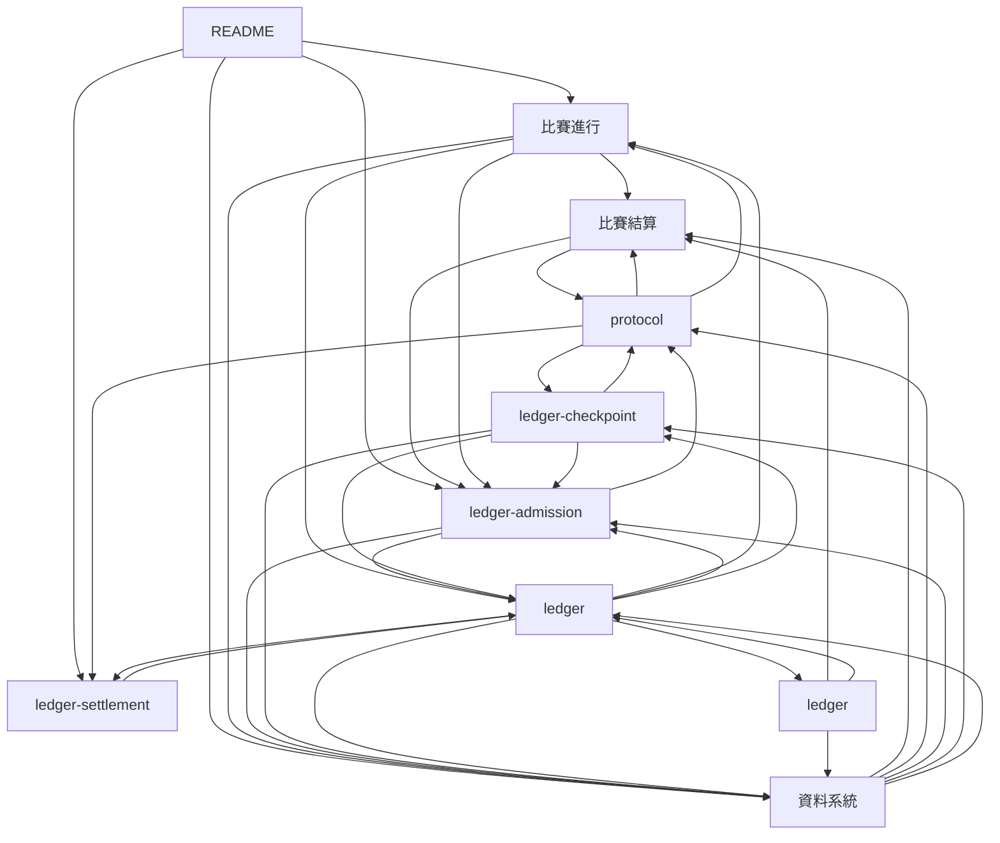

## 經濟（8 檔）

| 檔案 | type | 說明 |
|---|---|---|
| [流程/比賽結算.md](流程/比賽結算.md) | flow | 名次／鑄幣／分潤／信譽／TrueSkill |
| [流程/衍生.md](流程/衍生.md) | flow | Fork 樹＋三層分潤＋反複製檢查 |
| [程式參數/economy-config.md](程式參數/economy-config.md) | registry | OrbitDB 動態治理 economy config |
| [程式架構/bootstrap.md](程式架構/bootstrap.md) | impl | 站點組裝、正式 provider、derived registry 與 runtime 接線契約 |
| [程式架構/economy.md](程式架構/economy.md) | impl | 鑄幣／燒幣／比賽結算／分潤拆分／EconomyConfig |
| [程式架構/ledger-settlement.md](程式架構/ledger-settlement.md) | impl | 比賽結果、經濟結算結構與簽章交換協議 |
| [算式表.md](算式表.md) | registry | 物理／武器／經濟／信譽各核心算式 |
| [經濟系統.md](經濟系統.md) | canon | 三層分潤、虛擬貨幣、通膨控制 |

決策檔 13 筆——見 [decisions/INDEX.md](decisions/INDEX.md)。

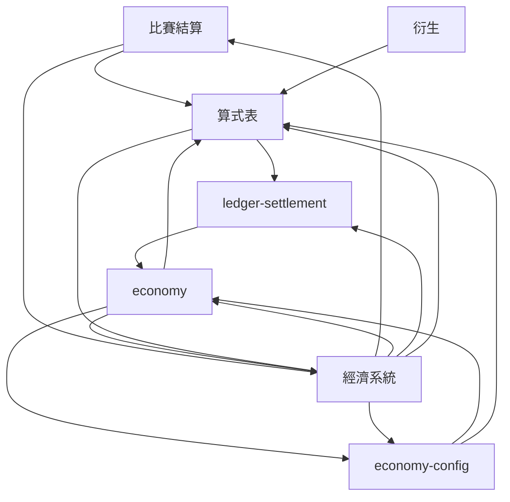

## UGC版權（17 檔）

| 檔案 | type | 說明 |
|---|---|---|
| [UGC機制.md](UGC機制.md) | canon | 上傳／編輯／送出（本機測試／上鏈／可編輯 GLB）／Fork |
| [流程/DMCA.md](流程/DMCA.md) | flow | Provider-scoped Notice／Counter-Notice／下架、恢復與簽章收件匣 |
| [流程/UGC上傳.md](流程/UGC上傳.md) | flow | 上傳／編輯／送出（本機測試／上鏈／可編輯 GLB）三階段 |
| [流程/衍生.md](流程/衍生.md) | flow | Fork 樹＋三層分潤＋反複製檢查 |
| [版權.md](版權.md) | canon | DMCA／反複製／五層防護 |
| [程式參數/protocol.md](程式參數/protocol.md) | registry | 共識、物理、UGC、安全、帳本、配對與比賽參數 |
| [程式架構/anti-piracy.md](程式架構/anti-piracy.md) | impl | mesh 指紋／相似度搜尋／上傳期 pending／爭議路由 |
| [程式架構/bootstrap.md](程式架構/bootstrap.md) | impl | 站點組裝、正式 provider、derived registry 與 runtime 接線契約 |
| [程式架構/dmca.md](程式架構/dmca.md) | impl | Notice／Counter 表單／黑名單檢查／下架・恢復・repeat-infringer |
| [程式架構/editor.md](程式架構/editor.md) | impl | Stage 2 編輯器（wave 管線／幾何工具／逐 sub-mesh 材質／三出口送出） |
| [程式架構/inbox.md](程式架構/inbox.md) | impl | 第一層 Provider-scoped Inbox、簽章快照、已讀與更新生命週期 |
| [程式架構/ugc-fork.md](程式架構/ugc-fork.md) | impl | 兩階段 fork 偵測／物理指紋／衍生樹 API |
| [程式架構/ugc-rating.md](程式架構/ugc-rating.md) | impl | UGC 評分（整數量化／Bayesian／隱式 fallback／里程碑） |
| [程式架構/程式流程/anti-piracy.md](程式架構/程式流程/anti-piracy.md) | impl-flow | 程式級流程圖：mesh fingerprint／灰區 similarity-pending |
| [程式架構/程式流程/ugc-fork.md](程式架構/程式流程/ugc-fork.md) | impl-flow | 程式級流程圖：指紋判定／Fork 樹 |
| [編輯器操作.md](編輯器操作.md) | canon | Stage 2 編輯器互動與 UI 操作（零件＋場地共用、PC／Mobile 雙端） |
| [資產政策.md](資產政策.md) | canon | 資產生命週期玩家面說明＋廢止材質登記（絕版品模型） |

決策檔 34 筆——見 [decisions/INDEX.md](decisions/INDEX.md)。

### UGC版權依賴圖（1/2）

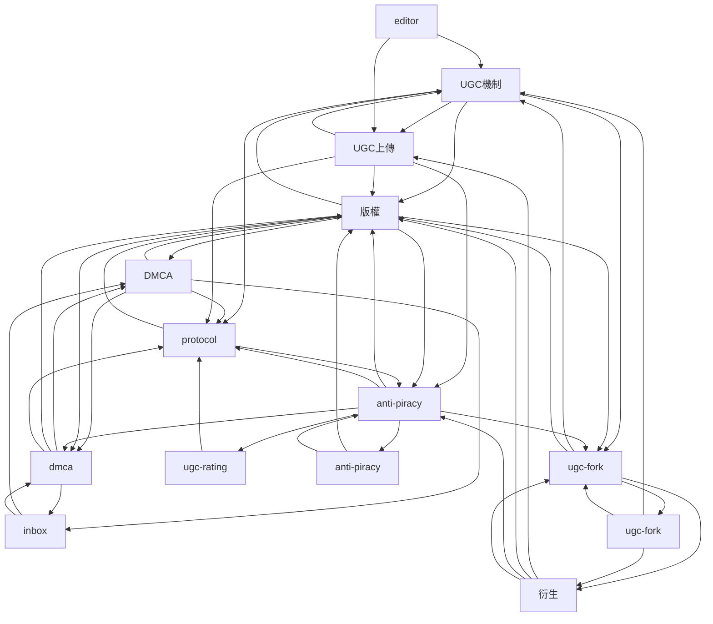

### UGC版權依賴圖（2/2）

#### UGC版權依賴圖跨頁關係

| 來源 | 目標 | 關係 |
| --- | --- | --- |
| [UGC機制](UGC機制.md) | [編輯器操作](編輯器操作.md) | 連結 |
| [UGC上傳](流程/UGC上傳.md) | [編輯器操作](編輯器操作.md) | 連結 |
| [editor](程式架構/editor.md) | [編輯器操作](編輯器操作.md) | 連結 |
| [編輯器操作](編輯器操作.md) | [UGC機制](UGC機制.md) | 連結 |
| [編輯器操作](編輯器操作.md) | [UGC上傳](流程/UGC上傳.md) | 連結 |
| [編輯器操作](編輯器操作.md) | [版權](版權.md) | 連結 |
| [編輯器操作](編輯器操作.md) | [protocol](程式參數/protocol.md) | 連結 |
| [編輯器操作](編輯器操作.md) | [editor](程式架構/editor.md) | 連結 |
| [資產政策](資產政策.md) | [protocol](程式參數/protocol.md) | 連結 |

## 材質（2 檔）

| 檔案 | type | 說明 |
|---|---|---|
| [材質表.md](材質表.md) | registry | 全 31 種統一材質的物理欄位與禁限規則 |
| [資產政策.md](資產政策.md) | canon | 資產生命週期玩家面說明＋廢止材質登記（絕版品模型） |

決策檔 7 筆——見 [decisions/INDEX.md](decisions/INDEX.md)。

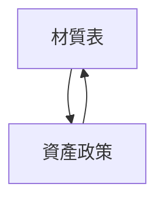

## 建模物理（12 檔）

| 檔案 | type | 說明 |
|---|---|---|
| [conformance/README.md](conformance/README.md) | index | 跨域 conformance 測試向量權威聲明＋家族索引 |
| [建模參數.md](建模參數.md) | index | 建模參數權威分冊導覽 |
| [建模參數/runtime.md](建模參數/runtime.md) | registry | Stage type 定案、處理流程與預設填補原則 |
| [建模參數/場地.md](建模參數/場地.md) | registry | 場地 GLB extras、天氣、物理環境、材質與 entity |
| [建模參數/零件與共用介面.md](建模參數/零件與共用介面.md) | registry | 零件 GLB extras、auto 欄位、Empty、Mount 與車輛約束 |
| [程式參數/calibration.md](程式參數/calibration.md) | registry | 待 playtest 校準的物理與武器常數 |
| [程式參數/protocol.md](程式參數/protocol.md) | registry | 共識、物理、UGC、安全、帳本、配對與比賽參數 |
| [程式架構/builtin-assets.md](程式架構/builtin-assets.md) | impl | builtin 命名空間／物理烘焙 extras 同 UGC／公版清單 |
| [程式架構/physics-engine.md](程式架構/physics-engine.md) | impl | Rapier 封裝 DeterministicWorld／固定 timestep／整數量化／determinism |
| [算式表.md](算式表.md) | registry | 物理／武器／經濟／信譽各核心算式 |
| [遊戲機制.md](遊戲機制.md) | canon | 機制庫、晶片技能、其他遊玩細節 |
| [零件與場景.md](零件與場景.md) | canon | 8 類零件＋3 類場景 entity 詳述 |

決策檔 53 筆——見 [decisions/INDEX.md](decisions/INDEX.md)。

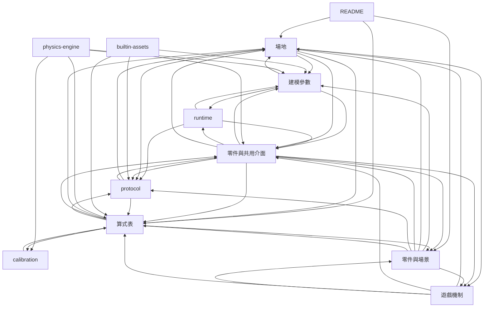

## 比賽房間（25 檔）

| 檔案 | type | 說明 |
|---|---|---|
| [conformance/README.md](conformance/README.md) | index | 跨域 conformance 測試向量權威聲明＋家族索引 |
| [流程/比賽進行.md](流程/比賽進行.md) | flow | LockedStartPackage 二次驗證＋GO 前 race-ready 屏障＋Rollback＋回合唯一共識錨 |
| [流程/觀戰.md](流程/觀戰.md) | flow | 主動觀戰＋淘汰自動轉觀戰 |
| [流程/配對.md](流程/配對.md) | flow | Quick Match 加入既有公開房＋握手＋倒數 |
| [程式參數/network.md](程式參數/network.md) | registry | 同步、signaling、節點發現與版本參數 |
| [程式參數/protocol.md](程式參數/protocol.md) | registry | 共識、物理、UGC、安全、帳本、配對與比賽參數 |
| [程式架構/bootstrap.md](程式架構/bootstrap.md) | impl | 站點組裝、正式 provider、derived registry 與 runtime 接線契約 |
| [程式架構/chat-system.md](程式架構/chat-system.md) | impl | 等待房共用文字聊天／房主中繼／速率限制／本機過濾 |
| [程式架構/matchmaking.md](程式架構/matchmaking.md) | impl | TrueSkill／既有公開房 Quick Match／動態窗口／房間管理／loadout 提交驗證 |
| [程式架構/network-sync.md](程式架構/network-sync.md) | impl | Rollback Netcode／InputBuffer 預測／checksum 去同步／重連 |
| [程式架構/pages-contracts.md](程式架構/pages-contracts.md) | impl | 路由頁面、AppDataProviders、O4Viewport 與 RaceSession 的資料入口契約 |
| [程式架構/peer-discovery.md](程式架構/peer-discovery.md) | impl | libp2p 組態／GossipSub／DHT／Peer Scoring／bootstrap |
| [程式架構/player-favorites.md](程式架構/player-favorites.md) | impl | 身分分域收藏清單、公開房間衍生狀態與授權通關來源 |
| [程式架構/race-messages.md](程式架構/race-messages.md) | impl | 賽中圖示訊息目錄、圖庫、九格 loadout、wire 與 HUD 契約 |
| [程式架構/race-routing.md](程式架構/race-routing.md) | impl | SPA shell、Race Config、Race／Result identity 與 RoomSession 恢復契約 |
| [程式架構/room-runtime.md](程式架構/room-runtime.md) | impl | 等待房 star 拓撲／可驗 ReadySet／倒數繼任／開賽編排 |
| [程式架構/spectator.md](程式架構/spectator.md) | impl | 觀戰連線／deterministic replay／精簡 fallback／淘汰轉觀戰 |
| [程式架構/程式流程/chat-system.md](程式架構/程式流程/chat-system.md) | impl-flow | 程式級流程圖：房間聊天／過濾 |
| [程式架構/程式流程/matchmaking.md](程式架構/程式流程/matchmaking.md) | impl-flow | 程式級流程圖：既有房 Quick Match／配對窗口／賽後簽章 |
| [程式架構/程式流程/network-sync.md](程式架構/程式流程/network-sync.md) | impl-flow | 程式級流程圖：Rollback／Snapshot |
| [程式架構/程式流程/spectator.md](程式架構/程式流程/spectator.md) | impl-flow | 程式級流程圖：來源分配／deterministic replay／fallback／淘汰切觀戰 |
| [美術資源/提示詞/賽中訊息圖示/default-inspired.md](美術資源/提示詞/賽中訊息圖示/default-inspired.md) | art | default-inspired 賽中訊息圖示 96 詞生成提示詞 |
| [美術資源/提示詞/賽中訊息圖示/moon-rabbit.md](美術資源/提示詞/賽中訊息圖示/moon-rabbit.md) | art | moon-rabbit-inspired 賽中訊息圖示 96 詞生成提示詞 |
| [賽內機制.md](賽內機制.md) | canon | 房間配對／比賽中／結算（含 HUD、聊天、觀戰） |
| [車輛組裝.md](車輛組裝.md) | canon | 玩家依正式／本機測試車位用途組車（本機 loadout） |

決策檔 52 筆——見 [decisions/INDEX.md](decisions/INDEX.md)。

### 比賽房間依賴圖（1/2）

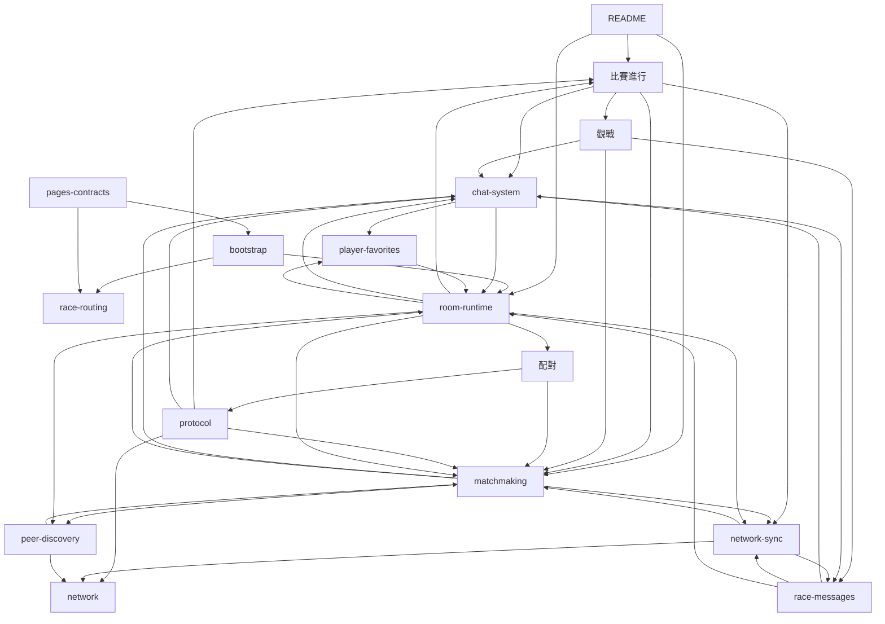

### 比賽房間依賴圖（2/2）

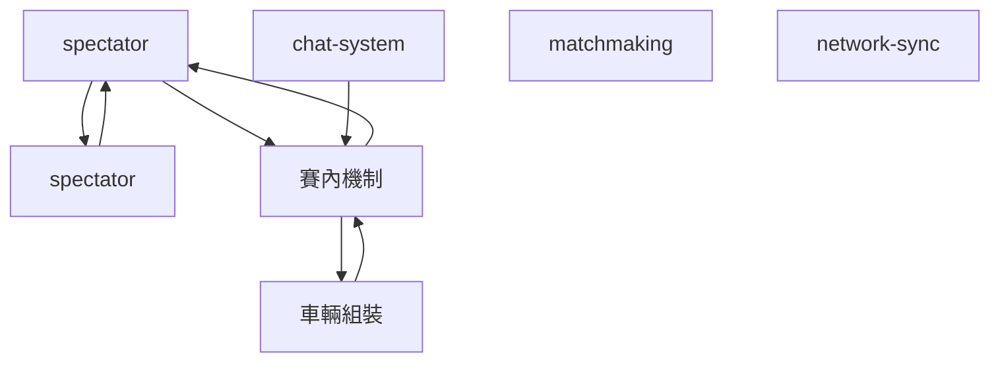

#### 比賽房間依賴圖跨頁關係

| 來源 | 目標 | 關係 |
| --- | --- | --- |
| [比賽進行](流程/比賽進行.md) | [賽內機制](賽內機制.md) | 連結 |
| [比賽進行](流程/比賽進行.md) | [車輛組裝](車輛組裝.md) | 連結 |
| [觀戰](流程/觀戰.md) | [spectator](程式架構/spectator.md) | 連結 |
| [配對](流程/配對.md) | [賽內機制](賽內機制.md) | 連結 |
| [protocol](程式參數/protocol.md) | [賽內機制](賽內機制.md) | 連結 |
| [chat-system](程式架構/chat-system.md) | [spectator](程式架構/spectator.md) | 連結 |
| [chat-system](程式架構/chat-system.md) | [chat-system](程式架構/程式流程/chat-system.md) | 連結 |
| [chat-system](程式架構/chat-system.md) | [賽內機制](賽內機制.md) | 連結 |
| [matchmaking](程式架構/matchmaking.md) | [matchmaking](程式架構/程式流程/matchmaking.md) | 連結 |
| [matchmaking](程式架構/matchmaking.md) | [賽內機制](賽內機制.md) | 連結 |
| [network-sync](程式架構/network-sync.md) | [network-sync](程式架構/程式流程/network-sync.md) | 連結 |
| [network-sync](程式架構/network-sync.md) | [賽內機制](賽內機制.md) | 連結 |
| [race-messages](程式架構/race-messages.md) | [spectator](程式架構/spectator.md) | 連結 |
| [race-messages](程式架構/race-messages.md) | [賽內機制](賽內機制.md) | 連結 |
| [spectator](程式架構/spectator.md) | [觀戰](流程/觀戰.md) | 連結 |
| [spectator](程式架構/spectator.md) | [chat-system](程式架構/chat-system.md) | 連結 |
| [spectator](程式架構/spectator.md) | [matchmaking](程式架構/matchmaking.md) | 連結 |
| [spectator](程式架構/spectator.md) | [peer-discovery](程式架構/peer-discovery.md) | 連結 |
| [spectator](程式架構/spectator.md) | [race-messages](程式架構/race-messages.md) | 連結 |
| [spectator](程式架構/spectator.md) | [room-runtime](程式架構/room-runtime.md) | 連結 |
| [chat-system](程式架構/程式流程/chat-system.md) | [配對](流程/配對.md) | 連結 |
| [chat-system](程式架構/程式流程/chat-system.md) | [chat-system](程式架構/chat-system.md) | 連結 |
| [chat-system](程式架構/程式流程/chat-system.md) | [race-messages](程式架構/race-messages.md) | 連結 |
| [matchmaking](程式架構/程式流程/matchmaking.md) | [配對](流程/配對.md) | 連結 |
| [matchmaking](程式架構/程式流程/matchmaking.md) | [matchmaking](程式架構/matchmaking.md) | 連結 |
| [network-sync](程式架構/程式流程/network-sync.md) | [比賽進行](流程/比賽進行.md) | 連結 |
| [network-sync](程式架構/程式流程/network-sync.md) | [network-sync](程式架構/network-sync.md) | 連結 |
| [spectator](程式架構/程式流程/spectator.md) | [觀戰](流程/觀戰.md) | 連結 |
| [賽內機制](賽內機制.md) | [比賽進行](流程/比賽進行.md) | 連結 |
| [賽內機制](賽內機制.md) | [觀戰](流程/觀戰.md) | 連結 |
| [賽內機制](賽內機制.md) | [配對](流程/配對.md) | 連結 |
| [賽內機制](賽內機制.md) | [chat-system](程式架構/chat-system.md) | 連結 |
| [賽內機制](賽內機制.md) | [matchmaking](程式架構/matchmaking.md) | 連結 |
| [賽內機制](賽內機制.md) | [network-sync](程式架構/network-sync.md) | 連結 |
| [賽內機制](賽內機制.md) | [player-favorites](程式架構/player-favorites.md) | 連結 |
| [賽內機制](賽內機制.md) | [race-messages](程式架構/race-messages.md) | 連結 |
| [賽內機制](賽內機制.md) | [room-runtime](程式架構/room-runtime.md) | 連結 |
| [車輛組裝](車輛組裝.md) | [比賽進行](流程/比賽進行.md) | 連結 |
| [車輛組裝](車輛組裝.md) | [配對](流程/配對.md) | 連結 |
| [車輛組裝](車輛組裝.md) | [matchmaking](程式架構/matchmaking.md) | 連結 |

## 信譽仲裁（8 檔）

| 檔案 | type | 說明 |
|---|---|---|
| [conformance/README.md](conformance/README.md) | index | 跨域 conformance 測試向量權威聲明＋家族索引 |
| [信譽系統.md](信譽系統.md) | canon | 玩家／零件／場景信譽 |
| [流程/DMCA.md](流程/DMCA.md) | flow | Provider-scoped Notice／Counter-Notice／下架、恢復與簽章收件匣 |
| [流程/信譽變動.md](流程/信譽變動.md) | flow | 信譽 delta derive 到 DerivedState（無獨立事件） |
| [流程/檢舉與仲裁.md](流程/檢舉與仲裁.md) | flow | 一般檢舉（非 DMCA）的仲裁流程 |
| [程式架構/dmca.md](程式架構/dmca.md) | impl | Notice／Counter 表單／黑名單檢查／下架・恢復・repeat-infringer |
| [程式架構/moderation.md](程式架構/moderation.md) | impl | 檢舉／純仲裁（隨機抽選＋加權）／黑名單×經濟 |
| [程式架構/reputation.md](程式架構/reputation.md) | impl | 玩家信譽純 derive（來源事件→delta／新手保護／API） |

決策檔 13 筆——見 [decisions/INDEX.md](decisions/INDEX.md)。

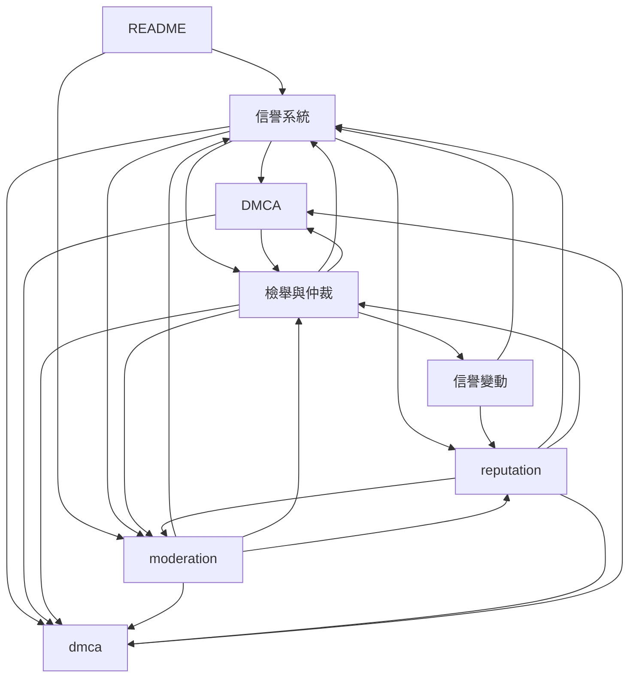

## 版本部署（18 檔）

| 檔案 | type | 說明 |
|---|---|---|
| [專案生命週期.md](專案生命週期.md) | canon | 專案階段、首次公開候選門檻、跨 repo 發布順序與上線後變更規則 |
| [流程/升版.md](流程/升版.md) | flow | CI build → GitHub Pages → Service Worker |
| [版本規範.md](版本規範.md) | canon | A 軸 client 版本＋升版策略；B 軸 UGC 資產 schema 版本 |
| [程式參數/network.md](程式參數/network.md) | registry | 同步、signaling、節點發現與版本參數 |
| [程式架構/bootstrap.md](程式架構/bootstrap.md) | impl | 站點組裝、正式 provider、derived registry 與 runtime 接線契約 |
| [程式架構/peer-discovery.md](程式架構/peer-discovery.md) | impl | libp2p 組態／GossipSub／DHT／Peer Scoring／bootstrap |
| [程式架構/pinning-service.md](程式架構/pinning-service.md) | impl | IPFS pinning 自架／管理 API／授權／Cluster／自動 pin |
| [程式架構/signaling-service.md](程式架構/signaling-service.md) | impl | WebRTC 握手中介／訊息協議／adapters／rate limit／TURN |
| [程式架構/versioning.md](程式架構/versioning.md) | impl | 版本收集／相容性／開賽前驗證／SW 升版／build |
| [程式架構/程式流程/signaling-service.md](程式架構/程式流程/signaling-service.md) | impl-flow | 程式級流程圖：握手／fallback |
| [程式架構/程式流程/versioning.md](程式架構/程式流程/versioning.md) | impl-flow | 程式級流程圖：版本廣播／升版／Service Worker |
| [美術資源/Immutable Release/README.md](美術資源/Immutable%20Release/README.md) | art | Authoring 大型原始資產的兩階段 immutable Release 操作手冊 |
| [部署資訊.md](部署資訊.md) | deploy | pinning／signaling／turn 自架、PWA、域名、SEO |
| [部署資訊/Graphify Release 聚合.md](部署資訊/Graphify%20Release%20聚合.md) | deploy | 四個產品 repo 的不可變 Graphify Release、specs 部分成功聚合與 GitHub App 喚醒 runbook |
| [部署資訊/open-4wd-pinning.md](部署資訊/open-4wd-pinning.md) | deploy | pinning 公版模板 repo 規格（TypeScript app＋kubo＋cluster） |
| [部署資訊/open-4wd-signaling.md](部署資訊/open-4wd-signaling.md) | deploy | signaling 公版模板 repo 規格（scoped signed v1） |
| [部署資訊/open-4wd-turn.md](部署資訊/open-4wd-turn.md) | deploy | TURN 公版模板 repo 規格（coturn、社群營運者自行部署） |
| [部署資訊/部署實際值與初始拓撲.md](部署資訊/部署實際值與初始拓撲.md) | deploy | 首次公開 trust root 與社群服務拓撲 |

決策檔 71 筆——見 [decisions/INDEX.md](decisions/INDEX.md)。

### 版本部署依賴圖（1/2）

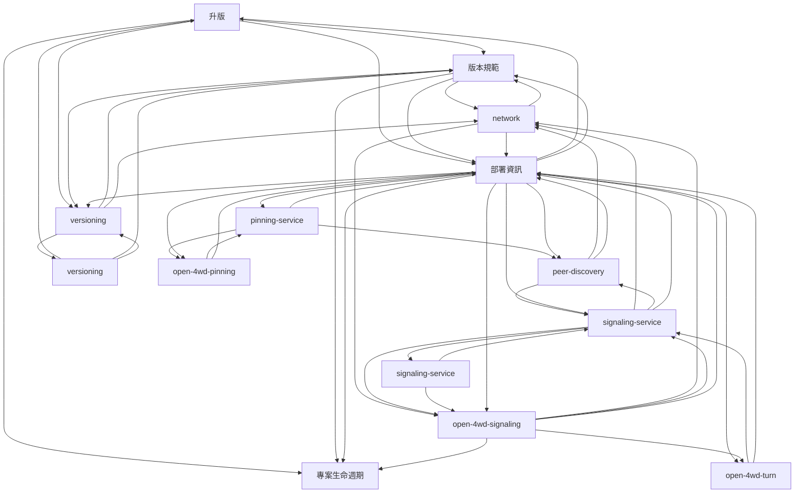

### 版本部署依賴圖（2/2）

#### 版本部署依賴圖跨頁關係

| 來源 | 目標 | 關係 |
| --- | --- | --- |
| [部署資訊](部署資訊.md) | [部署實際值與初始拓撲](部署資訊/部署實際值與初始拓撲.md) | 連結 |
| [open-4wd-pinning](部署資訊/open-4wd-pinning.md) | [部署實際值與初始拓撲](部署資訊/部署實際值與初始拓撲.md) | 連結 |
| [部署實際值與初始拓撲](部署資訊/部署實際值與初始拓撲.md) | [專案生命週期](專案生命週期.md) | 連結 |

## 資安（6 檔）

| 檔案 | type | 說明 |
|---|---|---|
| [程式參數/protocol.md](程式參數/protocol.md) | registry | 共識、物理、UGC、安全、帳本、配對與比賽參數 |
| [程式架構/inbox.md](程式架構/inbox.md) | impl | 第一層 Provider-scoped Inbox、簽章快照、已讀與更新生命週期 |
| [程式架構/key-manager.md](程式架構/key-manager.md) | impl | 助記詞／Ed25519／PIN 加密／profile／SignedPayload |
| [程式架構/player-favorites.md](程式架構/player-favorites.md) | impl | 身分分域收藏清單、公開房間衍生狀態與授權通關來源 |
| [程式架構/security.md](程式架構/security.md) | impl | Sanitize Worker／P2P 驗簽／CSP・SRI／依賴管控 |
| [資安規範.md](資安規範.md) | meta | UGC sanitize／簽署／CSP／漏洞流程 |

決策檔 42 筆——見 [decisions/INDEX.md](decisions/INDEX.md)。

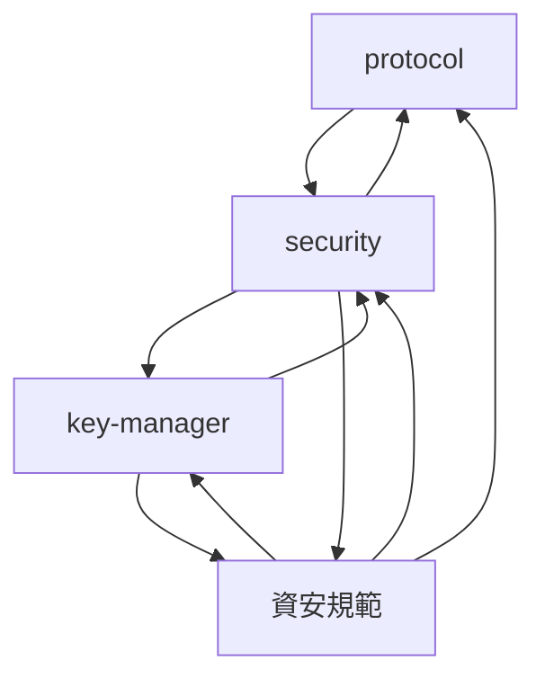

## 前端主題（35 檔）

| 檔案 | type | 說明 |
|---|---|---|
| [主題系統.md](主題系統.md) | canon | 視覺／音訊主題：token＋manifest 資源包、分類註冊表、fallback |
| [公告系統.md](公告系統.md) | canon | repo-owned 四語靜態公告、結構化內容、撤回／取代 |
| [程式參數/ui.md](程式參數/ui.md) | registry | 動畫、音訊、版面、語系與 SEO 參數 |
| [程式架構/announcements.md](程式架構/announcements.md) | impl | 四語公告 scanner／generator／catalog／safe renderer |
| [程式架構/audio-system.md](程式架構/audio-system.md) | impl | 播放槽名錄／主題音訊 fallback／BGM 轉場／三路混音 |
| [程式架構/i18n.md](程式架構/i18n.md) | impl | 字典載入／I18nService／ICU 複數／Intl 格式化 |
| [程式架構/pages-contracts.md](程式架構/pages-contracts.md) | impl | 路由頁面、AppDataProviders、O4Viewport 與 RaceSession 的資料入口契約 |
| [程式架構/pwa-offline.md](程式架構/pwa-offline.md) | impl | PWA manifest／SW 快取分路／離線 UI／UGC 快取 LRU |
| [程式架構/race-routing.md](程式架構/race-routing.md) | impl | SPA shell、Race Config、Race／Result identity 與 RoomSession 恢復契約 |
| [程式架構/seo.md](程式架構/seo.md) | impl | head metadata／JSON-LD／sitemap／SSG／Lighthouse CI |
| [程式架構/settings.md](程式架構/settings.md) | impl | AppSettings 資料模型／預設值／即時生效 vs 重整／persist |
| [程式架構/themes.md](程式架構/themes.md) | impl | ThemeService／token 套用／資產 fallback／themes:validate |
| [程式架構/ui-frontend.md](程式架構/ui-frontend.md) | impl | UI 前端技術選型與實作策略（渲染分工／token 架構／動畫效能預算／資產 pipeline） |
| [程式架構/程式流程/i18n.md](程式架構/程式流程/i18n.md) | impl-flow | 程式級流程圖：語系切換／社群 PR |
| [程式架構/程式流程/pwa-offline.md](程式架構/程式流程/pwa-offline.md) | impl-flow | 程式級流程圖：PWA／離線快取 |
| [編輯器操作.md](編輯器操作.md) | canon | Stage 2 編輯器互動與 UI 操作（零件＋場地共用、PC／Mobile 雙端） |
| [美術資源.md](美術資源.md) | art | 出貨資產／參考與原始工程／技術與設計契約的分類索引 |
| [美術資源/Immutable Release/README.md](美術資源/Immutable%20Release/README.md) | art | Authoring 大型原始資產的兩階段 immutable Release 操作手冊 |
| [美術資源/UGC卡片.md](美術資源/UGC卡片.md) | art | UGC 卡片結構／必顯欄位／評分顯示規則與入口 |
| [美術資源/主題外觀與 RWD.md](美術資源/主題外觀與%20RWD.md) | art | 主題 Skin Layer／頁面套用強度／寬高比例三軸 RWD 的穩定視覺規格 |
| [美術資源/主題審查計畫.md](美術資源/主題審查計畫.md) | art | 主題代表 viewport／靜態原型／整合守門與驗收工作的非 canon 計畫 |
| [美術資源/前端技術策略.md](美術資源/前端技術策略.md) | art | UI 前端實作契約的穩定導覽入口 |
| [美術資源/實際使用圖/賽內倒數與起跑動畫/README.md](美術資源/實際使用圖/賽內倒數與起跑動畫/README.md) | art | 兩主題賽內倒數與起跑動畫原始工程 |
| [美術資源/提示詞/UI資產.md](美術資源/提示詞/UI資產.md) | art | UI 資產生成提示詞 |
| [美術資源/提示詞/場地參考圖.md](美術資源/提示詞/場地參考圖.md) | art | 場地參考圖生成提示詞 |
| [美術資源/提示詞/賽中訊息圖示/default-inspired.md](美術資源/提示詞/賽中訊息圖示/default-inspired.md) | art | default-inspired 賽中訊息圖示 96 詞生成提示詞 |
| [美術資源/提示詞/賽中訊息圖示/moon-rabbit.md](美術資源/提示詞/賽中訊息圖示/moon-rabbit.md) | art | moon-rabbit-inspired 賽中訊息圖示 96 詞生成提示詞 |
| [美術資源/提示詞/賽內倒數與起跑動畫/default.md](美術資源/提示詞/賽內倒數與起跑動畫/default.md) | art | default 主題賽內倒數與起跑動畫提示詞 |
| [美術資源/提示詞/賽內倒數與起跑動畫/moon-rabbit.md](美術資源/提示詞/賽內倒數與起跑動畫/moon-rabbit.md) | art | 月兔主題賽內倒數與起跑動畫提示詞 |
| [美術資源/提示詞/零件參考圖.md](美術資源/提示詞/零件參考圖.md) | art | 零件參考圖生成提示詞 |
| [美術資源/提示詞/頁面概念圖.md](美術資源/提示詞/頁面概念圖.md) | art | 頁面概念圖生成提示詞 |
| [美術資源/美術方向.md](美術資源/美術方向.md) | art | 公版 GLB 美術方向、比例、零件辨識標準與 IP 邊界（參考件） |
| [美術資源/設計系統.md](美術資源/設計系統.md) | art | 視覺原則／色票／字級／間距／元件規則／3D 主視覺準則 |
| [美術資源/頁面線框.md](美術資源/頁面線框.md) | art | 各頁面 wireframe／版面結構與互動規則細化 |
| [語系清單.md](語系清單.md) | meta | i18n 四語系＋社群 PR 流程 |

決策檔 35 筆——見 [decisions/INDEX.md](decisions/INDEX.md)。

### 前端主題依賴圖（1/2）

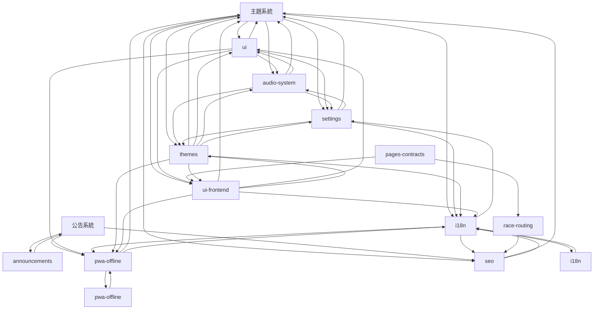

### 前端主題依賴圖（2/2）

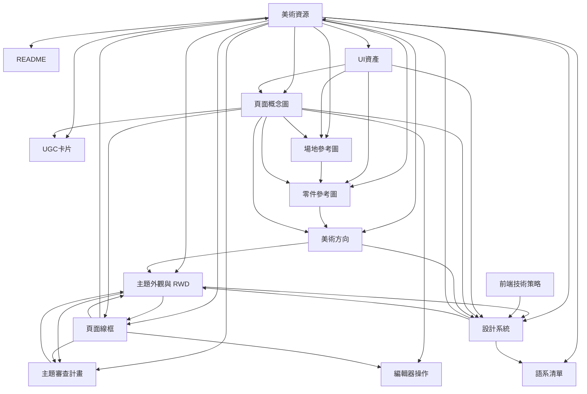

#### 前端主題依賴圖跨頁關係

| 來源 | 目標 | 關係 |
| --- | --- | --- |
| [主題系統](主題系統.md) | [美術資源](美術資源.md) | 連結 |
| [主題系統](主題系統.md) | [主題外觀與 RWD](美術資源/主題外觀與%20RWD.md) | 連結 |
| [主題系統](主題系統.md) | [語系清單](語系清單.md) | 連結 |
| [ui](程式參數/ui.md) | [主題外觀與 RWD](美術資源/主題外觀與%20RWD.md) | 連結 |
| [ui](程式參數/ui.md) | [語系清單](語系清單.md) | 連結 |
| [i18n](程式架構/i18n.md) | [語系清單](語系清單.md) | 連結 |
| [pages-contracts](程式架構/pages-contracts.md) | [頁面線框](美術資源/頁面線框.md) | 連結 |
| [pwa-offline](程式架構/pwa-offline.md) | [語系清單](語系清單.md) | 連結 |
| [race-routing](程式架構/race-routing.md) | [語系清單](語系清單.md) | 連結 |
| [seo](程式架構/seo.md) | [語系清單](語系清單.md) | 連結 |
| [settings](程式架構/settings.md) | [語系清單](語系清單.md) | 連結 |
| [ui-frontend](程式架構/ui-frontend.md) | [編輯器操作](編輯器操作.md) | 連結 |
| [ui-frontend](程式架構/ui-frontend.md) | [主題外觀與 RWD](美術資源/主題外觀與%20RWD.md) | 連結 |
| [ui-frontend](程式架構/ui-frontend.md) | [主題審查計畫](美術資源/主題審查計畫.md) | 連結 |
| [ui-frontend](程式架構/ui-frontend.md) | [UI資產](美術資源/提示詞/UI資產.md) | 連結 |
| [ui-frontend](程式架構/ui-frontend.md) | [頁面概念圖](美術資源/提示詞/頁面概念圖.md) | 連結 |
| [ui-frontend](程式架構/ui-frontend.md) | [設計系統](美術資源/設計系統.md) | 連結 |
| [ui-frontend](程式架構/ui-frontend.md) | [語系清單](語系清單.md) | 連結 |
| [i18n](程式架構/程式流程/i18n.md) | [語系清單](語系清單.md) | 連結 |
| [編輯器操作](編輯器操作.md) | [ui-frontend](程式架構/ui-frontend.md) | 連結 |
| [美術資源](美術資源.md) | [主題系統](主題系統.md) | 連結 |
| [美術資源](美術資源.md) | [ui](程式參數/ui.md) | 連結 |
| [美術資源](美術資源.md) | [pages-contracts](程式架構/pages-contracts.md) | 連結 |
| [美術資源](美術資源.md) | [race-routing](程式架構/race-routing.md) | 連結 |
| [美術資源](美術資源.md) | [ui-frontend](程式架構/ui-frontend.md) | 連結 |
| [UGC卡片](美術資源/UGC卡片.md) | [ui-frontend](程式架構/ui-frontend.md) | 連結 |
| [主題外觀與 RWD](美術資源/主題外觀與%20RWD.md) | [主題系統](主題系統.md) | 連結 |
| [主題外觀與 RWD](美術資源/主題外觀與%20RWD.md) | [ui-frontend](程式架構/ui-frontend.md) | 連結 |
| [主題審查計畫](美術資源/主題審查計畫.md) | [ui-frontend](程式架構/ui-frontend.md) | 連結 |
| [前端技術策略](美術資源/前端技術策略.md) | [ui-frontend](程式架構/ui-frontend.md) | 連結 |
| [UI資產](美術資源/提示詞/UI資產.md) | [主題系統](主題系統.md) | 連結 |
| [UI資產](美術資源/提示詞/UI資產.md) | [ui-frontend](程式架構/ui-frontend.md) | 連結 |
| [頁面概念圖](美術資源/提示詞/頁面概念圖.md) | [ui-frontend](程式架構/ui-frontend.md) | 連結 |
| [設計系統](美術資源/設計系統.md) | [主題系統](主題系統.md) | 連結 |
| [設計系統](美術資源/設計系統.md) | [audio-system](程式架構/audio-system.md) | 連結 |
| [設計系統](美術資源/設計系統.md) | [settings](程式架構/settings.md) | 連結 |
| [設計系統](美術資源/設計系統.md) | [ui-frontend](程式架構/ui-frontend.md) | 連結 |
| [頁面線框](美術資源/頁面線框.md) | [ui](程式參數/ui.md) | 連結 |
| [頁面線框](美術資源/頁面線框.md) | [ui-frontend](程式架構/ui-frontend.md) | 連結 |
| [語系清單](語系清單.md) | [ui](程式參數/ui.md) | 連結 |
| [語系清單](語系清單.md) | [i18n](程式架構/i18n.md) | 連結 |
| [語系清單](語系清單.md) | [pwa-offline](程式架構/pwa-offline.md) | 連結 |
| [語系清單](語系清單.md) | [seo](程式架構/seo.md) | 連結 |
| [語系清單](語系清單.md) | [settings](程式架構/settings.md) | 連結 |

## 治理營運（3 檔）

| 檔案 | type | 說明 |
|---|---|---|
| [專案生命週期.md](專案生命週期.md) | canon | 專案階段、首次公開候選門檻、跨 repo 發布順序與上線後變更規則 |
| [流程/治理事件.md](流程/治理事件.md) | flow | economy-config 治理多簽變更 |
| [程式參數/economy-config.md](程式參數/economy-config.md) | registry | OrbitDB 動態治理 economy config |

決策檔 48 筆——見 [decisions/INDEX.md](decisions/INDEX.md)。

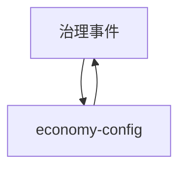

## 跨域（16 檔）

| 檔案 | type | 說明 |
|---|---|---|
| [ABOUT.en.md](ABOUT.en.md) | meta | 英文版 about——專案定位、corpus 組織與文檔工程方法論摘要，對外讀者入口（非權威、摘要自 文檔工程.md） |
| [使用技術.md](使用技術.md) | meta | 技術棧（前端／物理／P2P／鏈／IPFS） |
| [其他.md](其他.md) | index | 待辦／待討論／待校準集中索引 |
| [文檔工程.md](文檔工程.md) | meta | 文檔工程方法論——單一權威、現況-歷史分離、機器執法；本 repo 作開源範例 |
| [流程.md](流程.md) | index | 跨模組流程索引＋圖表風格規範 |
| [流程/玩家整體旅程.md](流程/玩家整體旅程.md) | flow | 從首次連線到回頭組裝的完整旅程 |
| [程式參數.md](程式參數.md) | index | 程式參數權威分冊導覽 |
| [程式參數/共通規則.md](程式參數/共通規則.md) | registry | 程式參數一致性級別、型別與變更規則 |
| [程式架構.md](程式架構.md) | impl | 抽象介面／模組依賴／頁面路由／測試（實作細化檔索引） |
| [程式架構/interfaces.md](程式架構/interfaces.md) | impl | 五個已接線抽象介面＋一個保留接縫＋共用型別與同版守門 |
| [程式架構/system-constants.md](程式架構/system-constants.md) | impl | 四層常數套件結構／Brand 型別／economy-config runtime／不變式 CI |
| [程式架構/testing.md](程式架構/testing.md) | impl | Vitest／Playwright／確定性 harness／CI matrix／coverage |
| [程式架構/toolchain.md](程式架構/toolchain.md) | impl | 正式建置、驗證與測試命令對映，以及目前 CI 執行事實 |
| [程式架構/程式流程/peer-discovery.md](程式架構/程式流程/peer-discovery.md) | impl-flow | 程式級流程圖：DHT＋GossipSub＋PeerScore |
| [程式架構/程式流程/testing.md](程式架構/程式流程/testing.md) | impl-flow | 程式級流程圖：CI matrix／Fuzz／跨瀏覽器 |
| [總覽.md](總覽.md) | index | spec source of truth 入口；主題分類導覽 |

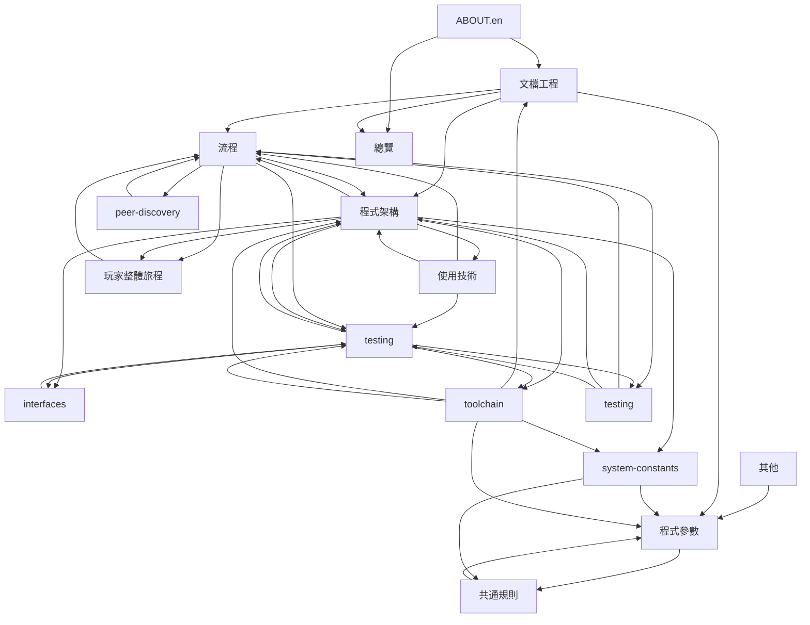
