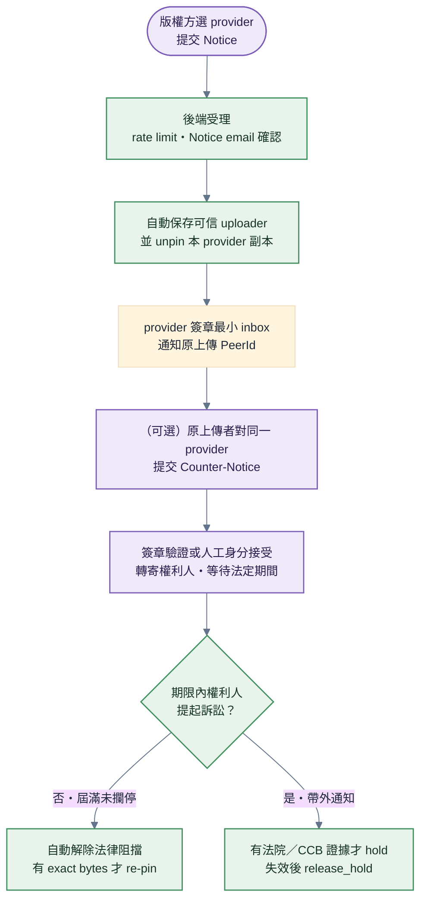

# DMCA

> **本檔角色**：版權方對玩家選定的 pinning provider 提交 Notice → provider 下架自己供應的副本 → Counter-Notice／hold／恢復的完整流程。
> **DMCA 是維運層法遵流程**——不進 P2P 帳本、不動信譽、決策不上鏈（法律責任在維運者身上，鏈上多簽無法承擔）；社群對同一內容可平行走 [檢舉與仲裁.md](檢舉與仲裁.md)（該路線才有信譽扣分）。
> 反複製 / Fork 分潤見 [../版權.md](../版權.md)。

## 1. 詳細流程



> 本圖色彩映射：綠 ＝ 維運層動作、紫 ＝ 兩造對外互動、紅 ＝ 拒絕路徑——DMCA 全程不上鏈，無帳本（藍）節點。

**步驟細目**：

1. **版權方提交 Notice**——Client 只列玩家已設定且宣告 `legal_notice`
   的 provider；表單直送該 provider，不經主 repo 或共同信箱。
2. **後端受理與自動下架**——per-IP rate limit＋64 KiB 尺寸上限＋email
   確認關。確認後從 provider pin metadata 保存可信 uploader PeerId 與恢復所需的最小
   category/source/logical/physical 計量，逐 CID unpin 並同步釋放 provider quota，再轉寄私有
   維運信箱；不採信 claimant 自報 PeerId。
3. **失敗可重試**——unpin 失敗保持 `received`，背景 sweep 重試；不得在副作用
   失敗時假報 `taken_down`。
4. **通知原上傳者**——Client 解鎖後對玩家已設定或已有案件 watch target 的 provider 簽章
   查詢；只接受該 provider 簽章的最小 inbox，不取得權利人個資或通知全文。通過驗證的結果
   進第一層 `/inbox?tab=dmca`；最後 signed envelope 可留在該 PeerId 本機，離線重驗後只標示
   stale，不當成即時 provider 狀態。
5. **（可選）原上傳者提交 Counter-Notice**——Inbox row 只有 `taken_down`、provider 仍可用且
   沒有 litigation hold 時提供準備入口；deep link 固定原 provider
   與 notice id。持有原 uploader 私鑰者簽署整份 payload；否則提交人工身分審查，不能自報
   PeerId。兩種模式的法律聲明與聯絡欄位相同。
6. **身分通過 → 私密轉寄、起算等待期**——可信原 uploader 簽章自動接受；人工模式由維運者
   accept 後才固定 `acceptedAt`。完整反通知只轉寄原權利人並留在 provider 私有案卷，不進
   inbox、透明度聚合或 Ledger。寄送失敗排程重試，但不重設期限。第 13 個工作日起可恢復，
   第 14 個工作日為最晚界線；週末與營運者設定的假日不計。
7. **期限內未攔停 → 自動恢復**——背景 sweep 自第 13 個工作日起解除本 provider 的法律阻擋；
   exact-CID bytes 仍在才重新完整驗 CID/DAG、量 logical bytes，並以保存的 physical attribution
   通過 signer/global quota reservation 後 re-pin；Cluster 成功才提交 quota。缺檔時記
   `restored_after_counter + missing`，等任一持有者依一般 exact-CID 流程補件，不建假 pin；
   配額暫時拒絕則保持未恢復供 sweep 重試，不以零計量繞過。
8. **權利人期限內提起程序 → 攔停（hold）**——帶外路徑：可識別的美國聯邦法院或 Copyright
   Claims Board 程序資料寄 DMCA 維運信箱；維運者驗核後以 admin `hold` 保存程序種類、reference
   與收件時間。無證據不得 hold；程序失效或結束時以 `release_hold` 解除，再由 sweep／人工
   restore 收尾。此路徑刻意沒有公開 hold API。

明顯誤判可由維運者提前 restore；一般權利爭議預設仍走 Counter-Notice。
整段流程不寫 Ledger、不動信譽、不建全域 client 下架清單；其他 provider 與
玩家本機 cache 不受單一 provider 案件控制。

## 2. 公開頁面

| 路徑                              | 內容                                         |
| --------------------------------- | -------------------------------------------- |
| `/dmca`                           | Notice / Counter-Notice 表單 + Policy 全文   |
| `/dmca/transparency`              | 逐 provider 顯示其自願公開聚合與不可用狀態   |
| `/inbox?tab=dmca`                 | 已解鎖玩家的 provider-scoped 案件與本機已讀  |
| provider `/api/dmca/transparency` | 該 provider 自願公開的年度聚合；未提供即忽略 |

`/ugc` 頁內與 Help 提供一般 DMCA 入口；`/ugc/:cid` 可導向 `/dmca?target=<cid>` 預填作品。
頁面只列玩家自己設定、且聲明對應能力的 provider。未設定 provider 時明確說明無可提交
端點，但不因此停用 UGC。`/inbox` 是 client 本機入口，不集中儲存 provider 案件、不聚合成
全域或官方案件清單；詳細生命週期見 [程式架構/inbox.md](../程式架構/inbox.md)。

## 3. Notice 表單欄位

詳見 [../程式架構/dmca.md §1](../程式架構/dmca.md)：

| 欄位 | 必填 |
|---|---|
| Claimant 姓名、email、電話、法律地址 | ✅ |
| 組織；代理人身分、姓名與關係 | 否；宣告代理人時姓名與關係必填 |
| 受保護作品的標題、類型與描述 | ✅ |
| 註冊號與首次發表日期 | 否 |
| 一筆以上被指內容：類型、CID、URL、描述 | ✅ |
| 被指內容 creator PeerId | 否 |
| 善意相信、偽證聲明、簽章與簽章日期 | ✅ |

表單不接受任意附件上傳；補充證據以 schema 內的作品／被指內容 URL 與描述表達，避免把未掃描檔案
帶入 provider 私有案卷。

## 4. Counter-Notice 表單欄位

詳見 [../程式架構/dmca.md §1](../程式架構/dmca.md)：

| 欄位               | 必填 |
| ------------------ | ---- |
| 對應 Notice 編號   | ✅   |
| 被指控方姓名       | ✅   |
| 被指控方法律地址   | ✅   |
| 連絡 email         | ✅   |
| 連絡電話           | ✅   |
| 誤判／錯誤識別聲明 | ✅   |
| 聯邦法院轄區       | ✅   |
| 接受權利人送達     | ✅   |
| 偽證聲明與簽章     | ✅   |

## 5. 維運層決策（無鏈上多簽）

- **責任主體**：每個 provider 營運者只處理自己控制的儲存與供應。公版與主 repo 不替其
  擔任 Registered Agent、共同營運者或安全港資格判定者。
- **自動與人工分界**：Notice 形式確認後自動下架；可信原 uploader 簽章的 Counter-Notice
  自動受理、轉寄與排程。人工處理無簽章案件的身分接受／拒絕、明顯誤判撤銷、例外失敗與
  有證據的法院／CCB hold，不要求營運者日常裁判著作權實體歸屬。
- **決策記錄**：provider 私有案卷的 `decisionLog`；不建立全域下架清單 PR。
- **不設鏈上 DMCA 多簽 / 不選社群代表**：出 client 版本的人本來就擁有終極權力，鏈上多簽只是把維運層權力演成分散的樣子；且匿名 PeerId 無法承擔法律身分。
- **決策執行**＝公開 notice／counter API 加背景 sweep；Admin API 只負責可信人工例外與 hold。
- **訴訟通知處理**：維運信箱收到可識別的聯邦法院／CCB 程序資料 → 驗核 → admin API
  `hold` 保存 evidence 並攔停；失效／終結後 `release_hold`。此路徑**刻意無專屬頁面 ／ 公開
  API**，且失效方向 fail-safe：沒有有效 hold ＝ 依期限恢復；所有動作經 Bearer 與 decisionLog
  稽核（[程式架構/dmca.md §5](../程式架構/dmca.md)）。

### 5.1 選配代理人登記與必要信箱

`DMCA_ENABLE` 預設關。開啟者至少要有私有維運信箱、存取控制、保存／刪除政策與可執行
排程；這些流程不等於已取得安全港。若營運者日後自行主張美國法 17 U.S.C. 512 安全港，
才由營運者
自行確認當時法律與登記要求：

1. **信箱（免費）**：以自有域名建 `dmca@<域名>`——建議 Cloudflare Email Routing：域名 DNS 託管 Cloudflare → 啟用 Email Routing（MX／SPF 自動配置）→ 建立位址 → 驗證轉寄目的信箱；回信以「以此地址寄出」（Gmail SMTP）或任何寄件設施。域名日後更換 ＝ 登記資料線上更新即可。
2. **登記**：以 Copyright Office 當時官方流程、費用與續期規則為準；登記服務提供者與
   designated agent 使用營運者自己的名稱、alternate names、地址、電話及 email，不得填
   Open4WD 主專案為代理人或冒充官方節點。
3. **公開公示同步**：營運者自己的公開頁面刊載與登記一致的聯絡資料；主 repo `/dmca`
   只顯示 provider 自己提供的入口與聲明，不集中公示共同代理人。
4. **隱私註記**：登記資訊（含郵寄地址、電話）進**公開名錄**——個人維運者可用組織名 ＋ 郵政信箱 ／ 虛擬地址，申請前先定案。

### 5.2 直寄信件處理（罐頭回覆範本）

Provider 維運信箱收到的直寄 notice，一律先以下列範本回覆導流（**導流、不是拒絕**）：

```text
Subject: Re: DMCA Notice — please use our DMCA form

Thank you for contacting <provider name> DMCA contact.

To process your notice promptly, please submit it via our DMCA form:
https://<provider-domain>/dmca

The form ensures your notice contains all elements required by
17 U.S.C. §512(c)(3) and issues a tracking ID.

If you prefer email, your notice must include ALL of the following,
otherwise it cannot be acted upon:
1. Identification of the copyrighted work claimed to be infringed;
2. Identification of the infringing material (asset CID and/or URL);
3. Your name, address, telephone number, and email address;
4. A statement of good-faith belief that the use is not authorized;
5. A statement, under penalty of perjury, that the information is
   accurate and you are authorized to act for the copyright owner;
6. Your physical or electronic signature.
```

- **公版不自動匯入直寄內容**：一般維運信箱以固定範本導回該 provider 的表單，避免營運者
  重打、改寫或誤傳敏感資料。若營運者已自行登記 designated agent，仍須自行確認直接送達
  其登記地址的通知在適用法律下如何處理；介面導流不是公版替其提供的法律拒絕理由。
- **要件不全**：同一範本列出缺少要件，導回表單補齊。
- **明顯垃圾 ／ 灌水**：不回覆、過濾即可（[程式架構/dmca.md §2](../程式架構/dmca.md) 防濫用；[§11](#11-異常情境) 異常情境）。

### 5.3 Admin API、Access 與 Swagger 維運 runbook

#### 5.3.1 Provider 部署一次性設定

1. 在 provider 部署設定 `DMCA_ENABLE=true`、`DMCA_ADMIN_TOKEN`、
   `SMTP_URL` 與 `DMCA_AGENT_EMAIL`；token 放 secret manager，不進 repo。`DMCA_ADMIN_TOKEN`
   缺席時服務必須 fail-fast。使用 Cloudflare Access 者可設
   `DMCA_TRUST_CLOUDFLARE_ACCESS_IDENTITY=true`，但僅能在
   origin 已封閉於 Tunnel/Access，才採 Cloudflare 注入的已驗證 email 寫入 `operatorId`。
2. 可建立 Cloudflare Tunnel，將營運者自己的 DMCA hostname 導向 private app origin；防火牆只接受
   Tunnel／內網，不另開公開入口。Tunnel 對 browser／CLI 是透明代理，不需要第三種應用 token。
3. 建立一個 Access self-hosted application，同時涵蓋 `/admin/*` 與
   `/api/dmca/admin/*`；Allow policy 只含 DMCA 維運者並要求 MFA。IP allowlist 可作自架者的
   額外選項，但不是公版必要條件，也不是人員身分／MFA 的替代品。
4. 設 `DMCA_ADMIN_DOCS_ENABLE=true` 啟用 `/admin/docs`。OpenAPI 與 Swagger 靜態資產全部
   self-host；固定 `persistAuthorization: false`、`validatorUrl: null`，不使用
   `preauthorizeApiKey`，不在 URL、spec、bundle 或 localStorage 存 token。
5. 驗證未登入請求停在 Access、已登入但沒有 Bearer 回 401、兩層都通過才可列案；再確認
   list 只回摘要、detail 不含 `confirmToken`，非法 action／status 組合回 409 且沒有副作用。

營運者 hostname 的權限責任：Access 只保護 Admin path，不可阻擋公開 notice、
counter-notice、status、inbox 與選配 transparency。
若未來另做機器唯讀工作，必須另開端點與 policy 評估；人工 `decision` 不允許 Service Auth
bypass，因 Service Token 不代表人員 MFA，亦無法單獨提供裁決責任歸屬。

#### 5.3.2 Swagger 操作

1. 開啟 `https://<provider-domain>/admin/docs`，完成營運者設定的 Access 登入與 MFA。
2. 按 **Authorize**，在 OpenAPI bearer 欄位只輸入 `DMCA_ADMIN_TOKEN` 本體，不輸入
   `Bearer` 前綴；Swagger 送出時自行組成 `Authorization` header。
3. 先以摘要列表篩選案件，再開單案 detail；確認資料與狀態後才呼叫 decision。例：

   ```json
   {
     "action": "take_down",
     "reason": "形式要件完整，指定 CID 與通知內容相符"
   }
   ```

4. 重讀單案，確認 status、副作用與 `decisionLog.operatorId`。完成後按 Logout／關閉分頁；
   因 `persistAuthorization=false`，重新整理或新分頁必須重新輸入 token。

Swagger 是 API 操作與檢查工具，不是 Grafana，也不是完整案件 dashboard；案件搜尋、PII 閱讀、
裁決與稽核仍完全依 Admin API 契約。正式裁決前不得只看列表摘要。

#### 5.3.3 PowerShell 與 curl

人工 CLI 使用 Cloudflare user token；命令會開瀏覽器完成 Access／MFA。先把
`DMCA_ADMIN_TOKEN` 放在目前 process 的環境變數或安全提示輸入，勿寫進 `.ps1`：

```powershell
cloudflared access login https://<provider-domain>
$dmcaAccessToken = cloudflared access token -app=https://<provider-domain>
$dmcaHeaders = @{
  'cf-access-token' = $dmcaAccessToken
  Authorization = "Bearer $env:DMCA_ADMIN_TOKEN"
}

# 有界摘要列表
Invoke-RestMethod `
  -Uri 'https://<provider-domain>/api/dmca/admin/notices?status=received&limit=25' `
  -Headers $dmcaHeaders

# 單案詳情
$noticeId = '<notice-id>'
Invoke-RestMethod `
  -Uri "https://<provider-domain>/api/dmca/admin/notices/$noticeId" `
  -Headers $dmcaHeaders

# 裁決；先人工核對 noticeId、action、reason
$decision = @{ action = 'take_down'; reason = '<reviewed-reason>' } | ConvertTo-Json
Invoke-RestMethod -Method Post `
  -Uri "https://<provider-domain>/api/dmca/admin/notice/$noticeId/decision" `
  -Headers $dmcaHeaders -ContentType 'application/json' -Body $decision
```

同一組 token 可直接交給 curl；必須同時帶兩個不同 header，不能用 Access Service Token 的
`Authorization` 單 header 模式覆蓋 DMCA Bearer：

```powershell
curl.exe 'https://<provider-domain>/api/dmca/admin/notices?limit=25' `
  --header "cf-access-token: $dmcaAccessToken" `
  --header "Authorization: Bearer $env:DMCA_ADMIN_TOKEN"
```

Windows bat 若要給非 PowerShell 使用者一鍵執行，只作薄包裝並把參數交給受版控的 `.ps1`，
不在 `.bat` 或旁置 txt 儲存 token：

```bat
@echo off
pwsh -NoProfile -File "%~dp0dmca-admin.ps1" %*
```

Access user token 有效期由 Access policy 決定；過期就重新 `access login`／`access token`，
不把它改成長效 Service Token 迴避 MFA。

#### 5.3.4 Postman

1. 匯入公版 OpenAPI；collection 本身不存 secret。
2. 建 private environment：`baseUrl=https://<provider-domain>`、`dmcaAdminToken` 與
   `cfAccessToken`，並把兩個 token 標為 sensitive；不要 export 這個 environment。
3. 以 `cloudflared access login`／`access token` 取得 user token後貼入 `cfAccessToken`。
4. collection headers 設 `cf-access-token: {{cfAccessToken}}` 與
   `Authorization: Bearer {{dmcaAdminToken}}`。每次依序 list → detail → decision → detail 驗證。
5. Access token 過期就重新取得；DMCA token 輪替時同步更新 secret manager 與 private
   environment，不修改或提交 OpenAPI／collection。

## 6. Repeat Infringer 偵測

| 未恢復下架次數                                                   | 處理                                                                                          |
| ---------------------------------------------------------------- | --------------------------------------------------------------------------------------------- |
| 每次成立                                                         | 該 UGC 下架 + 通知創作者（不動信譽）                                                          |
| 達 `REPEAT_INFRINGER_THRESHOLD` | **該 provider 拒服務**：拒 pin 該可信 uploader 的新上傳；不擴散到其他 provider、client 或信譽 |

計數只採 provider pin metadata 保存的可信 uploader，不採信權利人表單自報 PeerId；不動信譽、
不進鏈上三振。公版提供此政策工具但不因此替營運者主張 17 U.S.C. 512(i) 資格。
門檻值只由 [protocol.md §5](../程式參數/protocol.md#5-protocolledger鏈與多簽) 定義。

## 7. 文字黑名單（pre-check）

詳見 [../版權.md §7](../版權.md)：

上傳前對 UGC 名稱 / 描述 / tag 依受 review 條目的逐筆 `matchMode` 做 `exact`／`substring`／`regex` 比對；沒有全域 mode 開關：

```text
TEXT_BLACKLIST_VERSION: 'v1'         # 格式版本；庫資料隨 client minor 出貨（版權 §7）
```

阻擋訊息 4 語系（zh-TW / zh-CN / en / ja）。

## 8. 既得權益保護

詳見 [../版權.md §10](../版權.md)：

| 場景                     | 處理                             |
| ------------------------ | -------------------------------- |
| UGC 上鏈 → 後續被下架    | 歷史 royalty 不回收              |
| UGC retire（創作者主動） | 後續使用不算 royalty，歷史不回收 |
| DMCA 通過下架            | 同上                             |

理由：ledger append-only，事件不可撤銷（[../資料系統.md §1](../資料系統.md)）。

## 9. 資料載體

詳見 [../程式架構/dmca.md §3](../程式架構/dmca.md)：

| 載體             | 內容                                                    | 所在                                    |
| ---------------- | ------------------------------------------------------- | --------------------------------------- |
| `dmca-notices`   | Notice／Counter-Notice、可信 uploader map、狀態與 audit | provider 私有 KV（非帳本）              |
| 簽章 inbox       | 最小案件 id、CID、法律／資源狀態、期限與時間            | request-authenticated provider response |
| 維運 mail        | 通知雙方個資與轉寄內容                                  | provider 私有信箱                       |
| 文字關鍵字黑名單 | 名稱／描述／tag 上傳 pre-check                          | repo 檔案（非 DMCA 案件）               |

## 10. 透明度統計（純 derive、不上鏈）

每個 provider 可從自己的 `dmca-notices` 推導 `/api/dmca/transparency`，不另簽季報：

- DMCA Notice 受理數
- 通過數 / 拒絕數
- Counter-Notice 收件數
- Repeat Infringer 偵測案件
- restored + missing 資源狀態

只公開聚合值；姓名、聯絡資料、IP／UA、案件敘述與可回推個人的明細不出 provider 私有面。
主 client 可顯示玩家設定 provider 自願提供的統計，缺少即忽略，不集中形成全域統計。

## 11. 異常情境

| 情境                         | 處理                                                                                |
| ---------------------------- | ----------------------------------------------------------------------------------- |
| Notice 提交但簽章無效        | 拒絕，記入透明度報告                                                                |
| 被指控者離線無法接通知       | Provider 保留最小案件；client 解鎖後查詢選定 provider，本機已驗 snapshot 只作 stale 顯示 |
| Counter-Notice 後再被反駁    | 進入法律程序（超出系統可介入範圍）                                                  |
| 其他 pinning provider 仍供應 | 各 provider 是獨立責任主體；本案只停止被通知 provider 的供應，client 不冒充全域裁決 |
| 恢復時 bytes 已被 GC         | 法律狀態 restored、資源狀態 missing；等待 exact-CID 補件，不假造內容或建立新 UGC    |
| 不同 jurisdiction 認定不同   | Provider 營運者依其適用法律與自行取得的法律意見處理，不由主專案代為判定              |

## 12. DMCA Policy 全文

公開發布於 `/dmca` 頁面下方。詳見 [../程式架構/dmca.md §7](../程式架構/dmca.md)。

## 13. 跨模組對接

| 模組               | 內容                                             |
| ------------------ | ------------------------------------------------ |
| `dmca/`            | Provider-scoped API、簽章 inbox 與私有案卷       |
| `anti-piracy/`     | mesh fingerprint（上傳 pre-check）               |
| `moderation/`      | 一般檢舉（信譽扣分走該路線）；不接 provider 案件 |
| `pinning-service/` | Provider-scoped 下架 / re-pin / Repeat Infringer 拒服務 |
