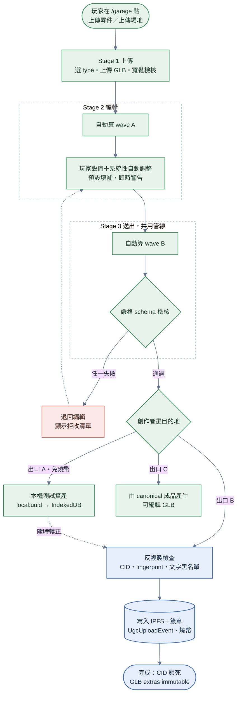

# UGC 上傳

> **本檔角色**：玩家從 GLB 檔案到上鏈的完整三階段流程。
> 機制細節見 [UGC機制.md](../UGC機制.md)；欄位 schema 見 [../建模參數.md](../建模參數.md)。

## 1. 三階段總覽

```text
上傳 (Stage 1) → 編輯 (Stage 2) → 送出 (Stage 3：本機測試 / 上鏈 / 可編輯 GLB)
```

**組裝（Loadout）是另一個介面操作、不屬此流程**：已上鏈的零件如何組裝成車，見 [../車輛組裝.md](../車輛組裝.md)。（「組裝」≠「賽前」；賽前是從車位選已組好的車、無編輯。）

## 2. 詳細流程



**步驟細目**：

1. **Stage 1：上傳**——UI 先選 type 與未標記外部 GLB 的來源單位（m / cm / mm）；上傳 GLB；sanitize Worker 只做結構安全清洗（無 external URL / 無惡意 extras / 無 NaN/Inf mesh，來源總三角形數 3M 與 80 MiB 都是 Stage 1 絕對 admission ceiling）。清洗後一次性正規化為公尺；無 marker 來源依 type 做 provisional uniform fit（場地最長水平邊預設對齊 150m，part 依各類 client guidance），已帶 [版本規範.md §15](../版本規範.md) current marker 的 Open4WD 成品不再轉單位或自動 fit，其精確 type 也不得由 UI 覆寫。
2. **Stage 2：編輯**——未標記 part 先在 Worker 以 Meshoptimizer 自動減至 90,000 vertices / triangles headroom 並保留 NORMAL、UV、材質與貼圖，再依 type 自動建立 part-side mount；chassis 建立 canonical 9 + custom 9。接著自動算第一波（wave A）：volume_m3 / mass_g / bbox_m / centroid_m / surface_area_m2、watertight 驗證、provisional uniform fit guidance、場地 visual / collider decimate（若編輯後超過 3M 等輸出上限）。玩家可再套正值 uniform scale；幾何、節點、empty 與其他空間欄位原子縮放，UV 與貼圖內容不隨空間倍率改寫。玩家另設 material、武器、可編輯 Mount、route 與場地 entity 等欄位；系統持續即時檢核。
3. **Stage 3：送出（共用 canonical finalizer）**——攤平編輯；part 在 Worker 重新執行同一套保真減面；再做 wave A/B 重算與完整規則檢核，建立並嵌入 current Canonical `PhysicsManifest`（含逐 tire region wear capacity、能量域熱欄位與 part collider proxies）＋version＋digest，寫入 [版本規範.md §15](../版本規範.md) 的 current marker、Draco 幾何壓縮、超過 4096px 的來源貼圖等比降採樣後轉 KTX2，最後以壓縮後成品重驗。本機儲存與上鏈使用同一份 canonical bytes；GLB 匯出以該 bytes 為唯一來源，再轉成展開 Draco、KTX2→內嵌 PNG 且移除 canonical marker／manifest／`auto_*` 的可編輯衍生檔。
4. **出口 A：存為本機測試資產（免燒幣）**——跳過反複製檢查 / similarity 宣告 / 文字黑名單（純鏈上關卡；不進鏈不影響他人）；產出 `local:<uuid>` → IndexedDB local-parts / local-tracks；測試零件只可裝入本機測試車位；測試場地只可用於本機測試；可重開編輯；可隨時走出口 B 轉正。
5. **出口 B：上鏈**——正常 UI 先在 presentation 對話框收集顯示名稱／描述／tags 並以共用 validator 即時檢核；三欄只寫入 `UgcUploadEvent.presentation` revision 0，immutable `metadata` **不得帶 `name`／`description`／`tags`**。接著直接使用共用 finalizer 的 canonical bytes；先算 root：若 ledger 已有同 root，只補回本機 block bytes並連回既有 UGC，不新增事件／作者／血緣、不收費或 self-fork。新 root 才做反複製檢查。事件 metadata 除既有 type／PhysicsFingerprint 外，必帶 `physicsManifestVersion`／`physicsManifestDigest`；每個收件 peer 對首次 CID 在有界 Worker 內解碼並忽略嵌入 manifest，從幾何、材質、合法 empties 與作者宣告獨立重建、重跑完整規則，再同時比對 embedded 與 event reference。缺塊 defer；schema、規則或 digest 不符 fail closed。成功後本機保存 `(CID,version,digest)` receipt，後續不再重建，但 receipt 不上鏈、不構成 verified 宣告。接著寫入 IPFS；簽章 → 寫 ledger `UgcUploadEvent`；燒 50 minor units（零件）/ 500（場地）。
6. **出口 C：匯出可編輯 GLB**——完成 canonical finalizer 後才做非 canonical 轉換並下載；不產生 CID、不寫本機資產或 ledger。轉換失敗不下載部分檔；再次匯入時視為一般外部 GLB，重走 Stage 1–3。
7. **完成**——CID 鎖死，GLB extras 與 admission metadata immutable。`UgcUploadEvent.presentation` 建立 revision 0，`presentationUpdatedAt` 取 upload 套用時的 canonical `state.derivedAt`；後續顯示名稱／描述／tags 由原作者在詳情頁另簽 `UgcMetadataUpdateEvent` 作 full replacement，不改 CID 或原 upload 簽章。只接受 exact CID 的下一 revision、並以事件套用時的 canonical `state.derivedAt` 計算至少 1 小時的成功更新間隔；live 以 `max(mirrorHead.derivedAt, event.timestamp)` 投影該 effective time，事件 `timestamp` 不直接作冷卻鐘。UI 採 single-flight，失敗保留表單；append 回傳不算成功，provider 必須等待 ledger 工作佇列、刷新 mirror，並確認權威 detail 已到目標 revision 才關閉表單。GLB 本身或結構性 metadata 必須走 fork 流程重新上鏈。完整界限見 [../UGC機制.md §4.4](../UGC機制.md#44-上鏈後可變欄位)。

若玩家對自己選定且已啟用寫入的 pinning provider 發出保存請求，`507` 的三種封閉
`reason` 必須分開呈現，且不得自動改送未經玩家選擇的節點：

| reason        | 玩家訊息語意                 | 可執行後續動作                                                |
| ------------- | ---------------------------- | ------------------------------------------------------------- |
| `signer-pins` | 你在此節點的保存件數已達上限 | 移除自己在該節點不再需要的 pin，或由玩家另選已設定的 provider |
| `signer-size` | 你在此節點的個人保存容量已滿 | 釋出自己的舊內容、縮小未來作品，或由玩家另選已設定的 provider |
| `global-size` | 此節點的整體容量已滿         | 稍後重試／聯絡該節點營運者，或由玩家自行選擇其他 provider     |

reason 缺失或不在封閉集合時只顯示一般「所選節點配額不足」；不顯示原始 response body。
這些結果只描述該 provider 的保存請求，不建立「官方節點」或預設 provider，也不回滾已完成的
本地／P2P 內容與 ledger 註冊。

## 2.1 場地路徑資料層狀態與轉移

起終點 / 路徑統一由 **`RoutePoint`（有序點）** 構成：**RP1 = 起點、RPn = 終點**（無獨立起終點 Empty）。**open / fixed 的差異 = 點與點之間有沒有「線（走廊）」**：無線 = `open`（自由跑）、有線 = `fixed`（b-soft 走廊）。type 由「有無走廊線」衍生（🔒，見 [場地.md §8.1 / §8.2](../建模參數/場地.md#8-場地-glb-root-extras)）。

**資料層狀態**：`∅` / `1點` / `open`（2 點無線）/ `fixed-2`（2 點 1 線）/ `fixed-N`（≥3 點）。

| 操作（資料層） | 行為                                                         | 轉移                                                         |
| -------------- | ------------------------------------------------------------ | ------------------------------------------------------------ |
| **加點**       | 加一點；滿 2 點即自動連成線；點 position 須貼 mesh 表面 ±5mm | `∅→1點`；`1點→fixed-2`；`open / fixed→fixed`（多一點即有線） |
| **刪點**       | 刪任一點（端點則鄰點遞補為端點）                             | `fixed-N→fixed-(N-1)`；`fixed-2 / open→1點`；`1點→∅`         |
| **刪線**       | **僅 `fixed-2`（2 點 1 線）可刪**；刪後 = 2 點無線 = `open`  | `fixed-2→open`                                               |
| **旋轉切線**   | 改該點 forward（在 surface 切線平面內、繞 normal 1 DOF）     | 不變狀態                                                     |

- **加點一律連線** → `open` 只能靠「刪線」達成；要從 `open` 變回 `fixed-2`，先「加點」（變有線）再「刪中間點」。
- 相鄰點不可重合（[場地.md §8.2](../建模參數/場地.md#82-trackroute-結構open--fixed-共用)）。
- **清空鍵**：一鍵回 `∅`（工具列 ＋ 二次確認，[編輯器操作.md §1.3](../編輯器操作.md)）。

> **編輯器 UX 細節**（相機操作、切線把手、PC / Mobile 手勢、3D 預覽 toggle 等）見 [編輯器操作.md §4.1](../編輯器操作.md)。本節僅規範資料層狀態與合法轉移。

## 3. Stage 1 拒收條件

| 條件                               | 原因                                                                                                                                                     |
| ---------------------------------- | -------------------------------------------------------------------------------------------------------------------------------------------------------- |
| 非 GLB 格式                        | 僅支援 GLB                                                                                                                                               |
| GLB 結構錯誤                       | 解析失敗                                                                                                                                                 |
| 無任何 mesh                        | GLB 至少含 1 個 mesh（零件 / 場地皆然）                                                                                                                  |
| 超過 source admission 絕對 ceiling | 來源 GLB > 80 MiB、來源總三角形數 > 3M 或其他 sanitize 資源預算；part 的 100k canonical cap 不在自動處理前拒收，改走 Stage 2 自動減面 + Stage 3 嚴格檢核 |
| sanitize Worker 拒絕               | 含 external URL / 惡意 extras / NaN/Inf mesh（安全性）                                                                                                   |
| node 名稱重複                      | 全系統以節點名稱為 key（`materials[]` / Mount 配對 / `route[]` / `checkpoints[]` 等），重名 = 解析歧義（[零件與共用介面.md §2](../建模參數/零件與共用介面.md#2-glb-root-extras--玩家宣告欄位零件--場地共用)）           |

> **禁止材質不在 Stage 1 拒收**：Stage 1 自動剃除違規材質指派 → 變未指派，Stage 2 重新指派；Stage 3 仍嚴格拒收殘留禁止材質。

## 4. Stage 3 拒收條件

| 條件                                                                                | 原因                                                                                                                                                                                                                             |
| ----------------------------------------------------------------------------------- | -------------------------------------------------------------------------------------------------------------------------------------------------------------------------------------------------------------------------------- |
| 必填欄位缺失                                                                        | 編輯未完成                                                                                                                                                                                                                       |
| 最重 / 最輕材質密度比 > 50:1                                                        | 約束違反（單一零件內多材質密度差）                                                                                                                                                                                               |
| Mount 位置違反 `MOUNT_AABB_REJECT_M`                                                | 拒收；門檻權威見 [protocol.md §3](../程式參數/protocol.md#3-protocolugcugc-規格約束)                                                                                                                                                                           |
| Mount 間距違反 `MOUNT_GAP_REJECT_M`                                                 | 拒收；門檻權威同上                                                                                                                                                                                                                |
| Tire / roller mount 軸違反 `HINGE_AXIS_REJECT_SIN`                                  | 拒收；門檻權威同上                                                                                                                                                                                                                |
| destructible + visual_only 同時設                                                   | 拒收                                                                                                                                                                                                                             |
| chip skill 重複                                                                     | 拒收                                                                                                                                                                                                                             |
| chip skill_slots 總 allocation_pct > 100%                                           | 拒收                                                                                                                                                                                                                             |
| weapon active 但缺 `weapon_mechanism` / `weapon_main_mesh_node`                     | 拒收                                                                                                                                                                                                                             |
| `general` actuator 缺 `weapon_max_angle_deg`（或驅動 pivot / 驅動體總數超上限）     | 拒收                                                                                                                                                                                                                             |
| `general` actuator payload 非 `mesh_node` / `chain` 二選一（缺 payload 或兩者並存） | 拒收                                                                                                                                                                                                                             |
| mesh fingerprint 相似度 ≥ 90%                                                       | 拒收（反複製；**僅對活躍作品**——仲裁下架對象任何 % 至多 pending；Provider-scoped DMCA 不加入比對對象或全域 gate，[../版權.md §5.3](../版權.md) 對象分層；正主救濟＝先檢舉命中對象下架、再上傳降級 pending，[../程式架構/moderation.md §5.7](../程式架構/moderation.md)） |
| mesh fingerprint 相似度 70–90%                                                      | 不拒收——可選**立即上鏈＋經濟隔離待審**（`similarity-pending`）或改走 fork（[../程式架構/anti-piracy.md §5.1](../程式架構/anti-piracy.md)）                                                                                       |
| 宣告 fork 且 `parent` 是仲裁黑名單或 similarity-pending 待審作品                    | 拒收（Provider-scoped DMCA 不改 client parent 資格；重製正道 = 大幅修改後以原創上傳，[../版權.md §4](../版權.md)）                                                                                                                 |

> **整車質量 / 整車 AABB** 屬組裝（loadout）層約束，在 [車輛組裝.md](../車輛組裝.md) 檢核，不在零件上鏈階段。

## 5. 階段對照表

| 階段                   | CID                      | 狀態                                | 燒幣                       |
| ---------------------- | ------------------------ | ----------------------------------- | -------------------------- |
| 上傳                   | 未生成                   | session（記憶體）                   | ❌                         |
| 編輯                   | 未生成                   | session（記憶體）                   | ❌                         |
| **本機測試**（出口 A） | 未生成（`local:<uuid>`） | 本機完成品（IndexedDB、過完整檢核） | ❌                         |
| 上鏈（出口 B）         | ✅ 鎖死                  | published                           | ✅ 50（零件）/ 500（場地） |
| 組裝                   | 不影響                   | 玩家本地                            | ❌                         |

> 上傳 / 編輯階段狀態 = 編輯 session 記憶體、**無持久化**（A2 不做草稿）；升版套用在 Stage 2 編輯中受 idle guard 延後（[../版本規範.md §8.2](../版本規範.md)）。**本機測試資產 ≠ 草稿**——是走完 wave B＋ 嚴格檢核的**可測試完成品**（顯式產出；重開編輯見 [編輯器操作.md §1.7](../編輯器操作.md)）。組裝的 loadout 另有本地持久化（[../車輛組裝.md](../車輛組裝.md)）。

## 6. 跨模組對接

| 模組                    | 內容                    |
| ----------------------- | ----------------------- |
| `security/`             | sanitize Worker         |
| `material-params/`      | 材質檢核                |
| `anti-piracy/`          | mesh fingerprint 反複製 |
| `dmca/`                 | 文字黑名單 + CID 黑名單 |
| IPFS（Helia / pinning） | GLB 寫入                |
| `ledger/`               | UgcUploadEvent 簽章     |
| `economy/`              | 上鏈燒幣                |

## 7. 工具

| 工具                        | 用途                                                |
| --------------------------- | --------------------------------------------------- |
| Blender + Custom Properties | 玩家本地 GLB extras 編輯                            |
| Stage 2 編輯器（網頁端）    | 大部分玩家用此                                      |
| `@gltf-transform/cli`       | 命令列驗證 / decimate                               |
| `pnpm check:assets`         | main repository shipped GLB 與 metadata policy 驗證 |
