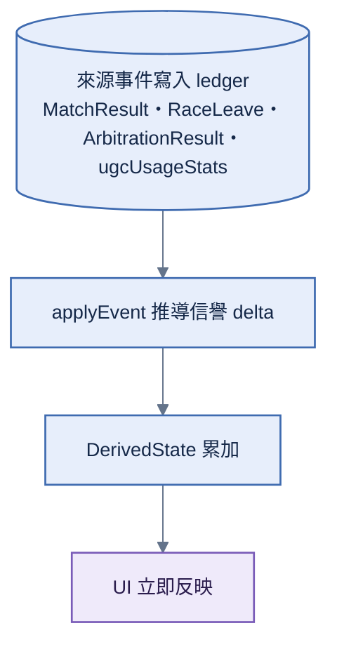

# 信譽變動

> **本檔角色**：玩家信譽**變動從來源事件 derive 到 DerivedState** 的流程（信譽無獨立事件）。
> 算式見 [../算式表.md §16](../算式表.md)；事件清單見 [../信譽系統.md §2](../信譽系統.md)。

## 1. 詳細流程

信譽**不開獨立事件**——由**來源事件** derive（同經濟）：

**步驟細目**：

1. **來源事件寫入 ledger**——MatchResultEvent（multisig；完賽 / 連勝 / 異常斷線）；RaceLeaveEvent（本人單簽；GO 後 voluntary leave）；ArbitrationResultEvent（檢舉成立依類型扣分（含剽竊）/ 檢舉準確 / 惡意檢舉）；ugcUsageStats 更新（被使用達門檻 / 高評分）。
2. **applyEvent 推導信譽 delta**——各來源 → ReputationDelta（target / delta / reason / causeEventId）；reason 對應加 / 扣分數值（信譽系統 [§2.2](../信譽系統.md#22-加分事件) / [§2.3](../信譽系統.md#23-扣分事件)）。
3. **DerivedState 累加**——reputation = clamp(500 + Σ delta, 0, 1000)（scores 存 raw）；新手下限 400 於**讀點**套用（`getEffectiveScore`，[../程式架構/reputation.md §4](../程式架構/reputation.md)——非累加時烘進分數）。
4. **UI 立即反映**——個人頁信譽分數更新 + 變動歷史（delta 串）prepend。

## 2. 加分 / 扣分事件

完整事件清單 + 加扣分數值見 [../信譽系統.md §2.2 / §2.3](../信譽系統.md)。

事件觸發來源摘要：

| 類別          | 來源                                                                                                                                                                                                                                                                                                                |
| ------------- | ------------------------------------------------------------------------------------------------------------------------------------------------------------------------------------------------------------------------------------------------------------------------------------------------------------------- |
| UGC milestone | derive 自 `ugcUsageStats`（累計達門檻）                                                                                                                                                                                                                                                                             |
| 比賽結果      | derive 自 `MatchResultEvent`（完賽 / 連勝 / 異常斷線；自 ranking / disconnects）——加分僅計 finisherCount ≥ 3 場＋rolling 24h 日額（`REPUTATION_MATCH_GAIN_DAILY_MAX`）；斷線罰**僅罰有本場簽章 loadout 者**（absent〔未交 loadout〕無參與證明不罰）、不受加分閘限制（[../信譽系統.md §2.2 / §2.3](../信譽系統.md)） |
| 主動離場      | derive 自本人單簽 `RaceLeaveEvent`；只立即套用本人 `disconnectCounts +1` 與 `frequent-disconnect -5`，不產生排名、TrueSkill、經濟或完賽效果；與同場 MatchResult 以 `(matchId, peerId)` 持久去重 |
| 仲裁結束      | derive 自 `ArbitrationResultEvent`（檢舉準確 +10 / 檢舉成立依類型 −20 或 −100（含剽竊）/ 惡意檢舉 −30）                                                                                                                                                                                                             |

**DMCA 下架零信譽足跡**（案件只約束各 provider 的供應出口、不進帳本或 client-wide derive；見 [../信譽系統.md §7](../信譽系統.md)）。

## 3. 新手保護

詳見 [../信譽系統.md §4.1](../信譽系統.md)：**唯一條款 = 註冊 < 7 天信譽下限 400**（仲裁扣分無新手豁免、檢舉門檻不因對象調整——純仲裁定罪門檻本身即防線）。

## 4. 信譽 = 純 derive（無獨立事件）

信譽不開獨立 ledger 事件；分數與 delta 都由來源事件純推導。`ReputationDelta` shape、reason 名錄與
applyEvent 掛點只由 [程式架構/reputation.md §1／§5](../程式架構/reputation.md) 定義，分數公式只由
[算式表.md §16](../算式表.md) 定義。

## 5. DerivedState 推導

DerivedState 推導是任何 peer 可重算的純函數；權威算式見 [算式表.md §16](../算式表.md)，
完整 reducer 與 state shape 見 [程式架構/reputation.md §2–§5](../程式架構/reputation.md)。

## 6. 信譽連動

`weight = log10(reputation + 10)` 用於仲裁加權投票（runtime 用整數 `weightX100` 預算表，[../算式表.md §17](../算式表.md)）；UGC 評分權重依信譽分三檔（0.5 / 1.0 / 1.5）。黑名單觸發 ＝ **純仲裁**：CID 級由仲裁通過寫 `BlacklistEvent`、玩家級 ＝ 三振純 derive——**無「加權檢舉超閾值」快速路徑**（[../信譽系統.md §2.4](../信譽系統.md)）。

完整公式見 [../算式表.md §17–19](../算式表.md)；連動規則見 [../信譽系統.md §2.4](../信譽系統.md)。

## 7. UI 顯示

個人頁信譽分數 + 變動歷史、UGC 卡片創作者信譽。詳見 [../信譽系統.md §3.1 / §9](../信譽系統.md)。

## 8. 異常情境

| 情境                       | 處理                                                                                                         |
| -------------------------- | ------------------------------------------------------------------------------------------------------------ |
| 信譽寫入                   | **信譽無獨立事件**——由來源事件（match / race-leave / 仲裁 / ugcUsageStats）derive；簽章與持久 `(matchId, peerId)` 離場效果去重由來源事件自理 |
| 衝突 delta（同時加分扣分） | DerivedState 純函數依**來源事件順序**累積、跨 peer 一致                                                      |

## 9. 跨模組對接

| 模組           | 內容                                                                                      |
| -------------- | ----------------------------------------------------------------------------------------- |
| `reputation/`  | 完整 event 清單 + derive 函數                                                             |
| `ugc-rating/`  | rating milestone → reputation +20                                                         |
| `moderation/`  | 檢舉成立 → 信譽扣分                                                                       |
| `dmca/`        | **零信譽足跡**（維運層下架、不進帳本；信譽扣分只走檢舉仲裁路線，[§2](#2-加分--扣分事件)） |
| `matchmaking/` | 新手保護期判定                                                                            |
| `ledger/`      | MatchResult／RaceLeave 等來源 event 寫入 + DerivedState                                   |
| `key-manager/` | event 簽章                                                                                |
