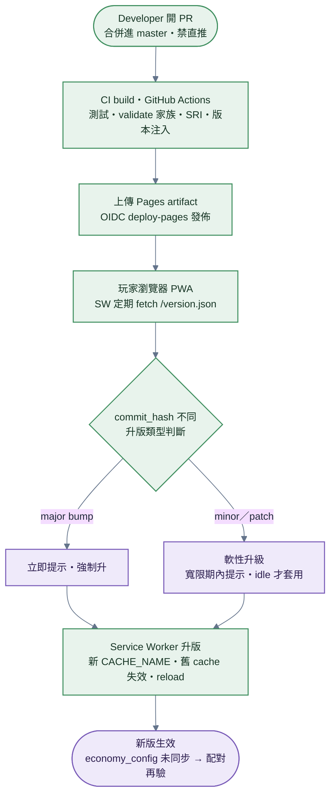
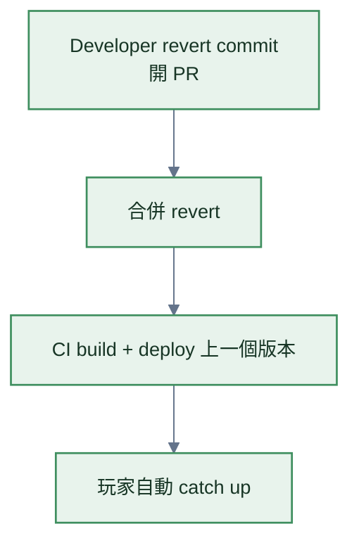

# 升版

> **本檔角色**：開發者 push 到 master 到玩家瀏覽器自動套用新版的流程。
> 版本系統見 [../版本規範.md](../版本規範.md)；部署環境見 [../部署資訊.md](../部署資訊.md)。

## 1. 詳細流程



**步驟細目**：

1. **Developer 開 PR → 合併進 master**（禁直推，見 [§8.2](#82-分支保護與-pr-工作流)）。
2. **CI build（GitHub Actions）**——驗 client_version 符合 X.Y.Z regex；跑單元測試（Vitest）；跑跨瀏覽器 fixture（Playwright）；validate 家族：`check:invariants` / spec↔const schema 一致性 / `i18n:validate` / `themes:validate`（[../程式架構/testing.md](../程式架構/testing.md) `validate` job）；`lighthouse.yml` 必跑 Lighthouse CI；生成 SRI hash。瀏覽器 bundle 不讀 `process.env`：client／protocol／derive／builtin／economy config 版本取自 [../部署資訊.md §11](../部署資訊.md#11-client-build-time-設定) 的編譯期權威，workflow 另在 build 後產生 `/version.json` 的 `commit_hash` 與 `build_timestamp`。
3. **Pages artifact 發佈**——build job 以 `actions/configure-pages` 與 `actions/upload-pages-artifact` 上傳產物；獨立 deploy job 取得 GitHub Pages OIDC 權限並執行 `actions/deploy-pages`，不寫部署分支。
4. **玩家瀏覽器 PWA**——Service Worker 啟動定期 fetch /version.json（network-only）；UPDATE_CHECK_INTERVAL_MS: 3_600_000（每小時）；比對 commit_hash；不同 → 觸發升版通知。
5. **升版通知判斷**——比對舊版 ↔ 新版 ClientVersionInfo；major bump（client major / protocol / derive_logic / builtin_assets）→ 立即提示，強制升；minor / patch → 軟性提示「2 分鐘後自動套用」。
6. **軟性升級**——啟動橫幅顯示新版本；UPDATE_FORCE_GRACE_PERIOD_MS: 86_400_000（24 小時寬限）；玩家可選「立即更新」或「等等」；寬限期過後 → 強制升級；套用（reload）僅在 idle：比賽 / 房間 / Stage 2 編輯中延後至離開後（[../版本規範.md §8.2](../版本規範.md) 套用時機 guard）。
7. **Service Worker 升版**——新版 SW 開始接管；新 CACHE_NAME（含 version hash）；舊版 cache 失效；reload 應用。
8. **新版生效**——玩家用新版繼續玩；若 economy_config 同步未完成 → 配對時再驗。

## 2. 升版分類

升版分類（patch / minor / major、是否擋配對）詳見 [../版本規範.md §3](../版本規範.md)。

升級提示對應：major → 立即強制；minor / patch → 軟性。

## 3. CI 流程細節

現行 workflow 與 required／scheduled／local 分工以
[程式架構/toolchain.md](../程式架構/toolchain.md) 的 inventory 為準：

1. `ci.yml` 執行 lint、型別、單元、跨瀏覽器 fixture、規則一致性與 production build。
2. `lighthouse.yml` 對 production profile 執行 required Lighthouse 門檻。
3. Pages build job 完成 CSP／SRI／版本注入後，以 `actions/configure-pages` 與
   `actions/upload-pages-artifact` 交付不可變 artifact。
4. 獨立 deploy job 只讀該 artifact，使用 Pages OIDC 權限執行 `actions/deploy-pages`。

## 4. CI 失敗處理

| 失敗類別                                | 處理        |
| --------------------------------------- | ----------- |
| Lint 錯誤                               | 阻擋 merge  |
| 單元測試失敗                            | 阻擋 merge  |
| 跨瀏覽器 fixture 失敗                   | 阻擋 merge  |
| 不變式違反                              | 阻擋 merge  |
| `client_version` 不符 X.Y.Z             | 阻擋 deploy |
| `rapier_version` 與 package.json 不一致 | 阻擋 deploy |
| 依賴 audit ≥ moderate                   | 阻擋 merge  |

## 5. Service Worker 升版機制

詳見 [../版本規範.md §8](../版本規範.md) + [../程式架構/pwa-offline.md §2](../程式架構/pwa-offline.md)。

### 5.1 Build 時嵌入

`CACHE_NAME = open4wd-${CLIENT_VERSION}-assets-${BUILTIN_ASSETS_VERSION}`（兩個版本值皆於 build 時直接嵌入）；activate
只清 `open4wd-` namespace 下的舊 cache。見 [../程式架構/versioning.md §7](../程式架構/versioning.md)。

### 5.2 Service Worker fetch version.json

```javascript
setInterval(async () => {
  const info = await (
    await fetch("/version.json", { cache: "no-cache" })
  ).json();
  if (info.commit_hash !== CURRENT_COMMIT) {
    triggerUpdateUI();
  }
}, UPDATE_CHECK_INTERVAL_MS);
```

### 5.3 升版 UI

| 升版類型 | UI 提示                                      |
| -------- | -------------------------------------------- |
| major    | 啟動橫幅「版本不相容，請立即更新」+ 阻擋配對 |
| minor    | 啟動橫幅「新版本 v1.3.0，2 分鐘後自動套用」  |
| patch    | 啟動橫幅「新版本 v1.2.4」+ 軟性套用          |

> 所有自動 / 強制套用皆受**套用時機 guard**（比賽 / 房間 / Stage 2 編輯中不 reload、延後至 idle，[../版本規範.md §8.2](../版本規範.md)）。

### 5.4 24 小時軟性寬限

寬限期內：

- 玩家可繼續用舊版
- 啟動橫幅持續提醒
- 寬限期過後：自動 unregister + reload

## 6. 強制重整

### 6.1 應用內按鈕

設定頁 → 「強制更新」：

1. unregister 所有 service worker
2. clear caches
3. reload

### 6.2 `/reset/` 逃生口

當 SW 卡死、應用無法啟動：

- 直接訪問 `/reset/`
- 純 static HTML，不依賴 SW
- 提供「清除所有快取 + 重新載入」按鈕

## 7. 升版影響配對

`checkCompatibility` 六欄位任一不同 → 擋配對；規範見 [../版本規範.md §5](../版本規範.md)，實作見 [../程式架構/versioning.md §2](../程式架構/versioning.md)。

major bump 後：

- 配對失敗時 UI 提示「您 v1.2.3，對手 v2.0.0；請立即更新」
- 提供「立即更新」按鈕（強制重整）

## 8. 變更操作流程（git × PR × 治理 × 上鏈）

> 本節是「開發 / 發布 / 治理 / 上鏈」操作順序的**集中權威**；[材質表.md §11](../材質表.md) / [程式架構/builtin-assets.md §7](../程式架構/builtin-assets.md) / [治理事件.md §6](治理事件.md) 等只留指標回此。

### 8.1 治理事件與升版解耦

`economy_config_version` 不需推 client 新版本：

- 由 ledger `ConfigUpdateEvent` 觸發、runtime 從 OrbitDB 讀最新值
- 配對 `checkCompatibility` 仍會驗（[../版本規範.md §5](../版本規範.md)）
- **development 本機 island** 可留空 ledger address／signer set 並使用 `genesisTimestamp = 0`，只供可重置開發資料使用；private／public 必須內嵌 receipt 的 exact address、正整數 timestamp 與 1 位或至少 3 位真 signer，之後才由治理 runtime 變更 economy config

詳見 [治理事件.md](治理事件.md)。**鏈上治理 runtime config = `economy_config` 單一傘**（政策群組 revShare / **forkDetection** + 經濟值群組 match_prize / creator_royalty / upload_costs / month_soft_cap，完整介面 + 預設見 [economy-config.md §17](../程式參數/economy-config.md#17-economy-configorbitdb-動態治理)（單一 authority）、套用邏輯見 [程式架構/economy.md](../程式架構/economy.md)；隨 `economy_config_version` 版控；**newcomer / reputation 為 protocol 常數不在 config**——[§17.3](../程式參數/economy-config.md#173-注意事項) 治理可調鐵則）；其餘（物理 / 材質 / 公版 / derive 演算法含 fork `fingerprintVersion`）全走 [§8.2](#82-分支保護與-pr-工作流) 純 client 發版，**無鏈上事件、無混合型**。

### 8.2 分支保護與 PR 工作流

- **`master` 受保護、禁止直推**；所有變更走 PR。（免費方案 branch protection 僅 public repo 可用——**private 開發期自律走 PR、切 public 當天啟用**；主 repo 可見性生命週期見 [../部署資訊.md §2.1](../部署資訊.md)。）
- CI 不變式 / 測試 / spec↔const review 全掛 **PR 閘門**（[§4](#4-ci-失敗處理)「阻擋 merge」）；merge 進 `master` = 觸發 [§1](#1-詳細流程) 自動部署 = 生效。
- 即使單人維護亦走 PR（留審計軌跡）。
- **`derive_logic` bump 的 PR 必載欄位**：生效切點（鏈上錨 ＝ 帳本檢查點 CID / 事件位置）＋ 追溯範圍（預設帶切點、既往不咎；政策權威 [../經濟系統.md §2.1](../經濟系統.md)）。

### 第一道真實破壞牆的原子清單

公開凍結前 baseline 仍維持 1；不得為尚未部署的歷史製造 checkpoint/protocol v2/v3。第一道真實破壞牆必須在同一批變更完成：

1. migration descriptor、上／下遷移純函式與 test vectors；
2. 可序列化 JSON metadata 與 TypeScript migration binding 逐筆對齊、生成 manifest、由 descriptor 派生的 walls、current/yanked version 一致性；
3. GLB loader 與可信 submitter 的 `open4wdVersion` stamping；
4. `asset-version-upgrade` exact schema、簽章、builder 與 admission catalog；
5. live content inspector／validator 與歷史 fold guard／atomic reducer；
6. `successorEdges`、`lineageNodeByCid`、checkpoint codec 與 royalty／rating／usage／milestone 節點聚合；
7. 以 entry CID 錨定的新 derive era（錨點本身用舊 era、下一 accepted entry 才切換）；
8. ADR、規格、rules/graph、release notes、`open-4wd/CONTRIBUTING.md` 所列基礎與本次變更適用檢查，以及 specs `pnpm check` 全綠。

任何一項未完成時，production admission 必須繼續拒絕升版事件。

### 8.3 公版資產 = 純 client 發版（不上鏈、無治理事件）

公版（builtin）在 git、不在鏈上 —— 同物理常數 / 材質數值，都是 build-time 資產、純 client 發版，**不走治理、無鏈上事件**。公版變更（新增 / 調整 / deprecate）= 編輯器 re-author → 匯出新 GLB → PR → CI → 推版（`builtin_assets_version` + client major）；與 UGC GLB 的鏈上提交流程**無關**。

- **CI 機械檢核**取代人工授權：GLB extras 合法（同 UGC Stage 3 validator）、`assets/builtin/` 物理烘焙值變動必 bump `builtin_assets_version`（path-based，[../版本規範.md §13](../版本規範.md)）。「數值平衡好不好」屬人類判斷 → [§8.2](#82-分支保護與-pr-工作流) PR review（與物理常數同標準）。
- **一致性 enforcement** 由 peer 端 `builtin-assets CID 比對` + 配對 `builtin_assets_version` 保證（[../版本規範.md §7](../版本規範.md)），不需鏈上事件。

> **材質廢止**同屬純 client 發版（minor、不 bump `builtin_assets_version`），見 [材質表.md §11](../材質表.md)。

詳見 [程式架構/builtin-assets.md §7](../程式架構/builtin-assets.md)。

### 8.4 Ledger Admission scheme 升級

Admission v1 的 hash domain、BaseEntry／proof shape、nonce 長度、大小公式與 18–22 bits 難度均為 protocol 常數，**不屬 `economy_config`，也沒有治理者可即時調整的 difficulty epoch**。治理者不逐筆簽署事件；日常 permissionless entry 由每位寫入者自行計算 proof。

Public freeze 後若需更改其中任一項，必須視為 protocol／ 鏈存取控制遷移：

1. PR 定義新 admission scheme、access-controller manifest、固定 vectors、完整 18-event／ 所有 ingress 測試與 client major／protocol bump；未知 scheme 必須 fail-closed。
2. 新舊 client 不得在同一 manifest 下對相同 bytes 使用不同 verdict；先發布可讀舊 v1、可驗新 scheme 的遷移 client。
3. 治理 signer 以既有 checkpoint 共識簽署明確生效 checkpoint／ 新 manifest；不是逐 entry 人工核准，也不是 runtime 自動依負載改難度。
4. 生效後新永久 entry 只接受新 scheme；舊 v1 歷史與既有 CID 永久可讀、可驗，不重寫、不重新挖礦。

目前仍在首次 public 前的開發期，Admission v1 直接作為 genesis 基線；本機只依 [pwa-offline.md §5](../程式架構/pwa-offline.md) 手動重置 `open-4wd` IndexedDB，不建立 admission-free 舊資料 migration。

## 9. 路徑型 bump 自動化

路徑型 bump 對照表詳見 [../版本規範.md §4](../版本規範.md)。

Conventional Commits（feat / fix / BREAKING CHANGE）+ path-based 雙重判定。

## 10. 異常情境

| 情境                        | 處理                                                                 |
| --------------------------- | -------------------------------------------------------------------- |
| GitHub Pages 暫時 down      | Service Worker fetch `/version.json` 失敗 → 軟性 fallback 用本地版本 + 警告 |
| 玩家在比賽中發生新版 deploy | 比賽結束前不切換（避免賽中異動）                                     |
| 不同 peer 升級速度不一      | major bump 立即擋配對 / minor 不擋 / 24 小時軟性寬限                 |
| Service Worker 註冊失敗     | 應用降級為 no-PWA 模式（仍可玩，但無離線快取）                       |
| Cache 損毀                  | `/reset/` 逃生口                                                     |

## 11. Rollback

若新版發現嚴重 bug：



注意：`client_version` 仍會 bump（不會回到舊版號），但實際 commit 內容回滾。Rollback 一律以新版本向前出貨，且不會把 `runtime_phase` 從 `live` 改回 `pre_launch`；經濟 re-derive 與 chain rebirth 也在 live emergency mode 下，依既有 checkpoint／major 程序執行。生命週期狀態與例外邊界見 [專案生命週期](../專案生命週期.md)。

## 12. 跨模組對接

| 模組           | 內容                                 |
| -------------- | ------------------------------------ |
| `versioning/`  | 完整版本系統 spec                    |
| `pwa-offline/` | Service Worker 升版                  |
| `seo/`         | 升版後 sitemap 重新生成              |
| `ledger/`      | economy_config_version 從 OrbitDB 讀 |
| GitHub Actions | CI/CD pipeline                       |
