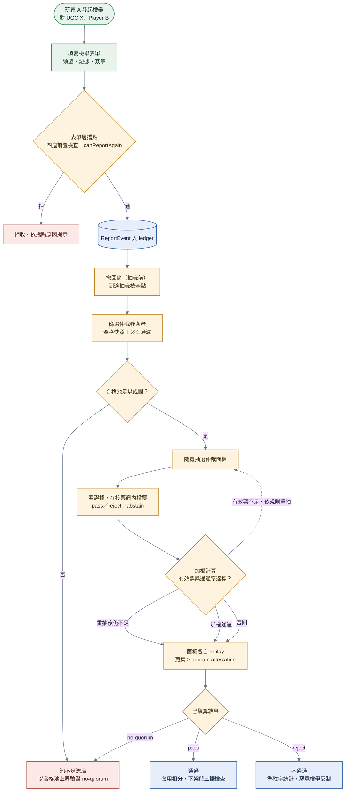
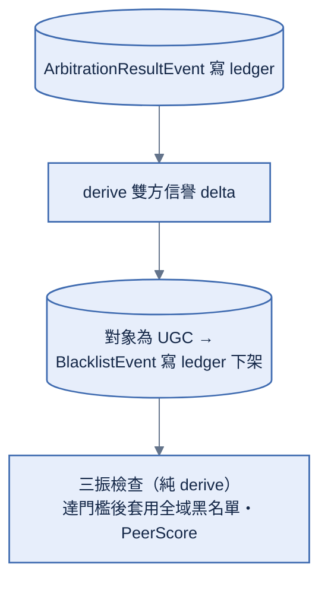
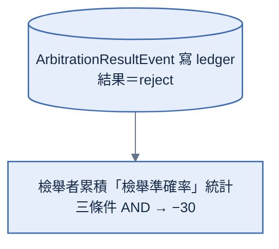

# 檢舉與仲裁

> **本檔角色**：玩家檢舉 UGC / 對手到仲裁投票完成的流程。
> DMCA 版權檢舉走獨立流程見 [DMCA.md](DMCA.md)。
> 信譽連動見 [../信譽系統.md §5](../信譽系統.md)。

## 1. 詳細流程



**步驟細目**：

1. **玩家 A 對某對象（UGC X / Player B）發起檢舉**，填寫檢舉表單——對象 CID 或 PeerId；檢舉類型（違反版權（含剽竊）/ 騷擾（限對話）/ 內容不當 / 其他）；至多 500 字補充說明；證據（screenshots / log fragment；騷擾時從同一 Player B 選取至多 16 則簽章聊天訊息，每則獨立 canonical 編碼且不超過 4096 UTF-8 bytes）；玩家 A 簽章。
2. **表單層擋點**（moderation.md [§4](../程式架構/moderation.md#4-撤回抽籤前-重新檢舉)，純 derive、全網同規則驗證）——CID 已在仲裁黑名單 → 拒（已下架；provider DMCA 案件不進此全域 gate——平行路線）；玩家已在全域黑名單 → 拒（已永 ban；其名下 CID 仍可逐一檢舉下架）；對象已有開放案 → 拒「已有審理中檢舉」（防同事件 k 案 pile-on 灌爆三振）；檢舉者同時開放案 ≥ REPORT_OPEN_MAX_PER_REPORTER（3，個人上限）→ 拒（防仲裁注意力洪水）；類型 × 對象不符（版權 →CID / 騷擾 → 玩家 / 內容不當 →CID / 其他 → 皆可）→ 拒。
3. **ReportEvent 入 ledger**。
4. **撤回窗（抽籤前）**——檢舉後首個滿 24h 的帳本檢查點 = 抽籤點；抽籤前可撤回：無任何後果（不進準確率、同對象可再告）；抽籤後不可撤（防重骰仲裁者）。
5. **篩選仲裁參與者**（資格取抽籤檢查點快照）——信譽 ≥ 200；比賽場數 ≥ 10；帳號年資 ≥ 30 天；非全域黑名單；兩造本人不入面板（檢舉者 / 被檢舉玩家 / 被檢舉 UGC 的作者）；與檢舉者 / 責任人無近期共同比賽（避免報復串；UGC 案先解析作者）。隨機抽選 7 位仲裁者（從合格池；池 < 7 → 流局）。
6. **仲裁者收到通知**——看補充說明與證據（screenshots / log / 簽章聊天訊息逐筆 canonical 解碼，驗 sender=signer 與 Ed25519 簽章；無效項明確標示）；看被檢舉對象本身（CID 內容 / 玩家歷史）；投票（pass / reject / abstain）——投票期 ARBITRATION_VOTE_WINDOW_HOURS（72h）。
7. **加權計算**（期滿 = 抽籤點起首個滿 72h 的帳本檢查點）——票集合 ＝ 該輪面板 × 窗內（log 序在期滿檢查點前）× 每人最後一筆（可改票；重抽輪不沿用第一輪票）；有效票（pass + reject）< 4 → 重抽一輪（上限 1 次），仍不足 → 流局；每仲裁者投票 weight = log10(reputation + 10)（抽籤快照；整數 weightX100 預算表，算式表 [§17](../算式表.md#17-信譽加權投票)）；加權通過比例 > 60% → 通過；否則 → 不通過。
8. **結果自證**——期滿後每位面板成員各自 replay 檢查點時間線與票序列，只簽自己算出的 `(reportEventId, target, result, passRatioX100)`；蒐集 **≥ quorum 份 attestation 才可寫結果事件**。`pass`、`reject` 與末輪票不足的 `no-quorum` 都適用；只有合格池 < 7、`arbiters=[]` 的流局沒有面板可簽，改由全網驗合格池上界。
9. **結果套用**（結果事件任一 peer 可寫、全網驗算防偽，moderation.md [§5.6](../程式架構/moderation.md#56-結果事件寫入與驗證permissionless--全網驗算)；流局 ＝ 寫 no-quorum 結果事件、同樣驗算）——**通過**：被檢舉者信譽扣分（依檢舉類型：-20 或 -100，見 [§2](#2-檢舉類型)）、對象為 UGC → BlacklistEvent 下架、檢舉者信譽 +10、責任人定罪累積 ≥ 3 → 全域玩家黑名單（純 derive 三振）→ peer-discovery 注入 PeerScore；**不通過**：累積到「檢舉準確率」統計、checkMaliciousReporter 三條件（已結案 ≥ 10 筆、lifetime 通過率 < 30%、30 天內未罰過）→ -30；**流局**：寫 result: 'no-quorum' 結果事件（零 delta；落 outcome 解除同對象序列化擋點）、不進準確率、同對象可立即再檢舉；上傳期案 = 解除 similarity-pending（經濟開始、不計安全港）。

## 2. 檢舉類型

| 類型               | 觸發條件                                                                                                            | 罰則（成立時）                                                                         |
| ------------------ | ------------------------------------------------------------------------------------------------------------------- | -------------------------------------------------------------------------------------- |
| 違反版權（含剽竊） | 上傳侵權內容；衍生未標 parentCid / mesh fingerprint 高度相似宣稱原創（版權方本人可另走 [DMCA.md](DMCA.md)） | 責任人 -100（`copyright-violation`）＋ UGC 下架                                        |
| 騷擾（限對話）     | 聊天辱罵 / 惡意訊息（證據 = 簽章聊天訊息）                                                                          | 被檢舉者 -20（`griefing`）                                                             |
| 內容不當           | UGC 含色情 / 血腥 / 仇恨等內容                                                                                      | 作者 -20（`ugc-blacklisted`）＋ UGC 下架                                               |
| 其他               | 自由填寫                                                                                                            | -20，reason 借對象所屬桶標籤（對 UGC → `ugc-blacklisted`＋下架 / 對玩家 → `griefing`） |

**作弊不是檢舉類型**：改物理 / 偽造輸入 / 結算做假由自動機制攔截（desync 偵測 / 簽章驗證 / 多簽驗算 / PeerScore）——能通過確定性驗證的行為仲裁也無從舉證；奇例走「其他」。比賽中的武器攻擊 / 破壞是合法玩法、不構成騷擾。

## 3. 黑名單機制

黑名單政策只由 [../信譽系統.md §6](../信譽系統.md) 定義，仲裁結果與三振 derive 只由
[../程式架構/moderation.md §5.4–§5.5](../程式架構/moderation.md) 定義，PeerScore 常數與注入只由
[network.md §10](../程式參數/network.md#10-networkpeer-discovery節點發現) 與
[../程式架構/peer-discovery.md](../程式架構/peer-discovery.md) 定義。

## 4. 仲裁參與者選擇

### 4.1 合格條件

池資格（取抽籤檢查點快照）：

- 信譽 ≥ 200
- 比賽場數 ≥ 10
- 帳號年資 ≥ 30 天（防 Sybil，與新手保護 7 天無關；註冊時間 = 首筆事件套用時的 `consensusNow`，[../信譽系統.md §4.1](../信譽系統.md)）
- 非全域黑名單（三振定罪者不得仲裁）

逐案過濾：

- **兩造本人不入面板**：檢舉者 / 被檢舉玩家 / 被檢舉 UGC 的**作者**
- 與檢舉者 / 責任人無近期共同比賽（最近 24h；UGC 案先解析作者再過濾）

### 4.2 隨機抽選

從合格池中隨機 **7 位**（`ARBITRATION_PANEL_SIZE = 7`，protocol 常數見 [../程式參數.md](../程式參數.md)）。抽籤點 = 檢舉後首個滿 24h 的帳本檢查點；隨機種子：`hash(reportId + 該帳本檢查點 timestamp)`，跨 peer deterministic（帳本檢查點見 [../程式架構/ledger.md](../程式架構/ledger.md)）。重抽（有效票不足時，上限 1 次）用新檢查點 seed、並排除第一輪缺席者。

**人數依據**：合格門檻使 weight ∈ [2.32, 3.00]（差距 ≤ 1.29×、近似人頭）；quorum 4 張有效票下，7 人只需 ~57% 回覆率即可成案（6 人要 67%，流局重抽反而燒掉整個新面板）；抗串謀主力是入池門檻 ＋ 逐案隨機抽 ＋ 共賽排除，人數再放大收益遞減。

## 5. 投票機制

### 5.1 投票期間

`ARBITRATION_VOTE_WINDOW_HOURS = 72`（[protocol.md §5](../程式參數/protocol.md#5-protocolledger鏈與多簽)，待 playtest 校準）。**期滿判定 = 抽籤點起首個滿此時數的帳本檢查點**（該檢查點兼任重抽 seed；重抽輪自重抽檢查點重新起算）。詳見 [../程式架構/moderation.md §5.3](../程式架構/moderation.md)。

### 5.2 投票選項

| 選項    | 意義                     |
| ------- | ------------------------ |
| pass    | 同意檢舉                 |
| reject  | 反對檢舉（被檢舉者無辜） |
| abstain | 棄權（不參與加權計算）   |

### 5.3 加權

```text
weight = log10(reputation + 10)
```

仲裁者 A reputation 800 → weight = 2.91
仲裁者 B reputation 200 → weight = 2.32

通過比例 = `Σ(pass × weight) / Σ((pass + reject) × weight)`

通過閾值 60%。信譽取**抽籤檢查點快照**（投票期間變動不影響本案）；runtime 用整數 `weightX100` 預算表 + 整數交叉相乘判定——**浮點 log10 不得進共識計算**（[../算式表.md §17](../算式表.md)）。票集合 ＝ 該輪面板成員 × 窗內（log 序在期滿檢查點前）× 每人取最後一筆；`arbitration-vote` 收件只做兩造排除＋窗界粗篩，精確面板與窗口由 tally 終判（[../程式架構/moderation.md §5.3](../程式架構/moderation.md)）。

## 6. 結果處理

### 6.1 通過



1. **derive 信譽 delta**（自本 ArbitrationResultEvent、無獨立事件）——責任人（被檢舉玩家本人 / 被定罪 UGC 的作者）：-20 或 -100（依檢舉類型，[§2](#2-檢舉類型)）；檢舉者：+10。
2. **對象為 UGC** → BlacklistEvent 寫 ledger（下架）。
3. **三振檢查（純 derive、無獨立事件）**——同一責任人仲裁定罪累積 ≥ 3 → 全域玩家黑名單；注入 peer-discovery PeerScore；其他 client 自動忽略該 PeerId。

### 6.2 不通過



準確率為 lifetime 累積（非滑動窗）；checkMaliciousReporter 三條件 AND（[../信譽系統.md §4.3](../信譽系統.md)）：已結案 ≥ 10 筆、通過率 < 30%、30 天內未罰過 → -30（重複惡意檢舉）。

### 6.3 棄權 / 有效票不足（流局）

Quorum = **4 張有效票**（pass + reject，棄權不計——否則 3 棄權 + 1 pass 也「達標」，變一人定生死）：

- 投票期滿有效票 < 4 → 重抽一輪（上限 1 次；新檢查點 seed、排除第一輪缺席者）
- 第二輪仍 < 4 → **流局**：非 reject、不進檢舉者準確率（沒人投票 ≠ 檢舉不實）、同對象可再檢舉；末輪面板各自 replay 並蒐集 ≥ quorum 份 attestation 後，任一 peer 才可寫 `result: 'no-quorum'` 結果事件（[../程式架構/moderation.md §5.3／§5.6](../程式架構/moderation.md)）
- 合格池 < 7 → 直接流局（同樣寫 no-quorum 結果事件、`arbiters = []`）

## 7. 仲裁者激勵（開放項）

目前**無投票激勵**。playtest 觀察回覆率：若有效票長期不足 quorum，再考慮「每張有效票 +1 信譽」（屆時新增 reason、屬 client 發版；**非治理 config**）。

## 8. 信譽連動

| 結果                    | 影響                                                    |
| ----------------------- | ------------------------------------------------------- |
| 檢舉通過                | 檢舉者 +10 / 責任人 -20 或 -100（依檢舉類型）           |
| 檢舉未通過              | 累積「準確率」統計                                      |
| 流局 / 抽籤前撤回       | 不計入準確率、無任何懲罰                                |
| 檢舉者準確率 < 30% 累積 | 檢舉者 -30                                              |
| 仲裁者投票（無論結果）  | 暫不直接影響信譽（見 [§7](#7-仲裁者激勵開放項) 開放項） |

詳見 [信譽變動.md](信譽變動.md)。

## 9. UGC 黑名單後續

UGC 被加入黑名單（CID 級）後：

1. 各 pinning provider 從已驗 ledger derive 仲裁黑名單，自動 unpin 自己控制的 CID 並拒絕重新 pin
2. 各 peer 從同一 ledger derive 全域玩家黑名單，將結果注入本機 PeerScore；不另廣播黑名單訊息
3. 客戶端在 UGC 詳情頁顯示「已下架」
4. 上傳檢核：pre-check 只比對仲裁黑名單（derive 自 `BlacklistEvent`）；provider DMCA 案件不進 client-wide 上傳 gate（[../程式架構/dmca.md](../程式架構/dmca.md)）
5. **歷史 royalty 不回收**（既得權益保護）

詳見 [../版權.md §10](../版權.md)。

## 10. 玩家黑名單後續

**觸發 = 純 derive 三振**（同一責任人仲裁定罪累積 ≥ 3，無獨立事件；[../程式架構/moderation.md §5.5](../程式架構/moderation.md)）。此為**全域黑名單**——與玩家本地的「個人封鎖清單（blocklist）」無關（[../賽內機制.md §1](../賽內機制.md)）。PeerId 被加入黑名單後：

1. peer-discovery PeerScore < REJECT 閾值
2. 其他 client 拒絕與該 PeerId mesh 連線
3. matchmaking 拒配對
4. 已存在的 ledger event / UGC 不刪除（不可改性）
5. 玩家可建新 PeerId（無中心管理）→ 但無法繼承舊資產

## 11. 異常情境

| 情境                                  | 處理                                                                                                                             |
| ------------------------------------- | -------------------------------------------------------------------------------------------------------------------------------- |
| 合格池 < 7                            | 流局（同對象可**立即**再檢舉——池未成長前再告仍會流局；檢舉案本身 90 天自動過期）                                                 |
| 投票期滿有效票 < 4                    | 重抽一輪（上限 1 次）；仍不足 → 流局（不進準確率、可再告）                                                                       |
| 證據不可驗（截圖 / log 無法離線驗真） | 仲裁者自行權衡證據力（證據隨 `ReportEvent` 上鏈簽章、事後不可竄改）；簽章聊天訊息可離線驗真                                      |
| 玩家退坑後（PeerId 不在線）           | 仍可被檢舉（PeerId 永久綁定歷史）                                                                                                |
| 帳本檢查點停擺                        | 抽籤 / 期滿全掛檢查點節奏——`LEDGER_CHECKPOINT_INTERVAL_HOURS`（24）觸發提案（[../程式架構/ledger-checkpoint.md §3](../程式架構/ledger-checkpoint.md)） |

## 12. 跨模組對接

| 模組              | 內容                                                  |
| ----------------- | ----------------------------------------------------- |
| `moderation/`     | 檢舉 + 仲裁完整 spec                                  |
| `reputation/`     | 信譽變動套用                                          |
| `peer-discovery/` | PeerScore 黑名單                                      |
| `dmca/`           | 版權方本人路線（維運層，與本流程分離）                |
| `ledger/`         | ReportEvent / ArbitrationResultEvent / BlacklistEvent |
| `key-manager/`    | 簽章                                                  |
