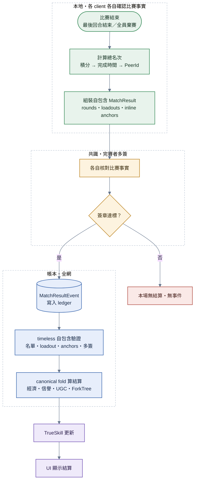

# 比賽結算

> **本檔角色**：完賽後從計算名次到鑄幣 / 信譽更新的流程。
> 算式見 [../算式表.md §12–15, §16–17](../算式表.md)；經濟見 [../經濟系統.md](../經濟系統.md)。

## 1. 詳細流程



**步驟細目**：

1. **比賽結束觸發**——最後一回合（第 N 回合）結束 / 全員棄賽。
2. **計算總名次**——N 回合積分加總（roundPoints = P − k + 1，算式表 [§20.1](../算式表.md#201-多回合積分與總名次)）由高到低；同分 → 總完成時間（DNF 回合計該回合時限）少 → 多；仍同 → PeerId lexicographic。
3. **組裝自包含比賽事實**——`MatchResultEvent` 只含 rounds、總名次、loadouts、disconnects、grid proof 與逐回合 `roundAnchors[]`；不攜帶 payout、經濟 frontier 或 fold 前態。每張 inline anchor 都綁定 `matchId`、round、終局 tail、在場 roster，以及外層 grid proof 的 `gridContextDigest + gridSeed`。
4. **多簽背書**——⌊N/2⌋+1 完賽者各自核對 candidate 與本機賽內觀測；一致才簽章，不一致拒簽（湊不滿門檻 → 本場無結算、無事件，[§9](#9-多簽未達門檻無結算無事件)）。簽章背書的是比賽事實，不是自行申報的獎金。
5. **簽章門檻達標**——`MatchResultEvent` 寫入 ledger（一場比賽一筆）；信譽、UGC 使用統計與經濟結算都由事件位置的 canonical fold 推導，非另存。
6. **自包含驗證（全網、非參與者，[§8.6](#86-收件驗證全網非參與者)）**——live admission 與 timeless fold 使用同一套名單、grid/loadout proof、inline anchor 與多簽驗證；不 dereference 外部 CID、不信任事件指定前態。
7. **canonical fold 自動更新**——依事件前一位置的 `DerivedState` 計算 `mintEligible`、獎金、royalty、三層分潤與月硬頂，再更新 Economy／Reputation／UGC／ForkTree。rolling window 的時間一律取 `state.derivedAt`，不取可倒填的事件 timestamp。
8. **TrueSkill 更新**——每位玩家 (μ, σ) 演化；新人 σ 大 → 變動快；資深玩家 σ 小 → 穩定。
9. **UI 顯示結算**——名次榜；我方獎金 / 鑄幣；我方 rating 變動；我方信譽變動；用到的 UGC 創作者收益（公開透明）。

## 2. 比賽獎金

依名次 × 玩家數 × 月軟曲線係數計算，bigint 整除尾數抹零（共識安全）。

公式 + 8 人賽範例見 [../經濟系統.md §6](../經濟系統.md)；純算式見 [../算式表.md §13](../算式表.md)。

## 3. 整除尾數抹零（共識關鍵）

所有鑄幣公式 bigint 整除；截斷的小數**不發給任何人、不累加滯留池、不補給冠軍**。

跨 JS 引擎 / CPU 架構結果一致論證見 [../經濟系統.md §13](../經濟系統.md)。

## 4. Royalty（創作回饋金）

`base × rating/5 × niche × monthFactor` 計算，24h 同 `(cid, player)` 去重。

公式見 [../算式表.md §14](../算式表.md)；Niche 線性連續（×0.5–×2.0 clamp）見 [../經濟系統.md §7.1](../經濟系統.md)。

## 5. 三層分潤（70 / 20 / 10）

每筆 royalty 依 fork 樹拆 current / parent / grandparent。封頂 3 層；治理可調。

詳見 [../經濟系統.md §8](../經濟系統.md) + [../版權.md §3](../版權.md) + 算式見 [../算式表.md §15](../算式表.md)。

## 6. 信譽變動（derive、無獨立事件）

賽後信譽變動**自 `MatchResultEvent` derive**（同經濟、不另開事件）：

| 來源 | 加分 / 扣分 |
|---|---|
| 完賽（每場非斷線）| +1 |
| 連勝 5 場 | +5 |
| 異常斷線（每次，僅罰有本場簽章 loadout 者；absent 不罰）| -5 |
| UGC 被使用達門檻（每 100 次，自 ugcUsageStats）| +5 |

加分（+1 / +5）僅計 finisherCount ≥ 3 之場、受 rolling 24h 日額（`REPUTATION_MATCH_GAIN_DAILY_MAX`）；斷線罰不受限（但 absent〔未交 loadout〕不罰）。詳見 [../信譽系統.md §2 / §10](../信譽系統.md)。

## 7. TrueSkill 更新

每場後依名次調整 (μ, σ)；新人 σ 大、資深 σ 小；FFA 不平手。

公式詳見 [../算式表.md §20](../算式表.md)。

## 8. 簽章門檻

依〔LEDGER-R-095〕，`⌊N/2⌋+1` 完賽者多簽的 N **一律**為 original active roster（`ranking ∪ disconnects` 去重），`disconnects.reason` 不得改變分母；signer 仍只能是非 forfeit 完賽者。覆蓋完整 candidate 的 `signatures` 同時是 removal certificate，少數分割側不能把失聯者改標 voluntary 後縮小分母自行定稿。

| Original active roster N | 簽章門檻 |
|---|---|
| 8 | 5 |
| 7 | 4 |
| 6 | 4 |
| 5 | 3 |
| 4 | 3 |
| 3 | 2 |
| 2 | 2（finisherCount < 3 → 整場經濟 void，**事件照寫**；match facts 仍走完整簽章，fold 才產生空 settlement，[../經濟系統.md §6.2](../經濟系統.md)）|

### 8.1 多訊息協議

完賽 → 簽章 → 寫 ledger 全程透過 5 種 P2P 訊息：

| 訊息類型 | 發送方 | 用途 |
|---|---|---|
| `SettlementProposalMessage` | 主 peer | 比賽結束後廣播自包含 candidate；`proposerSignature` 自簽算進 quorum |
| `SettlementSignatureMessage` | 完賽者 | 比賽事實核對通過後簽章背書（含 `candidateHash`）|
| `SettlementRejectMessage` | 完賽者 | 本機觀測或自包含證明不一致時拒簽（含 `reason`），透明審計 |
| `SettlementTakeoverMessage` | 任一完賽者 | 主 peer 中斷時沿用原 candidate 與已收集簽章接手；candidate 不含 settlement/frontier |
| `SettlementCancelMessage` | 建案主 | 決定性拒簽者過多（quorum 不可能湊滿）＝主動終局，全員即刻收攤免等滿窗 |

### 8.2 時間窗

| 階段 | 預設 | 行為 |
|---|---|---|
| `SETTLEMENT_TIMEOUT_SEC` | 30 秒 | 簽章收集總超時；達不到視為失敗、本場無經濟結算 |
| `SETTLEMENT_TAKEOVER_WAIT_SEC` | 5 秒 | 收到第一個 takeover 後等候窗，蒐集所有合法 takeover，最後選 `PeerId byte-order` 最小者為新主 |

常數定義見 [protocol.md §7](../程式參數/protocol.md#7-protocolgameplay比賽)（protocol/gameplay；settlement 時序屬協議常數、非經濟治理 config）。

### 8.3 主 peer 流程

```text
1. 比賽結束（最後一回合結束 / 全員棄賽）
2. 主 peer 由 N 回合 rounds[] 算總名次（`deriveTotalRanking`，算式表 §20.1）
3. 收齊逐回合 inline anchor 證書，驗證其 grid binding、終局 tail、在場名單與多簽
4. { candidate, proposerSignature } = buildMatchResultCandidate(...)
5. 廣播 SettlementProposalMessage（之後週期重送至定稿——各 peer 進窗時序不同、
   單發漏收＝takeover 無 candidate 可接）
6. 啟動 `SETTLEMENT_TIMEOUT_SEC` 計時器
7. 收集 Signature / Reject 直到：
   - 累計簽章 ≥ ⌊N/2⌋+1 → 寫入 ledger
   - 完賽者扣除決定性拒簽者 < 需要的 → 主動廣播取消（transient 拒簽不計、
     後補簽章覆蓋先前拒簽）
   - timeout 到 → 視為失敗
```

**定稿回報 ＝ 鏈上確認**：各端（含主）以「已驗證套用的 `MatchResultEvent` 出現」為唯一成功出口——「已簽即樂觀定稿」會在主死於寫入前時誤報成功；湊滿而未上鏈 ＝ takeover 收尾。

### 8.4 完賽者驗算流程

收到 `SettlementProposalMessage` 後：

```text
0. 提案者身分閘：candidate.peerId ≠ 本機觀測的合法主（非 forfeit 完賽者
   byte-min）→ 忽略（不鎖 candidate、真主提案仍可審）——防非主搶發偽案收割簽章
1. 驗證 candidate 的 matchId/grid proof/loadout participation/inline round anchors/外層 quorum
2. 本機觀測錨：candidate.rounds / loadouts 與自身賽內觀測、賽前交換提交比對
   ——防「內部自洽但憑空捏造」的名次騙取多簽
3. 結果一致 → 廣播 SettlementSignatureMessage（之後等鏈上確認、不樂觀定稿）
4. 不一致 → 廣播 SettlementRejectMessage（含 reason，所有 peer 透明審計）；
   決定性拒簽的 candidate 以 hash 記住、重送不重審（重發 Reject 供收集端記帳）
```

### 8.5 異常情境

| 情境 | 處理 |
|---|---|
| 完賽者驗算不一致 | 拒簽 + 廣播 Reject |
| 主 peer 的本機觀測或 anchor 落後 | 補齊比賽事實後重組 candidate；經濟 state 不進 proposal |
| 主 peer 惡意 | 完賽者多數拒簽 → 達不到門檻 → 無結算；Reject 只供本場透明審計，不自動轉成檢舉或裁決 |
| **主 peer 簽章中斷線** | 任一已收到 candidate 的完賽者廣播 `SettlementTakeoverMessage` 接手 |
| **接收 takeover 時 collectedSignatures 驗證** | 每個 peer **逐一驗證** 每個 sig 對 candidate 合法；任一不合法 → 視為惡意 takeover、忽略 |
| **兩個完賽者同時接手** | 5 秒等候窗：蒐集所有合法 takeover，選 PeerId byte-order 最小者為新主；彼此漏收致雙主並行 append＝重複條目由 fold 端 match-result 全鏈冪等閘（同 matchId 已入帳＝no-op）吸收 |
| takeover 後 timeout 處理 | 新主接手後 timeout **重新計時** 完整 `SETTLEMENT_TIMEOUT_SEC` |
| 完賽者拒簽 | 不停 quorum、不否決其他簽章；主 peer 視為「該 peer 不會簽」、從剩餘繼續收集 |
| fold 時跨月 | 以 canonical `state.derivedAt` 執行 UTC 月 rollover；candidate 不帶 monthFactor |
| 非鑄幣場 | 仍走完整簽章流程；fold 產生 `not-eligible`/`monthly-hard-cap` outcome，balances 不變但 matchRecord 仍留稽核資料 |

### 8.6 收件驗證（全網、非參與者）

多簽只證明「完賽者同意」。因 OrbitDB public-write 允許直接 append 舊時戳事件，安全條件不得只存在 live admission；`appendEvent` 與 timeless fold 對 `match-result` 使用同一套自包含驗證（權威見 [../程式架構/ledger-admission.md §1](../程式架構/ledger-admission.md)）：

0. **matchId 綁 roster 與起跑證明**：`matchId === deriveMatchId(sorted(ranking ∪ disconnects), startedAt, matchRules, gridProof)`（與 [../程式架構/ledger-admission.md §1](../程式架構/ledger-admission.md)／[../程式架構/matchmaking.md §4.1](../程式架構/matchmaking.md) 同式）——自陳名單或挪用他場 grid proof 都配不出合法 id，擋單人自簽搶佔 `matchId` 毒化冪等去重集
1. `signatures[]` ≥ ⌊N/2⌋+1、signer ∈ 非 forfeit 完賽者、簽章對整事件有效
2. `roundAnchors.length === rounds.length`；每張證書須自包含 match/round、120-frame 終局 tail、anchor timestamp、canonical present roster 與嚴格多數簽章，且 `gridContextDigest + gridSeed` 必須與外層完整 `gridProof` 相符。缺證書以 `null` 表示，該場 canonical settlement 為不具鑄幣資格。
3. fold 在套用位置直接從前態執行 `computeMatchSettlement(event, state)`，不接受事件 supplied payout、frontier、rating/base snapshot；金額無法由共謀 roster 自選。
4. incoming mint 加入後若超過月硬頂，整筆 outcome 為 `monthly-hard-cap` 且不入帳；不是等既有值達頂才擋。live 首播另有 ±30 秒 anti-replay，但這不是 fold 安全邊界。

> 假比賽**內容**（共謀房假名次）P2P 無從外部驗證；但經濟結果只由 canonical state、固定公式與 hard cap 產生。完整 grid proof 只在外層保留一次；每回合 anchor 簽其 digest 與 seed，避免 8 人 × 5 回合事件超過 64 KiB。

## 9. 多簽未達門檻（無結算、無事件）

`SETTLEMENT_TIMEOUT_SEC` 內湊不滿 ⌊N/2⌋+1（驗算不一致拒簽 / 掉線）→ **本場無 `MatchResultEvent`**——該場不存在於帳本：無獎金、無 royalty、無信譽變動、無 TrueSkill、無 matchRecord（信譽與 TrueSkill 全由 `MatchResultEvent` derive，事件不存在即無從套用）。玩家重新配對即可；惡意主 peer / 驗算不一致 / takeover 情境見 [§8.5](#85-異常情境)。

> **無仲裁路徑**：settlement 正確性是**客觀可重算**的（[§8.6](#86-收件驗證全網非參與者) 收件驗證即機械比對）；名次真偽外部本就無從驗證——主觀投票裁客觀算術是錯的工具。

## 10. 月軟曲線

月初 UTC 1 號 `monthMinted = 0` 重置；月度跨界 `checkMonthRollover` 時序保證見 [../經濟系統.md §5.1](../經濟系統.md)。

公式見 [../算式表.md §12](../算式表.md)。

## 11. 24h K=5 防刷 + per-player 有獎場數上限

同 `comboHash`（sorted PeerIds）24h 內最多 5 場**具鑄幣資格**（`mintEligible`——獎金 / royalty / usage 統計整場同閘），防固定 8 人圈刷無限獎金與 royalty；另同一玩家 24h 內最多 `player_prized_matches_per_day`（20）場領獎（防輪換組合繞過 K=5——個人層第二道防線，名次保留、不影響他人）。

詳見 [../經濟系統.md §6.1 / §6.1b / §6.2](../經濟系統.md)。

## 12. 異常情境

| 情境 | 處理 |
|---|---|
| 部分玩家離場或拒簽 | 餘下完賽者可簽，但不論 network／voluntary，門檻都取 original active roster：3→2、4→3、2→2；拿不到嚴格多數即無 MatchResult |
| 玩家本人主動離場 | GO 後 best-effort 上鏈本人單簽 `RaceLeaveEvent`；只立即套用本人斷線計次與 −5，不能縮小 MatchResult quorum；與後續 MatchResult 以 `(matchId, peerId)` 去重 |
| 無 quorum／結算取消 | 任一仍在場完賽者可上鏈零經濟、零評分、零全域處罰的 `RaceAbortEvidenceEvent`，保存有界 frame 摘要、訊息 digest 與本機觀察；整場仍 fail-closed |
| 網路分割 4 人 2–2／2 人 1–1 | 兩側都拿不到原 roster 嚴格多數，`partition-void`，不得進 settlement |
| 完賽人數 < 3（斷線 / 棄賽致）| MatchResultEvent 仍寫完整名次；canonical fold 產生的 `matchPrizes` / `royalties` 全空（經濟 void），事件本身不含 payout；防全員斷線刷幣（[../經濟系統.md §6.2](../經濟系統.md)）|
| 全玩家斷線 | MatchResultEvent 無法寫入 → 該場不存在於帳本（同 [§9](#9-多簽未達門檻無結算無事件)：無名次 / 無獎金 / 無 TrueSkill）|
| candidate hash 不一致 | 拒簽 + 廣播 Reject（[§8.5](#85-異常情境)）；湊不滿 ⌊N/2⌋+1 → 本場無結算、無事件（[§9](#9-多簽未達門檻無結算無事件)，**無仲裁路徑**——各端直接核對 match facts）|
| 回合 timeout 強制結束 | 依當前名次定該回合名次，少數玩家可能未完該回合（不影響 match 續行）|

## 13. 結算頁 UX（`/result/:resultId`）

正式 resultId 是 64 位小寫 matchId digest，resolver 才可查 ledger；本機 resultId 為
`local-result-<uuid>`，只查 session-scoped 本機結果儲存，缺資料回 `/race-config`，不得以
本機 id 呼叫 ledger provider。兩者共用 ResultPage，但本機摘要不含或冒充 matchId。

正式 participant／spectator 都只能在已驗證套用的 MatchResult 出現後進入共用 ResultPage。
spectator 的 `result-ready` 只攜帶 matchId 與 RoomId 參照，頁面仍須獨立查 verified MatchRecord；
等待期間不顯示摘要，查無或驗證失敗直接回原 RoomPage。RoomSession 保留至使用者看完手動
返回。公開區顯示排名、回合、最快圈、結束原因、破壞統計與 rating／reward；participant
另有再戰操作，spectator 不得取得 participant action。

| 區塊 | 內容 |
|---|---|
| 勝者 3D 展示 | **總名次**第 1 名車輛 3D 模型旋轉展示（含創作者署名）|
| 總排名表 | 完整**總名次**（積分加總）、各人鑄幣 / royalty / TrueSkill Δ / 信譽 Δ |
| 回合明細 | 各回合（場地 / 該回合名次 / 積分）逐回合展開 |
| 比賽彩蛋 | 破壞物統計（撞壞多少 entity）、撞擊熱點圖（場地俯瞰 + 撞擊密度色塊）、最快圈速、最猛攻擊瞬間 |
| UGC 創作者收益 | 公開透明列出本場（N 回合）用到的 UGC 與各創作者收到 royalty（含 fork 分潤路徑）|
| 賽後操作 | participant 可請求同房再戰；所有具 RoomSession context 的角色都可手動返回 `/room/:roomId`，spectator 不顯示再戰操作 |

設計理由：彩蛋是「物理湧現結果的視覺化」，讓玩家感受 UGC 賽事真正發生的互動。

## 14. 跨模組對接

跨模組名稱、責任與實作路徑只由 [程式架構.md §1](../程式架構.md) 的模組表定義；本流程各步
在首次使用處連到相應實作 authority，模組摘要以該表為準。
