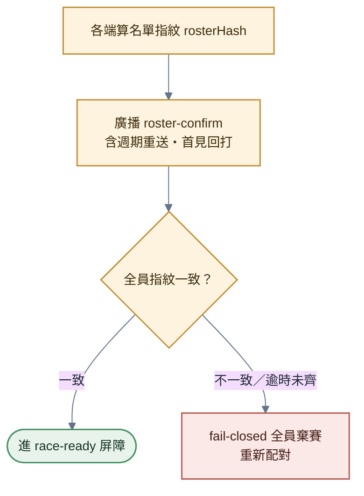
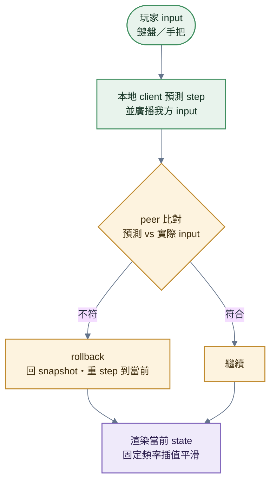
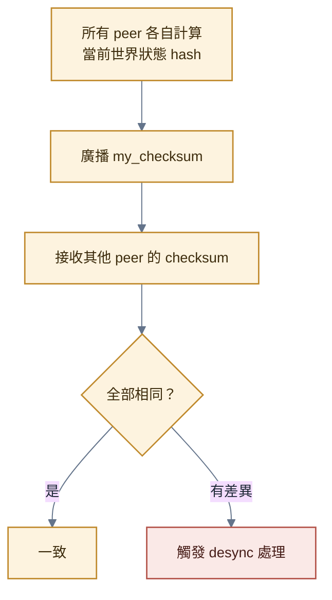
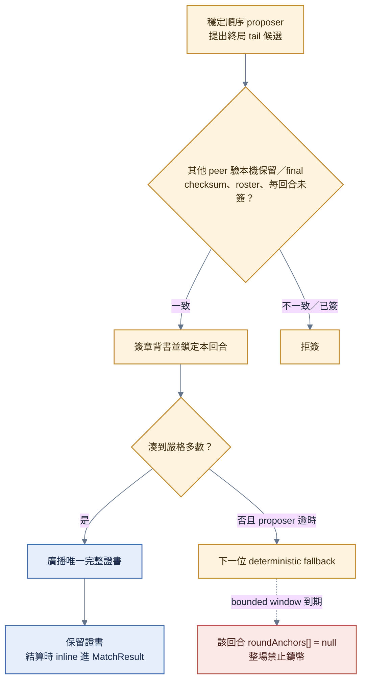
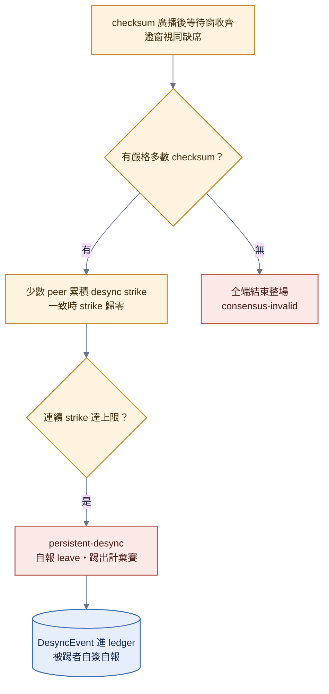
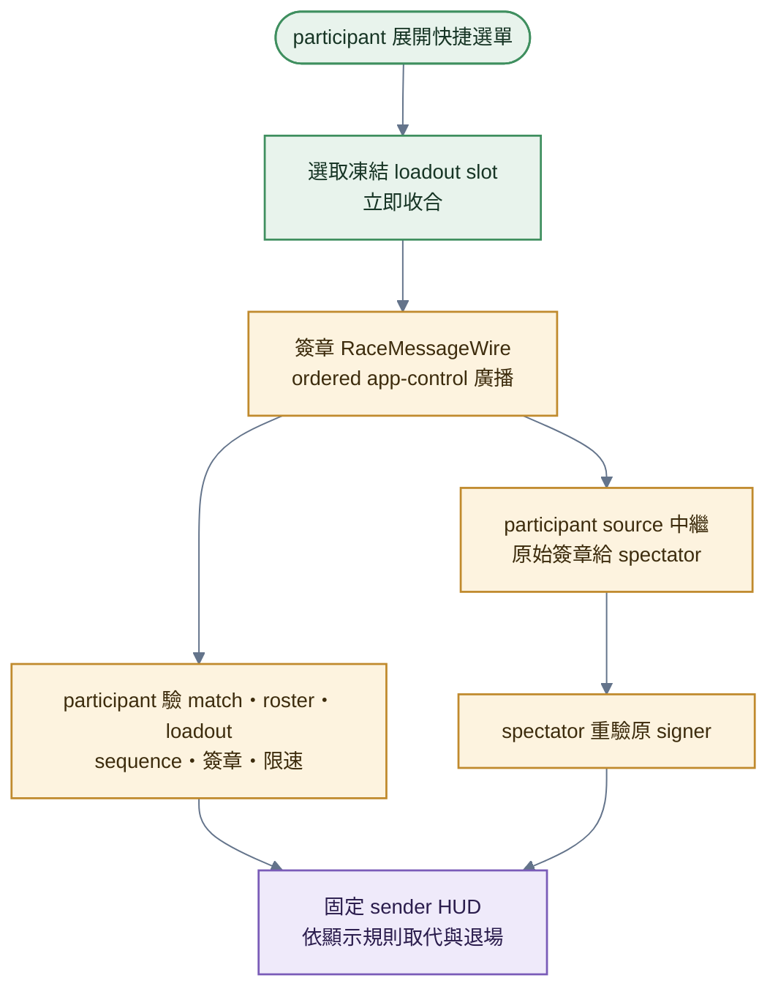
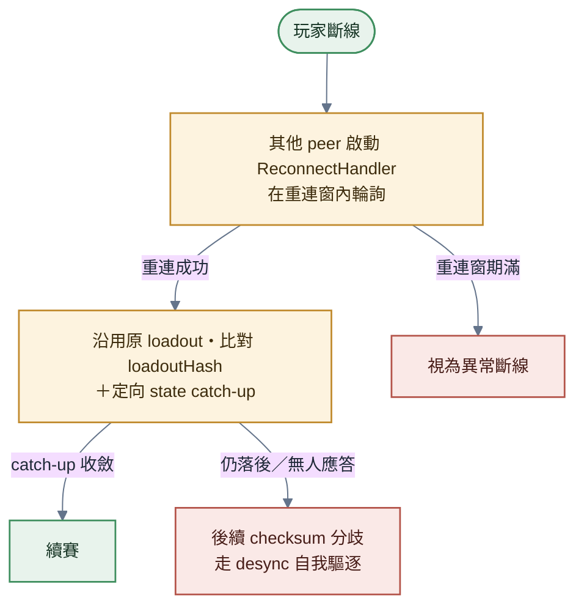

# 比賽進行

> **本檔角色**：從等待房鎖定資料的 preloading 二次驗證、GO 前 race-ready 屏障到完賽 / 超時的所有同步機制。
> 結算流程見 [比賽結算.md](比賽結算.md)；演算法見 [../算式表.md](../算式表.md)。

## 1. 鎖定裝備的二次驗證與參與證明（LoadoutSubmission）

等待房的 `ReadyDeclaration` 已經是最終選車，並已收進不可變的 `LockedStartPackage`。`preloading` 狀態不再允許換車；仍在線的 survivor 在固定時間內重送 matchId-bound `LoadoutSubmission`，用途是取得 ledger 參與證明並對鎖定資料作第二道驗證。倒數中已確認的 `preStartDisconnects` 不建立 race transport、不要求提交，也不提供本場重連；他們仍保留在 original roster、matchId 與原起跑格。提交與 survivor roster 交叉核對完成後才建立本回合 world／network／presentation；GO 倒數與模擬 frame pump仍須再通過 [§1.7](#17-go-前-race-ready-屏障)。

### 1.1 提交時間窗

| 階段 | 時長 | 行為 |
|---|---|---|
| 等待提交 | `LOADOUT_SUBMIT_WINDOW_SEC`（60 秒）| 收集 survivor participants 的 LoadoutSubmission；窗內收件即驗，無獨立互驗窗 |
| 完成提交階段 | — | 收到且精確符合 LockedStartPackage → 進 survivor roster 交叉核對；未提交者列為 disconnect，仍須滿足 original roster 的至少 2 人嚴格多數 |

提交窗以注入的單調時鐘記錄絕對 deadline；`setTimeout` 只負責喚醒並在 callback 時重算剩餘時間，不能把背景分頁被瀏覽器夾長的 timer 當成協議時鐘。回到前景時立即重評 deadline；尚未到期但 2 秒重送已逾期，只補送目前提交一次並從當下排下一次，不追補成 burst。

### 1.2 提交訊息

```typescript
interface LoadoutSubmission {
  type: 'loadout-submit';
  matchId: string;
  participant: PeerId;
  loadout: MatchParticipantLoadout;  // carRotation（一車 / 回合）；見 車輛組裝.md
  submittedAt: Timestamp;
  signature: Signature;
}
```

### 1.3 驗證項

| 項 | 規則 |
|---|---|
| 簽章 | Ed25519 驗章，**綁 matchId**（簽 `loadoutSigningMessage(matchId, loadout)`＝跨場不可重放；賽後隨結算存 `loadoutSignatures`＝參與證明，見 [§1.4](#14-不上鏈)）|
| 鎖定資料一致 | participant 與 `carRotation` 必須精確等於 `LockedStartPackage` 的 ReadyDeclaration；車庫後續修改或替換提交一律 fail closed |
| Loadout 結構 | 8 類 part 對應、Mount 配對演算法通過、`passive_weight_split_pct` 值域與 passive-only（[../車輛組裝.md §3.5](../車輛組裝.md)）|
| 整車約束 | 依 [零件與共用介面.md §7.1](../建模參數/零件與共用介面.md#7-約束限制stage-1--stage-3-嚴格檢核) 的單一權威值檢核 |
| 黑名單檢查 | 用到的 CID 不在 moderation 黑名單 |
| B 軸資產版本 | loadout 各 CID 的 schema 版本可用性檢核（基準 = `Room.pinnedCheckpointCid`、新鮮度 ≤ `ROOM_PINNED_CHECKPOINT_MAX_AGE_HOURS` 72h）——[../版本規範.md §24](../版本規範.md)・[../程式架構/matchmaking.md §5](../程式架構/matchmaking.md) |
| 場地相容性 | 車輛 AABB.x + `NARROWEST_PATH_MARGIN_M`（0.05）≤ `auto_narrowest_path_m`（場地）— 警告但不阻擋 |

### 1.4 不上鏈

`LoadoutSubmission` **不單獨寫進 ledger**，賽後 loadout 與其 matchId-bound 簽章分別納入 `MatchResultEvent.loadouts` 與 `loadoutSignatures` 一併儲存（省 ledger 空間 + 賽後可審計）。**簽章 ＝ 參與證明**：收件 ⓪-loadout 驗其有效性、applier 只罰 ／ 只評有 loadout 者——擋憑空自造一場塞任意玩家 `disconnects` 投毒信譽 ／ 灌斷線（[../程式架構/ledger-admission.md §1](../程式架構/ledger-admission.md)）；absent（未交 loadout＝ 無承諾）者不受斷線罰。

### 1.5 重連時的 loadout 處理

本節只適用 GO 後的中途斷線。倒數中列入 `preStartDisconnects` 者本場不提供重連；GO 後中途斷線 < 15 秒可重連的玩家**沿用原 loadout**（避免重連時偷換）。重連時 peer 端比對 `loadoutHash`：

```typescript
if (reconnectingPeer.loadoutHash !== originalSubmission.loadoutHash) {
  // 拒絕重連，視為新連線（重新加入需新一場比賽）
}
```

### 1.6 名單交叉核對（開賽前共識輪）

loadout 交換各端的提交窗**獨立定案**——名單剪刀差（某端視 X 在場、他端視 X 逾時 disconnect）若不擋下，開賽後各端模擬的車數不同 ＝ 決定性立即發散。交換定案後、世界構建前：



1. **各端算 survivor 名單指紋**——rosterHash = sha256(sorted `${peerId}:${loadoutHash}` 行 join '\n')；matchId、grid proof 與 original roster 不重算。
2. **廣播 roster-confirm**（含週期重送；首見對端指紋 ＝ 回打自己的——對端可能漏收首發）。
3. **全員指紋一致 → 進 racing**；任一不一致或逾時未齊 → fail-closed 全員棄賽（重新配對）。

寄件者身分 ＝ 傳輸層連線歸屬認證（同 control 訊息慣例）。已知取捨：房內任一成員可蓄意送錯指紋炸掉開賽（等價於它拒不提交 loadout 的擾亂能力、不放大）。

### 1.7 GO 前 race-ready 屏障

survivor roster 共識完成後，每一回合都建立新的 `RaceReadyCoordinator`。屏障只計已通過上述交叉核對的 survivor participants；original roster 內的 `preStartDisconnects` 與 preloading 缺席者不送、不等，觀戰者也不能阻塞 GO。訊息綁定 `matchId`、`roundIndex`、傳輸來源與 `sender`，非 survivor roster、錯場、錯回合或來源冒名一律丟棄。

```typescript
type RaceReadyMilestone = 'world-built' | 'network-ready' | 'presentation-ready';

interface RaceReadyMessage {
  type: 'race-ready';
  matchId: string;
  roundIndex: number;
  sender: PeerId;
  milestone: RaceReadyMilestone;
}
```

milestone 為有限、嚴格單調序列：

1. `world-built`：本回合物理 world 與所有車輛 rig 已建立。
2. `network-ready`：本回合 rollback network 已可用。
3. `presentation-ready`：場地資產、全 survivor roster 車資產皆成功完成，且 viewport 在完成後實際 render 至少一幀；proxy／失敗資產不得假冒完成。同賽道下一回合仍須重開 readiness 世代。

每端只接受高於既有 rank 的進度；重送或倒退不算進度、不得延長 stall 窗。最新本機 milestone 每 2 秒重送以容忍 control message 遺失。stall 與 resend 都保存單調時鐘絕對 deadline，timer callback 只重算／重排；回到前景時立即檢查 stall，若仍有效但 resend 已逾期則只補送一次。只有全 survivor roster 都達 `presentation-ready` 才建立 countdown／frame pump 並進 GO。

RacePage 在 readiness barrier 期間以局部「巡禮」導播場內車群，不把巡禮放回 RoomPage，也不用全場 bounds fit。每回合 countdown 開始時 participant 一次切到跟車自己；之後由使用者控制，淘汰或完賽不自動切鏡。外部 spectator 初始為自由。

**取消語意**：任一 survivor peer 在 GO 前觸發 `peer-left`，或 `RACE_READY_STALL_TIMEOUT_MS`（30 秒）內沒有任何嚴格進度，立即取消屏障。此時不倒數、不 step、不產生 round／match settlement，也不記 forfeit、斷線或信譽變動。房主批次移除 missing 的非 host participant（host 永遠保留），房間回 `waiting`、清 `currentMatchId`、LockedStartPackage 作廢、全員 Ready 歸零並廣播單一新 snapshot；所有仍在線 participant 返回 `/room/:roomId`。其後須重新 Ready、驗證並自動倒數，以新 `startedAt` 推導新 id。

## 2. 高層概念

| 機制 | 目的 |
|---|---|
| Rollback Netcode | input 預測 + 錯誤回滾 |
| Fixed timestep 60Hz | 跨平台 deterministic |
| Snapshot Checksum | 偵測 desync |
| 回合 Consensus Anchor | 終局尾窗唯一多簽證書 |

## 3. 每幀（16ms）



1. **玩家 input（鍵盤 / 手把）→ 本地 client**——用我方 input 預測本幀 step；用對手「最近收到的 input」當預測；廣播我方 input 到 mesh DataChannel。
2. **其他 peer 接收**——比對我方預測 vs 實際對手 input；不符 → rollback：回到 N frame 前的 snapshot、用正確 input 重新 step 到當前 frame；符合 → 繼續。
3. **渲染當前 state**（含 60Hz 插值平滑）。

輸入採純 rollback，不另加 input delay。

## 4. 每 120 frame（2 秒）— Snapshot Checksum



hash 演算法 ＝SHA-256（32 bytes）。

`SNAPSHOT_INTERVAL_FRAMES: 120`、`PEER_DESYNC_TOLERANCE_FRAMES: 30`（**等待容差窗**：某 peer 的 checksum 逾 30 frame 未到 → 該輪視同缺席、不阻塞多數決）。

## 5. 每回合終局 — 唯一 Consensus Anchor

每 120 frame 的 checksum 票只做 ephemeral desync 偵測。每回合終局在 bounded window 內建立至多一張寫入 ledger 的嚴格多數證書，公式與事件 schema 見 [../資料系統.md §6](../資料系統.md)。



**步驟細目**：

1. proposer 依 original roster 的 PeerId code-unit 順序選出；逾時每 `CONSENSUS_ANCHOR_FALLBACK_SLOT_MS`（2000ms）換下一位。
2. 候選 frame 只能是 rollback finality 之外最後 120-frame 對齊邊界或其前一個邊界。signer 必須仍保留該幀、checksum 相同、roster/離場時序一致，且本回合尚未簽過。
3. 湊到 `floor(presentPeers.length/2)+1` 個不同 signer 後廣播完成證書；結算時將完整證書 inline 放入 `MatchResultEvent.roundAnchors[roundIndex]`。證書簽 `gridContextDigest + gridSeed` 綁定外層唯一完整 `gridProof`，不重複攜帶大型 commitment/reveal payload；未達 quorum 填 `null`。
4. `CONSENSUS_ANCHOR_COLLECTION_TIMEOUT_MS`（12000ms）到期仍無 quorum → 對應 `roundAnchors[roundIndex]` 填 `null`；不得單簽 fallback，canonical fold 只能產生 `mintEligible=false`。

## 6. Desync 偵測與處理



**步驟細目**：

1. **Snapshot Checksum 廣播後，等待窗 PEER_DESYNC_TOLERANCE_FRAMES（30 frame ≈ 0.5s）收齊**——逾窗未到的 peer 該輪視同缺席、不阻塞多數決。
2. **只接受嚴格多數 checksum**。2–2、3–3、2–2–1 等平手無法辨認哪端是少數，所有端一致結束整場 `consensus-invalid`，不各自把自己或對手當成被驅逐者。
3. **有嚴格多數時，與多數派不一致的 peer → 累積 1 次 desync strike；一致時歸零**——不 rollback、不中斷比賽（決定性重播同一批 input 必得同一結果，治不了真分歧）。
4. **連續 strike ≥ DESYNC_STRIKE_LIMIT（3、防假陽性）→ persistent-desync**——該玩家廣播 leave（reason: 'desync'）→ 被踢出 race、計棄賽；DesyncEvent 進 ledger（被踢者自簽自報、含其觀測的 hash 票面）。

`DesyncEvent` **不影響玩家信譽、純供開發者調查**（[../程式架構/ledger.md §9](../程式架構/ledger.md)；作弊由自動機制當場處置——持續 desync 踢出計棄賽即其代價，作弊非檢舉類型，[../信譽系統.md §5.1](../信譽系統.md)）。簽章 ＝ 被踢者單簽（無法強制他人為調查記錄簽章；事件無 state reducer、收件放行）——`signatures[]` 欄容多簽、他端自願附簽為開放項。

## 7. Anchor 衝突處理

同一 `(matchId, roundIndex)` 若收到兩張不同且各自完整有效的嚴格多數證書，代表 per-round sign-once equivocation 或 membership view 分裂。各端保存兩張原始證書與重疊 signer 至 `RaceAbortEvidenceEvent.anchorConflicts`，整場 `consensus-invalid`、禁止鑄幣；不採最長鏈、first-seen 或 checksum 字典序選邊，也不做 majority state overwrite。

## 8. 觀戰整合

觀戰者：

- 接收 world descriptor／checkpoint／已簽 input stream，或能力不足時的精簡 fallback
- **不簽章**（不影響共識）
- 主模式執行**唯讀、非權威** deterministic replay；不送 input、不參與 checksum 多數決
- 共用 CameraController：跟車 / 自由 / 巡禮；淘汰與完賽不自動切鏡

詳見 [觀戰.md](觀戰.md)。

## 9. HUD（不顯示數字預警）

HUD 欄位 ／ 錨點 ／widget 行為權威 = [../賽內機制.md §2.4](../賽內機制.md)（本檔不重列）。設計選擇：過熱 / 損耗走**視覺 mask 不顯示數字**、無 cooldown timer、無「即將過熱」預警（殺手鐧靠玩家判斷溫度餘額）。

## 10. 比賽中圖示訊息



**步驟細目**：

1. participant 以單一按鈕展開 3×3 九宮格；選取凍結 slot 後立即收合。
2. 送端以平均每 2 秒一則、burst 2 限速，簽章只含 match、loadout digest、slot、sequence 與 messageId 的 `RaceMessageWire`；至少一條 control link 可寫才回報成功。
3. participant 驗原 signer、match、固定 roster、loadout、單調 sequence 與簽章；source 向 spectator 中繼同一份原始簽章，spectator 不信任 source 重包身分。
4. participant 與 spectator 都依 canonical roster 顯示固定 HUD。每 sender 最多一條，新接受訊息立即取代並獲得完整 5 秒。
5. 賽內不建立自由文字輸入、文字歷史或 spectator chat；等待房文字聊天另見 [../程式架構/chat-system.md](../程式架構/chat-system.md)。

## 11. 反作弊（賽內層）

| 攻擊 | 防禦 |
|---|---|
| 修改 client 物理 | snapshot checksum 多簽偵測 |
| Input 偽造 | 每個 input 帶 sign + nonce + timestamp |
| Rapier collider 順序差異 | mesh fingerprint 跨 peer 比對 |
| 卡關（卡空 / 卡牆）| 卡空 → 脫離 / 掉出自動重定位（[../遊戲機制.md §12](../遊戲機制.md)）；卡牆不另偵測 = 無法完賽（賽程時間上限兜底）|
| 連續 desync | 當場踢出計棄賽（斷線 −5 / forfeit 自然承接）；`DesyncEvent` 純記錄供調查、不進信譽 / 黑名單（黑名單 = 純仲裁三振，[../程式架構/ledger.md §9](../程式架構/ledger.md)）|

詳見 [../資安規範.md §12](../資安規範.md)。

## 12. 中途斷線與重連

### 12.1 Reconnect 流程



**步驟細目**：

1. **玩家斷線** → 其他 peer 啟動 ReconnectHandler（RECONNECT_TIMEOUT_MS: 15_000）；15 秒內持續嘗試 reconnect（500ms 輪詢）。
2. **重連成功** → 沿用原 loadout（比對 loadoutHash 防偷換，[§1.5](#15-重連時的-loadout-處理)）＋ 催定向 state catch-up（best-effort：帶 requestId/target 的 sync-request → 同一 peer 關聯 sync-response → 原子 loadState；未請求 ／ 錯來源 ／ 超過 900 幀拒收；見 [../程式架構/network-sync.md §7.1](../程式架構/network-sync.md)）。
3. **catch-up 收斂則續賽**；仍落後 ／ 無人應答 → 後續 checksum 分歧走 desync 自我驅逐（≡ 異常斷線）。
4. **15 秒未重連** → 視為異常斷線。

### 12.2 異常斷線後處理

1. 15 秒後的 race-mesh `offline` 不代表 room-control／spectator-stream 離線；三平面以 `(peerId, plane, generation)` 各自裁定。
2. GO 後由固定 original active roster 的嚴格多數守門：本端可達數 `≥ floor(N/2)+1` 才移除失聯者並續賽；不足則 `partition-void`，不產生 MatchResult／信譽／TrueSkill。
3. 可續賽側仍須由原 roster 嚴格多數對包含 `disconnects` 的完整 candidate 簽章；此簽章集即 removal certificate。3 人 2–1 可 2 簽；4 人 3–1 要 3 簽；4 人 2–2、2 人 1–1 均無法定稿。
4. 合法 removal 的玩家位置為最後完賽者之後（依斷線時間排序）；已交本場簽章 loadout 者信譽扣 −5（absent 不罰，見 [../信譽系統.md §2](../信譽系統.md)）。

### 12.3 中途斷線者壓 σ 權重

| 條件 | 行為 |
|---|---|
| 累積斷線次數 < 5 | TrueSkill 正常更新 |
| 累積斷線次數 ≥ 5 | σ 維持較大（不收斂，σ ≥ 6.0），配對時與資深玩家避開 |

```typescript
adjustRatingForFrequentDisconnects(rating, disconnectCount, threshold = 5)
```

### 12.4 Graceful Leave vs 異常斷線

| 類別 | 訊息 | 信譽影響 | 經濟結算 |
|---|---|---|---|
| Graceful Leave | GO 後先送 `{ type: 'leave', reason: 'voluntary' }`，再 best-effort 上鏈本人單簽 `RaceLeaveEvent` | 本人 `disconnectCounts +1`、`frequent-disconnect -5`；與同場 `MatchResultEvent.disconnects` 以 `(matchId, peerId)` 持久去重 | `RaceLeaveEvent` 本身不產生排名、TrueSkill 或經濟效果；若後續 MatchResult 達原 active roster 嚴格多數，才以 forfeit 記最後名次、不計 finisherCount、不發獎金（[經濟系統.md §6.2](../經濟系統.md)）|
| 異常斷線 | race-mesh 15 秒未重連；由原 active roster 嚴格多數納入 `MatchResultEvent.disconnects` | `disconnectCounts +1`、`frequent-disconnect -5`；與同場 `RaceLeaveEvent` 共用去重鍵 | 合法 MatchResult 以 forfeit 記最後名次並累積影響 σ；無 quorum 則整場 fail-closed，不得由少數替第三人扣分 |

## 13. 回合結束觸發

| 觸發 | 處理 |
|---|---|
| 完成 `lap_count` 圈 | 玩家進入「已完賽」；其他人繼續 |
| chassis broken（`physicsRetired`）| 玩家自動切觀戰；battery／motor 失能不切觀戰 |
| 場上無未完賽存活車 | battery／motor 失能車進入最多 120 幀的回合級終局窗；全部低於速度門檻連續 15 幀可提前結束 |
| 玩家主動退出 | 計為棄賽（[§12.4](#124-graceful-leave-vs-異常斷線)）|
| 達房間設定的賽程時間上限（預設 600s、範圍 60–1800）| 強制結算依當前名次 |

進入 [比賽結算.md](比賽結算.md)。

## 14. 跨模組對接

跨模組名稱、責任與實作路徑只由 [程式架構.md §1](../程式架構.md) 的模組表定義；本流程各步
在首次使用處連到相應實作 authority，模組摘要以該表為準。
