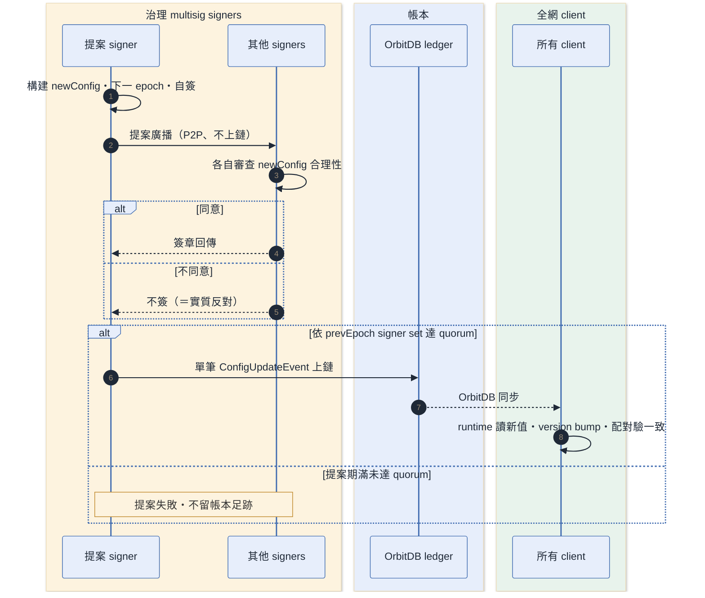
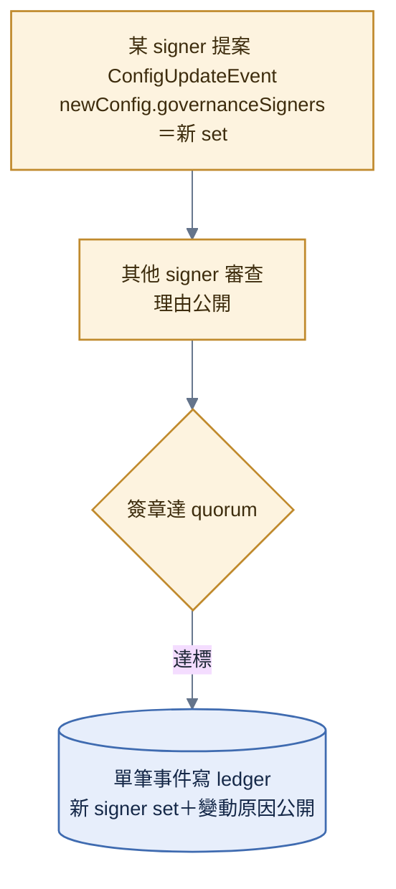
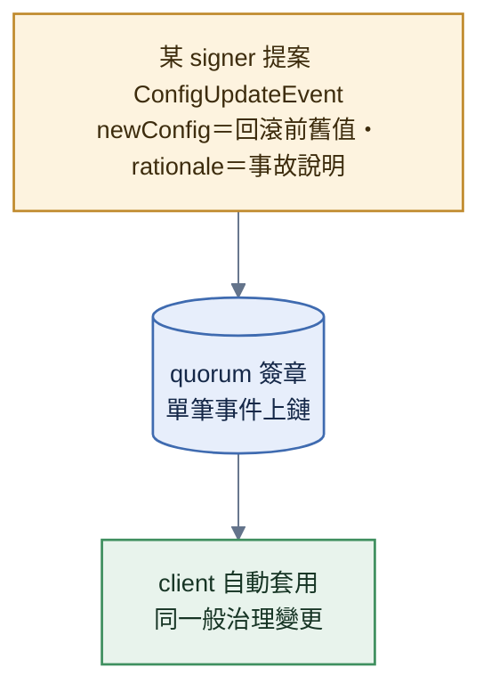

# 治理事件

> **本檔角色**：economy-config / 黑名單版本等治理變更從提案到生效的流程。
> 預設值見 [economy-config.md §17](../程式參數/economy-config.md#17-economy-configorbitdb-動態治理)；經濟參數見 [../經濟系統.md §14](../經濟系統.md)。

## 1. 詳細流程



**步驟細目**：

1. **multisig signer 提案 ConfigUpdateEvent**——構建 newConfig（EconomyConfig 結構）；prevEpoch = 當前 epoch；新 epoch = prevEpoch + 1；公開說明變動理由；signer 自己簽章一份。
2. **提案廣播（signer 間 P2P、不上鏈）**——未達門檻不產生任何帳本事件（append-only 帳本無 pending 狀態）。
3. **其他 signer 簽章**——各自審查 newConfig 合理性；通過 → 簽章回傳；不同意 → 不簽（＝ 實質反對）。
4. **簽章門檻達標 floor(2N/3)+1（以 prevEpoch 的 signer set 計）**——**單筆 `ConfigUpdateEvent`（含 signers / signatures / rationale）寫入 OrbitDB**；epoch = newEpoch（提案階段已定 = prevEpoch + 1）。
5. **所有 client 自動套用**——runtime 從 OrbitDB 讀最新值；economy_config_version bump；配對時 checkCompatibility 強制驗 economy_config_version 一致。
6. **新值生效**——鑄幣 / 燒幣 / 配對 等模組從新 config 取值（信譽 / 仲裁走 protocol 常數、不吃 config，[§2.2](#22-不在治理-config-的值治理可調鐵則)）。

## 2. 可治理的參數

詳見 [economy-config.md §17.2](../程式參數/economy-config.md#17-economy-configorbitdb-動態治理)：

### 2.1 revShare（分潤比例）

| 欄位                 | 預設值 | 說明                                           |
| -------------------- | ------ | ---------------------------------------------- |
| `currentTierPct`     | 70     | 創作者層（**pct 整數**——共識計算不用浮點比例） |
| `parentTierPct`      | 20     | parent fork 層                                 |
| `grandparentTierPct` | 10     | grandparent 層                                 |
| `maxDepth`           | 3      | 封頂三層                                       |

**不變式**：三層總和必須 = 100。

### 2.2 不在治理 config 的值（治理可調鐵則）

config 值只能在**可重放的 epoch 讀點**消費：match settlement 由 canonical fold 讀事件位置的 `state.economyConfig` 並純函數產生；固定費率事件攜帶金額但 fold 對同一讀點精確驗證；fork 判定結果在 event creation 定稿並簽章。會讓既有事件隨最新 config 重新解讀的**累積型 derive 值一律為 protocol 常數、不進 config**（[economy-config.md §17.3](../程式參數/economy-config.md#17-economy-configorbitdb-動態治理)）：

| 值                                                             | 所在                                           | 為何不可治理                                                                       |
| -------------------------------------------------------------- | ---------------------------------------------- | ---------------------------------------------------------------------------------- |
| 新手保護 7 天 / 下限 400                                       | [protocol.md §5](../程式參數/protocol.md#5-protocolledger鏈與多簽) `NEWCOMER_*` | 經 `getEffectiveScore` 烘進評分權重等累積 derive——epoch 切換使 genesis replay 分叉 |
| 信譽初始 500 / clamp 0–1000                                    | 同上 `REPUTATION_*`                            | 改值＝全史分數重算                                                                 |
| 惡意檢舉三條件（30% / 10 筆 / 30 天）                          | 同上 `MALICIOUS_REPORTER_*`                    | 烘進信譽 delta                                                                     |
| DMCA Repeat Infringer 閾值（`REPEAT_INFRINGER_THRESHOLD`） | [protocol.md §5](../程式參數/protocol.md#5-protocolledger鏈與多簽)             | DMCA 是維運層法遵流程、屬 pinning 維運政策常數                                     |

### 2.3 forkDetection（fork 偵測門檻）

完整門檻 shape 與逐欄 genesis 值以 [economy-config.md §17.2](../程式參數/economy-config.md#17-economy-configorbitdb-動態治理) 為單一權威；本流程不重抄數值。

> fork 判定的相似度門檻 = **原創 / fork（royalty 分潤）的經濟邊界** → 治理可調。判定**演算法 / 指紋**（`fingerprintVersion`）屬 `derive_logic`（client 發版），此處僅治理「門檻值」。含於 `EconomyConfig`、隨 `economy_config_version` 版控。

### 2.4 經濟值群組（鑄幣 / 費用 / 退役門檻）

| 群組                                    | 內容                                                                                                                                                     |
| --------------------------------------- | -------------------------------------------------------------------------------------------------------------------------------------------------------- |
| `match_prize`                           | base_amount / rank_multipliers / min_player_count / combo 窗口 / per-player 有獎場數上限                                                                 |
| `creator_royalty`                       | base_per_use / dedup_window（niche 乘子＝固定公式、derive_logic 軸——非治理槽，[../算式表.md §14](../算式表.md)）                                         |
| `upload_costs`                          | part / track / metadata 上鏈費                                                                                                                           |
| `expansion_costs`                       | vehicle_slot 車位擴充                                                                                                                                    |
| `sponsorship`                           | min_amount 最低贊助                                                                                                                                      |
| `month_soft_cap_minor` / `month_hard_cap_minor` | 月軟曲線軟上限／全域月硬頂                                                                                                                       |
| `hot_match_quarters`                    | `DerivedState.recentMatches` 的查詢／展示 hot 保留窗；經濟冪等與 rolling cap 使用各自持久索引                                                        |
| `ugc_lifecycle`                         | P5 退役 6 門檻                                                                                                                                           |
| `forkDetection`                         | Stage 1 幾何與 per-type Stage 2 物理差異門檻                                                                                                             |
| `governanceSigners`                     | 下一 epoch 的治理 signer set；仍由 prevEpoch signer quorum 核准                                                                                           |

> 完整欄位 + 預設值見 [economy-config.md §17](../程式參數/economy-config.md#17-economy-configorbitdb-動態治理)（單一 authority）。皆含於 `EconomyConfig`、隨 `economy_config_version` 版控、走 `ConfigUpdateEvent`。

## 3. ConfigUpdateEvent 結構

```typescript
interface ConfigUpdateEvent extends BaseEvent {
  type: "config-update";
  epoch: EconomyConfigEpoch; // newEpoch = prevEpoch + 1
  prevEpoch: EconomyConfigEpoch;
  newConfig: EconomyConfig;
  rationale: string; // 公開說明
  signers: PeerId[]; // multisig 成員
  signatures: Signature[]; // 每 signer 一筆
}
```

詳見 [../資料系統.md §12](../資料系統.md) + [../程式架構/ledger.md §8](../程式架構/ledger.md)。

**簽章 digest 與 fold 守門**（實作即權威 `src/economy/governance.ts`）：各 signer 對 `ledgerSigningDigest(ledgerAddress, event)`（事件剔除 `signature|signatures`）簽章、達 quorum 後 `appendPreSigned` 原樣上鏈；digest 的 ledger domain 與 chainId 定義只引用 [../程式架構/ledger-admission.md §1](../程式架構/ledger-admission.md)。套用端守門全 timeless（epoch 連號 ＋prevEpoch signer set quorum＋`newConfig` 結構逐欄驗 ＋revShare 不變式），無效 ＝no-op——歷史 append 與 live 首播同一判定（[../程式架構/ledger.md §6.1](../程式架構/ledger.md) foldGuard 目錄）。生效後 `DerivedState.economyConfig` 即為 runtime「從 OrbitDB 讀最新值」的讀點；**固定費率事件（slot／maintenance／upload 費）之金額對此讀點精確驗證**（費率收口）。

**live 首播 defer 態**（accept／reject 之外的第三態、live-only）：live 首播收件驗證時，若本機 `economyConfig.epoch` 落後於事件 `prevEpoch`（本地鏡像未追上、無法核當前 signer set），則**暫緩排隊重審、非拒收**（有界重試）；fold 依序 replay 恆已達 `prevEpoch`，故無此態。MatchResult 的經濟結果由 canonical fold 推導，收件端沒有 settlement defer 分支。

## 4. multisig signer set 變更

### 4.1 Signer set 規範

- **genesis**：由 genesis governance config 定義初始 signer set
- **公開資訊**：signer set 必須公開列出 `PeerId`、顯示名稱、角色與加入理由
- **變更門檻**：signer set 變更必須由既有 signer set 達 quorum 後生效
- **quorum**：N=1 時為 1；N>=3 時為 `floor(2N/3) + 1`；N=2 signer set 非法
- **強制移除條件**：signer 私鑰外洩、長期離線或惡意簽章時，可用治理事件移除

### 4.2 變更流程

**signer set 變更 ＝ 同一 `ConfigUpdateEvent` 族**（改 `EconomyConfig.governanceSigners` 欄位；[../程式架構/ledger.md §8](../程式架構/ledger.md)——**無獨立 SignerSetUpdateEvent 型別**）：



- 提案內容：`newConfig.governanceSigners` = 新 set；`rationale` = 加入理由 / 移除原因。
- quorum 以 **prevEpoch 的 signer set** 計——新成員本筆不計票。

**規範**：增減 signer **必須**留下上鏈事件與公開理由（rationale）。

## 5. 與 client 發版的關係

### 5.1 解耦

- `economy_config_version` 由治理層 runtime 變更
- 其他版本欄位（client_version / protocol_version 等）由 client 發版週期固定
- 治理變更不需推 client 新版本

### 5.2 配對版本檢查

即使兩個 client 版本相同，若 economy_config_version 不同（一邊 catch up 完、另一邊還沒）→ 拒配對：

```typescript
checkCompatibility(my, peer):
  ...
  if (my.economy_config_version !== peer.economy_config_version) return false;
```

此閘確保開賽前的 fork 分類、玩家可見費率／報價與房間輸入基準一致；MatchResult 的 payout 不使用房間版本快照，而由 canonical fold 讀事件位置的 epoch state，因此不以「先算 settlement 金額一致」作為配對理由。

詳見 [../版本規範.md §5](../版本規範.md)。

## 6. 變更類型對照

| 變更類型                                                                 | 走治理               | 走客戶端發版                                                                                                                                                                            |
| ------------------------------------------------------------------------ | -------------------- | --------------------------------------------------------------------------------------------------------------------------------------------------------------------------------------- |
| revShare / match_prize / creator_royalty 等 config 數值                  | ✅ ConfigUpdateEvent | ❌                                                                                                                                                                                      |
| **fork 偵測門檻**（`EconomyConfig.forkDetection`；原創 / fork 經濟邊界） | ✅ ConfigUpdateEvent | ❌                                                                                                                                                                                      |
| 公版資產變更（builtin-assets 新增 / 調整 / deprecate）                   | ❌                   | ✅ major bump（**純 client 發版、不上鏈、無治理事件**——同物理常數；`builtin_assets_version` +1 + 新 GLB（編輯器烘焙）；[程式架構/builtin-assets.md §7](../程式架構/builtin-assets.md)） |
| 物理常數（K_MAGNET_FORCE / K_ACID 等）                                   | ❌                   | ✅ major bump（影響 deterministic）                                                                                                                                                     |
| 材質物理屬性                                                             | ❌                   | ✅ major bump                                                                                                                                                                           |
| 材質**廢止**（`DEPRECATED_MATERIAL_IDS`）                                | ❌                   | ✅ **minor**（不擋配對；僅上傳驗證規則、非物理值、零賽中足跡；[材質表.md §11](../材質表.md)）                                                                                           |
| 鑄幣公式 itself（不只參數）                                              | ❌                   | ✅ major bump（derive_logic_version + 1）                                                                                                                                               |
| fork 偵測**演算法 / 指紋**（`fingerprintVersion`，非門檻）               | ❌                   | ✅ major bump（derive_logic）                                                                                                                                                           |
| Sanitize Worker（Web Worker）升版（`SANITIZE_WORKER_VERSION`）           | ❌                   | ✅ major（protocol/security；[protocol.md §4](../程式參數/protocol.md#4-protocolsecurity安全)）                                                                                                                     |
| 黑名單關鍵字庫**資料**（`TEXT_BLACKLIST_VERSION` = 格式版本常數）        | ❌                   | ✅ **minor**（庫資料隨 client minor 出貨；僅上傳 pre-check + 顯示過濾、不 gate 配對，[版權.md §7](../版權.md)）                                                                         |
| B 軸資產 schema（新版本 / 破壞牆 / 遷移描述子）                          | ❌                   | ✅ major（發版軸掛鉤——映射變動影響 deterministic；[版本規範.md §16](../版本規範.md)）                                                                                                   |
| yank 清單（壞版標記）                                                    | ❌                   | ✅ major（影響降版目標 = 共識輸入；CI 強制同版存在非 yanked 替代版；[版本規範.md §22](../版本規範.md)）                                                                                 |

> 「走客戶端發版」者的 git / PR 操作順序（分支保護 + 公版純 client 發版）見 [升版.md §8](升版.md)。

## 7. 緊急回滾規則

**緊急回滾 ＝ 一筆把值設回舊 config 的 `ConfigUpdateEvent`**（epoch 照樣 +1、**不另設事件型別**——append-only 帳本只能前進、「回滾」是內容回退非鏈回退）：



- 提案內容：newConfig = 被回滾前的舊值（epoch N−1 的 config 內容）；rationale = 事故說明 + 指明回滾自哪個 epoch。

- 回滾**不刪除歷史事件**——每筆 `ConfigUpdateEvent` 在 canonical order 建立可重放 epoch；回滾事件之前的 settlement 仍由當時位置的前態計算，之後才讀回滾後的新 epoch。事件史不改、payout 也不需內嵌（[§2.2](#22-不在治理-config-的值治理可調鐵則)）。
- 回滾條件：發現 config 有 bug / 被惡意設定 / 重大爭議。
- 本節只救**參數壞損**；規則（derive / 結算邏輯）壞損 ＝ 修法 ＋ 全網重算、帳本壞損 ＝ 鏈重生——完整復原階梯見 [../經濟系統.md §2.1](../經濟系統.md)。

## 8. 提案期 / quorum

**規範**：

- 提案期：7 天（待 playtest 校準）
- quorum：N=1 時為 1；N>=3 時為 `floor(2N/3) + 1`；N=2 非法
- 表決 = **簽或不簽**（事件僅載 `signatures[]`、無 reject / abstain 載體——不簽即實質反對，提案期滿未達 quorum 即失敗；反對理由可公開於提案討論、不上鏈）

## 9. 透明度

所有治理事件公開：

- **達標事件**（含 signers / signatures / rationale）全部寫 ledger；未達標提案不留帳本足跡（簽章收集在 signer 間 P2P，[§1](#1-詳細流程)）
- 任何 peer 可查詢 / 重算
- 公開 signer set（`EconomyConfig.governanceSigners`）與變動歷史

## 10. 異常情境

| 情境                                                   | 處理                             |
| ------------------------------------------------------ | -------------------------------- |
| 提案期過了未達 quorum                                  | 提案失敗，需重新提案             |
| signer 拒絕全部簽章（攻擊）                            | 換 signer set（也走治理）        |
| 客戶端 catch up 不一致                                 | 配對 checkCompatibility 強制驗證 |
| 治理 config 含不合法值（不變式違反）                   | client 拒絕套用，警告            |
| 不同 client 看到不同 economy_config（OrbitDB sync 慢） | 等同步完成；配對前再驗           |

## 11. 跨模組對接

| 模組                                                                                                                           | 內容                                                                                                                                                                      |
| ------------------------------------------------------------------------------------------------------------------------------ | ------------------------------------------------------------------------------------------------------------------------------------------------------------------------- |
| `src/economy/config.ts`                                                                                                        | `EconomyConfig` 介面＋genesis 預設（`GENESIS_ECONOMY_CONFIG`）的唯一 runtime authority；`system-constants/economy-config/` 不保存 shape／預設副本                                     |
| `economy/`                                                                                                                     | rev share / month curve / 鑄幣                                                                                                                                            |
| `reputation/`                                                                                                                  | 信譽全走 protocol 常數（新手保護 / 惡意檢舉門檻）、**不吃治理 config**（[§2.2](#22-不在治理-config-的值治理可調鐵則)）                                                    |
| `moderation/`                                                                                                                  | 仲裁 / 黑名單套用 antiAbuse                                                                                                                                               |
| `ledger/`                                                                                                                      | `ConfigUpdateEvent`（**單一事件族**：config 值 / `governanceSigners` 變更 / 緊急回滾皆同型別，[§4.2](#42-變更流程)・[§7](#7-緊急回滾規則)）                               |
| `versioning/`                                                                                                                  | economy_config_version 版本欄位                                                                                                                                           |
| 本流程 [§4](#4-multisig-signer-set-變更) / [§7](#7-緊急回滾規則) / [§8](#8-提案期--quorum) + [資料系統.md §12](../資料系統.md) | signer set / quorum / 緊急回滾規則                                                                                                                                        |
