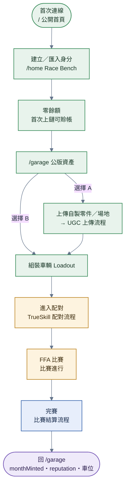

# 玩家整體旅程

> **本檔角色**：玩家從首次連線到回頭組裝的完整旅程概觀。
> 細節分流見其他流程檔（[../流程.md](../流程.md) 索引）。

## 1. 整體旅程

**步驟細目**：

1. **首次連線** → `/` 公開首頁（可看公告與遊戲介紹，不讀取玩家資料）。
2. **建立 ／ 匯入身分** → `/home` Race Bench。
3. **餘額 0**——無冷啟動鑄幣；首次上鏈可賒帳（見經濟系統 [§10](../經濟系統.md#10-首次上鏈負資產)）。
4. **進入 /garage 看公版資產**（24 零件 + 3 場地）——（選擇 A）上傳自製零件 / 場地 → 進 UGC 上傳流程；（選擇 B）直接用公版資產組車。
5. **組裝車輛（Loadout）** → **進入配對**（TrueSkill 配對流程）→ **8 人 FFA 比賽**（比賽進行流程）→ **完賽**（比賽結算流程）。
6. **回 /garage** 看新累積的 monthMinted / reputation / 解鎖車位。
7. **持久待辦**——已解鎖玩家可隨時從第一層 `/inbox` 查看自己所選 provider 回傳的身分定向
   事項；目前只有 DMCA tab。Toast 關閉不會刪除案件或標記已讀，開啟個別案件才寫本機
   PeerId-scoped read marker。
8. **回看正式賽事**——online-ready 首頁顯示玩家自己的正式賽事歷史；先呈現 hot 紀錄，再以
   不透明游標逐頁載入 quarter cold partitions。部分成功保留已載列，失敗保留續載位置並可重試；
   不把 pinning 暫時離線誤顯示成「歷史已到底」。每列可進入既有 `/result/:resultId` 結算頁。

## 2. 旅程節點對應細節流程

| 節點 | 流程檔 |
|---|---|
| 首次上鏈負資產 | 每 PeerId 一生一次，首次上鏈餘額不足可入負（[../經濟系統.md §10](../經濟系統.md)）|
| 上傳自製 UGC | [UGC上傳.md](UGC上傳.md) |
| 衍生 fork 既有 UGC | [衍生.md](衍生.md) |
| 組裝（Loadout）| [../車輛組裝.md](../車輛組裝.md) |
| 進入配對 | [配對.md](配對.md) |
| 比賽進行 | [比賽進行.md](比賽進行.md) |
| 比賽結算 | [比賽結算.md](比賽結算.md) |
| 觀戰 | [觀戰.md](觀戰.md) |
| 檢舉 | [檢舉與仲裁.md](檢舉與仲裁.md) |
| 版權通報 | [DMCA.md](DMCA.md) |
| Provider-scoped Inbox | [../程式架構/inbox.md](../程式架構/inbox.md) |

## 3. 玩家狀態演化

| 階段 | 玩家擁有 |
|---|---|
| 建立身分 | 0 幣（首次上鏈可入負）+ 公版資產（24 零件 + 3 場地）+ 1 個可用本機測試車位；1 個正式車位保留但在 onboarding 完成前鎖定 |
| 首場比賽後 | + 比賽獎金（依名次）+ TrueSkill rating 變動 + 信譽變動 |
| 上傳第一個 UGC 後 | 燒 50 minor units（零件）/ 500（場地）（餘額不足時首次上鏈可入負，一生一次）+ UGC 在 ledger 公開 |
| 累積數場後 | UGC 可能被其他玩家使用 → royalty 鑄幣 + UGC rating 累積 |
| 擴充車位 | 燒 1000 minor units / 次（無上限，純消耗入口；[economy-config.md §17](../程式參數/economy-config.md#17-economy-configorbitdb-動態治理) `vehicle_slot_minor`）|

## 4. 異常處理

| 情境 | 處理 |
|---|---|
| 沒有上鏈幣可用 | 用公版資產 + 比賽贏錢 + 等月初係數重置 |
| 信譽被刷低 | 新手保護期內有下限 400；扣分僅能經純仲裁定罪（加權 >60%）＋惡意檢舉者 −30 反制——無單方刷分路徑 |
| 帳號被盜（助記詞外洩）| 換新 PeerId 重新開始；不可恢復舊資產（P2P 設計，無中心管理）|
| 登出／跨分頁鎖定時正在看 Inbox | 立即清空頁面、badge、記憶體與摘要 toast 並取消請求；保留原 PeerId 本機 snapshot 供下次解鎖 |
| Provider 暫時離線 | 其他 provider 繼續顯示；最後一次簽章驗證通過的本機案件只以 stale 顯示，操作停用 |

## 5. 互動式 Onboarding（4 步引導）

新玩家首次登入後強制走完 4 步引導，通過才開放正式上鏈：

| 步驟 | 動作 | 目的 |
|---|---|---|
| 1. 抄寫助記詞 | 顯示 BIP39 24 字 → 玩家手抄 → 隨機字位抄寫驗證 | **強制備份意識**（遺失 = 資產全失，無找回管道）|
| 2. 組裝第一台車 | 用公版資產（24 零件 + 3 場地）組一台 loadout | 熟悉組裝流程 + Mount 配對 |
| 3. 完整進行一場單人本機測試 | 使用本機測試車位，直到正常產生結果 | 熟悉操控、HUD、技能與物理反應 |
| 4. 通過 → 開放上鏈 | 啟用已保留的正式車位 + 上鏈權限 + UGC 上傳 | 確保玩家準備好後才允許產生鏈上事件 |

第 3 步的完成條件是 race runtime 成功產生 canonical `LocalMatchSummary`，不要求 Bot、其他對手、
獲勝、特定名次或抵達終點。`completed`、`duration-limit` 與終局解算後的 `eliminated` 都完成
onboarding；里程碑不得另行猜測 battery／motor／chassis 狀態來改寫 race 結果。時間到但未抵達
終點仍是 DNF、`finishTimeMs = null`，只是教學里程碑完成，不得顯示成競賽完賽。載入失敗、賽前
取消、runtime error、直接離開、缺失摘要或 session／summary mode 不相符都不完成。

Bot 不屬 onboarding 隱含需求。未來若新增，必須另立功能設計，定義 AI 輸入、難度、車輛與技能
配置、隨機性、離線邊界與結果語意；不得自動成為正式上鏈解鎖條件。

**新手用語平民化**：對非加密貨幣背景玩家，使用「備份碼」而非「助記詞」、「儲值點數」而非「虛擬幣」（內部技術名稱不變）。

備份中斷時不得再次顯示或暫存原本的明文備份碼。玩家回到登入頁後，只有兩條路：以自己
抄下的同一組備份碼重新匯入並驗證為原身分後繼續，或明確放棄並重建身分；若已遺失就不能
繞過驗證。登入成功的安全 return URL 才可恢復，否則一律進 `/home`。

本節是引導流程權威（4 步 + 用語規則）；各步 UI 文案由 i18n 與對應頁面線框共同約束，不另形成第二套流程。

### 5.1 正式上鏈授權邊界

`chainUnlocked` 是所有玩家主動正式鏈寫入的共同授權條件，不只控制正式車位與 UGC 上傳。
車位購買、UGC 評分／撤回、檢舉、仲裁投票與創作者發布都必須在最靠近 ledger mutation 的
provider 邊界重新檢查；頁面上的停用狀態或提示只能作前置 UX，不能取代該邊界。正式 mutation
必須先登錄集中 policy，未知 command 預設拒絕。

既有正式賽事與仲裁協定的收尾事件不屬玩家取得新權限，僅可用具名、附理由且有測試的 protocol
allowlist 例外；呼叫端漏查不構成例外。本機草稿、本機資產、本機測試比賽與純讀取不受此閘
影響。`/home` 對未完成玩家持續顯示目前進度與下一個可恢復步驟；編輯器在計費與 canonical
finalize 前顯示同源拒絕，但 provider 仍是最後權威。

### 5.2 備份碼與本機資料備份不可混用

「備份碼」恢復 PeerId 與簽章能力，是帳號唯一復原根；`.open4wd-backup` 只搬移勾選的 sealed 身分
資料、裝置設定與本機 GLB，永遠不含備份碼／私鑰／`encryptedSeed`。新裝置應先以每個身分自己的
備份碼建立相同 PeerId，再匯入本機資料包；也可先匯入成 orphan sealed container，日後相同 PeerId
恢復時才可解密。忘記資料包密碼時只能重新匯出，沒有找回管道。

## 6. 跨模組對接

| 模組 | 內容 |
|---|---|
| `key-manager/` | BIP39 助記詞 → PeerId 派生 |
| `economy/` | 比賽獎金 / royalty / 首次上鏈負資產 |
| `reputation/` | 信譽 delta 累積（derive）|
| `ugc-rating/` | UGC 評分累積 |
| `matchmaking/` | TrueSkill 演化 |
| `inbox/` | Provider-scoped 持久待辦、本機 signed snapshot、已讀與身分隔離 |
