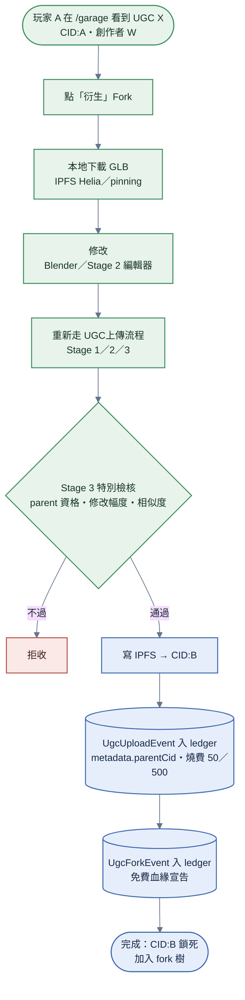
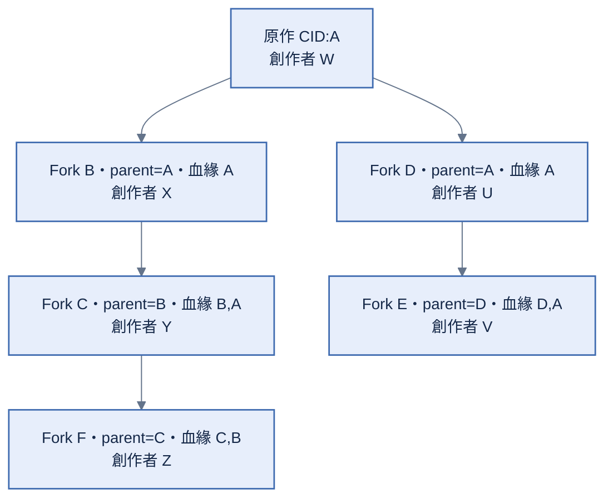

# 衍生（Fork）

> **本檔角色**：玩家衍生（fork）他人 UGC 並重新上鏈的流程。
> 三層分潤見 [../版權.md §3](../版權.md) + [../算式表.md §15](../算式表.md)；反複製見 [../版權.md §5](../版權.md)。

## 1. 詳細流程

**步驟細目**：

1. **玩家 A 在 /garage 看到 UGC X（CID:A，創作者 W）**，點「衍生」（Fork）。
2. **本地下載 GLB**（IPFS Helia / pinning）。
3. **玩家用 Blender 或 Stage 2 編輯器修改**——改 mesh；改材質；改 GLB extras（除 type 之外）；改 mount 位置。
4. **重新走 [UGC 上傳流程](UGC上傳.md) Stage 1 / 2 / 3**。
5. **Stage 3 特別檢核（衍生流程獨有）**——依 [../版權.md §4–§5](../版權.md) 驗 parent
   資格、最小修改幅度、反複製相似度與 identical-root 補回；`PhysicsFingerprint` 欄位與聚合只依
   [../程式架構/ugc-fork.md §3–§4](../程式架構/ugc-fork.md)。
6. **寫 IPFS → CID:B**。
7. **寫兩筆事件**——先寫 `UgcUploadEvent`（metadata.parentCid: CID:A）並燒上鏈費 50 minor units（零件）／500（場地）；再寫 `UgcForkEvent`（childCid: CID:B / parentCid: CID:A）作免費血緣宣告。兩筆都由玩家 A 簽章；無 ancestors 欄，血緣由 fold 自 `UgcUploadEvent.metadata.parentCid` derive。
8. **完成**——CID:B 鎖死、加入 fork 樹。

## 2. Fork 樹結構

> Fork F 的血緣為 [C,B]——A 不再進血緣，靠 B 的 record 上溯。

`UgcForkEvent` 的 current wire（`childCid`／`parentCid`）只在
[../程式架構/ledger-admission.md §1.0](../程式架構/ledger-admission.md#10-事件目錄與-ledger-自有結構) 定義；本流程
不重抄 schema。royalty 血緣仍由 fold 沿 `UgcUploadEvent.metadata.parentCid` 上溯。

## 3. Fork 約束

Fork 授權、血緣、深度、修改幅度門檻與 mesh 相似度分工只由
[../版權.md §3–§5](../版權.md) 定義；`PhysicsFingerprint` diff 演算法只由
[../程式架構/ugc-fork.md §3–§4](../程式架構/ugc-fork.md) 定義。

## 4. 三層分潤觸發

當 fork 衍生物被合格比賽使用時，canonical fold 依其 derived lineage 觸發分潤。角色與血緣政策只
由 [../版權.md §3](../版權.md) 定義，百分比與整除只由 [../算式表.md §15](../算式表.md) 定義。

## 5. 反複製五層防護（衍生流程相關）

衍生流程不另列防護層或門檻；完整權威是 [../版權.md §5](../版權.md)。

## 6. 衍生 vs 重新原創

| 情境 | 處理 |
|---|---|
| 從現有 UGC 改 → 衍生 | Fork 流程，分潤回原作 |
| 從零開始原創 | UGC 上傳流程（`metadata.parentCid = null`）|
| 微改既有 UGC 試圖偽裝原創 | mesh fingerprint 拒收 |
| 衍生但 parentCid 未標 / 標錯 | 仲裁可懲罰（信譽 -100，違反版權含剽竊——app 內 fork 自動標 `parentCid`，未標 = 蓄意繞過上傳）|

## 7. 信譽連動

| 情境 | 信譽變動 |
|---|---|
| 衍生作品被廣泛使用 | +5（每 100 次使用）|
| 仲裁判定違反版權（含剽竊 / 未標 parentCid）| -100（`copyright-violation`）|
| Fork 作品被檢舉成立（內容不當 / 其他）| -20 |

## 8. 既得權益保護

衍生作品上鏈後：

- 即使後續原作被退役 / 黑名單，本衍生品歷史 royalty 不回收
- 衍生品本身被退役後，後續使用不算 royalty，但歷史不回收
- **反向**：祖先（parent / grandparent）退役 / 黑名單 / unusable / yanked **不影響本衍生品被用時對其分潤**（分潤跟血緣、與可用性正交，見 [../版權.md §3.4](../版權.md)）

詳見 [../版權.md §10](../版權.md)。

## 9. 異常情境

| 情境 | 處理 |
|---|---|
| 修改幅度太小 (< 10%) | Stage 3 拒收，UI 提示「需更多修改」 |
| 相似度 70–90%（疑似剽竊）| 可選**立即上鏈＋經濟隔離待審**（`similarity-pending`——可玩可展示、royalty / usage 不記）或改走 fork（對象已下架則無此選項）；上傳期仲裁判抄 → **下架、不扣信譽**（灰區可能是撞衫；與事後檢舉定罪 -100 分開）、判非抄 / 流局 → 解除隔離（[../程式架構/anti-piracy.md §5.1](../程式架構/anti-piracy.md)）|
| 原作已被 DMCA 下架 | 衍生流程仍可進行（產生新 CID），但若衍生品也侵權 → 連帶處理 |
| 玩家忘記簽章 | 編輯器強制簽章；無 PeerId 不可上鏈 |
| 上鏈時 IPFS unavailable | 自動 retry + pinning fallback |

## 10. 跨模組對接

| 模組 | 內容 |
|---|---|
| [`程式架構/ugc-fork.md`](../程式架構/ugc-fork.md) | Fork 偵測 + 衍生樹（70/20/10 拆分見 程式架構/economy.md）|
| `anti-piracy/` | mesh fingerprint + 相似度比對 |
| `dmca/` | 衍生品如侵權走 DMCA |
| `economy/` | 燒幣 + royalty 拆分 |
| `ledger/` | UgcUploadEvent（收費）＋ UgcForkEvent（免費血緣宣告） |
| `reputation/` | 違反版權（含剽竊）/ 廣用之信譽變動 |
