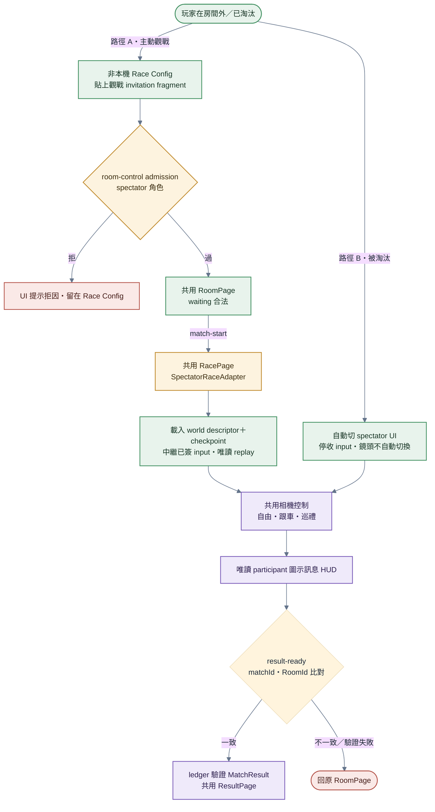
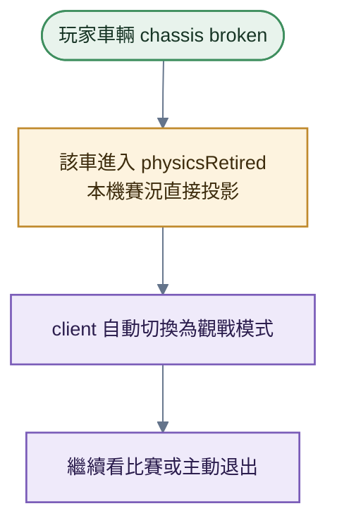

# 觀戰

> **本檔角色**：玩家進入觀戰、視角切換、淘汰自動轉觀戰的流程。
> 對應模組（實作）：[../程式架構/spectator.md](../程式架構/spectator.md)。

## 1. 詳細流程

**步驟細目**：

1. **路徑 A：主動觀戰**——`/race-config#...` 讀取 RoomId、spectator role 與 192-bit invitation 後立即清除 fragment，再以 OPAQUE 送 `{ role: 'spectator' }` 到 room-control admission。secret 不進 join-request、query、history 或 referrer；錯誤 invitation 對外只回通用拒絕（[D-20260806-01](../decisions/D-20260806-01-OPAQUE角色邀請驗證.md)）。
2. **路徑 B：自己被淘汰**（in-race UI 切換，非新連線——玩家仍在 race mesh 內）——chassis broken 令車輛 `physicsRetired` → 自動切 spectator UI（停收 input、沿用本機世界）；battery／motor 功能失能不觸發此路徑。相機保持當前模式與目標，不自動切到領先車。步驟 3–4 為**路徑 A** 專屬（外部觀戰者才需撥號與建 replay 世界；已淘汰者略過）。
3. **建立 spectator 連線（participant-source star，路徑 A）**——match-start 後，由房主對已 admission spectator 做 least-loaded source assignment；平手依固定 participant roster，回 `{ peerId, sourceEpoch }`。dial source 後，source 以已驗名冊過閘才接受單向 `'spectator'` DataChannel。觀戰者**不進 race mesh、不參與簽章**。
4. **接收 replay（路徑 A）**——`SpectatorRaceAdapter` 先用 world descriptor（場地、固定 roster 與 loadout、天候 seed、圈數／時限規則）建同型世界，載入 bounded SavedState 後以 2–6 幀 jitter buffer 重播來源中繼的參賽者已簽 input；每 120 幀 checksum 失配即重載快照。DataChannel 在 UTF-8 decode 前依 source／viewer 方向套 raw cap 與 message／byte bucket，大型 checkpoint 再受獨立低頻 quota；viewer 只在 waiting-checkpoint 接受目前 source assignment generation、PeerId 與單調 frame，snapshot／signature bytes 只解碼一次。觀戰本機物理不具權威、不送 input、不參與 checksum 多數決。RacePage 依序顯示建立世界、等待 checkpoint、追趕與 live；版本不符或裝置能力不足時自動降級成正面表列、有 256 KiB 上限的 10Hz fallback，並明示精簡模式。
5. **共用賽事呈現**——replay 本地以參賽端相同 mapper 產生速度、馬達轉速、碰撞／武器音效、HUD、小地圖與回合結束摘要。倒數因 world descriptor 到達時間不等於倒數起點，改由 source 傳低頻 `countdown` 控制 overlay／提示音；該訊息不具物理或賽果權威。fallback 只提供精簡位姿／公開 HUD，不偽造完整回合呈現。
6. **視角控制**——產品只有跟車、自由、巡禮三模式。「類型」在自由／巡禮間切換，從跟車離開固定進自由；「跟車」在非跟車時進目前目標，已跟車時依固定 roster 序切下一台；participant 另有「自己」永遠跟自己。淘汰與完賽車仍留在序列，只跳過離線者。外部 spectator 與本回合已淘汰 participant 可用 `C` 切換類型、`LB`／`RB` 或畫面左／右緣切換上一／下一目標；手把採 rising edge，鍵盤輸入焦點內不觸發，仍在比賽的 participant 不攔截這些操作。
7. **賽中圖示訊息**——觀戰者不可送，只接收 participant source 中繼的原始 participant 簽章 envelope；本機重驗 match、roster、loadout、sequence 與簽章後，使用與 participant 相同的固定 sender HUD。等待房則與 participant 共用文字聊天。
8. **比賽結束**——鏈上確認後才送 `result-ready { resultId, matchId, roomId }`；RacePage 先與目前 RoomSession 雙 id 比對，再導向共用 `/result/:resultId` 獨立讀 verified MatchRecord。全場異常終局送具體 `session-end` 並顯示原因與回房入口；GO 前取消或所有在線 participant 都無法供流／重撥失敗時，直接以 `pre-race-cancelled`／`source-unavailable` 回原 `/room/:roomId`。

## 2. 觀戰者特性

| 特性 | 說明 |
|---|---|
| 不簽章 | 不參與回合 consensus anchor multisig |
| 唯讀 replay | 主模式執行同型物理但不具權威；版本／能力不足才用精簡 fallback |
| 不影響 desync | 觀戰者 checksum 不參與多數派計算 |
| 無 input | 不送 input 到 race room |
| 視角自由 | 自由切換多個視角 |
| 同一世界呈現 | 主模式共用 world builder、renderer 與 HUD；顯示標籤由本機以 `nicknameSnapshot`＋完整 PeerId 雜湊短指紋解析，無合法快照時只顯示指紋 |
| 同一節奏呈現 | 主模式本地導出音效、速度、回合摘要與小地圖；倒數由低頻控制同步；fallback 明示精簡 |
| 串流健康度 | NET 只由觀看端本機推導；replay 看 input buffer，fallback 看快照新鮮度，停更會降級 |

## 3. 視角模式

| 模式 | 說明 |
|---|---|
| 跟車 | 鎖定某 PeerId 的車，camera 跟隨；目標離線時依固定序找下一台 |
| 自由 | 滑鼠 / 手把自由操控 camera 位置與朝向 |
| 巡禮 | 依車群與局部路段尺度輪播導播鏡位，做場景碰撞避讓，不做全場 fit |

跟車模式由 participant 與 spectator 共用同一套純本機 presentation rig（[D-20260810-01](../decisions/D-20260810-01-跟車距離與世界水平穩定視角.md)）：直線距離可在 `0.30–2.00 m` 調整，預設 `0.50 m`，固定既有仰角比例。相機 up 永遠為世界 `+Y`；車體傾斜、倒置或水平車頭退化時保留最後穩定水平朝向，恢復直立後平滑接回 yaw。遮擋只暫時拉近 effective distance，解除後平滑回復，不改寫裝置偏好。此狀態不進 spectator snapshot、房間狀態、物理、rollback、ledger 或 checksum。

## 4. 觀戰加入時機

| 時機 | 處理 |
|---|---|
| 賽前（room waiting）| 可先以 spectator role admission 進共用 RoomPage，等待 match-start |
| 倒數中 | 可加入；接收當前倒數控制，world ready 後進 replay 或精簡 fallback |
| 比賽中 | 隨時可加入；從 checkpoint 與 bounded backlog 追到目前 frame |
| 比賽結束（結算前）| 可加入看結算 |

## 5. 淘汰自動轉觀戰

**步驟細目**：

1. **玩家車輛 chassis broken**——該車直接進入 `physicsRetired`，不建立額外事件型別。
2. **client 自動切換為觀戰模式**——先對鍵盤與指標所有尚未放開的技能槽送出一次
   `release`，清除 hold tick 與 HUD active，再停止接受新的 `press`；切換 UI 為 spectator UI；
   保留淘汰前的相機模式與跟車目標；沿用參賽期間的本機世界。後到的 keyup／pointerup
   必須冪等，不得復活或重複保留 hold 狀態。
3. **玩家可繼續看比賽，或主動退出**。

「淘汰」唯一條件：chassis broken → `physicsRetired`。battery／motor broken 僅停止功能，仍保留場上物理與合法完賽資格。

詳見 [../零件與場景.md §12](../零件與場景.md)。

## 6. 觀戰房間設定

觀戰三欄位 ＝ 房主設定、掛在 [../程式架構/matchmaking.md §4 `Room`](../程式架構/matchmaking.md)（權威）：

- `allowSpectators`（預設 true；false = 不入觀戰清單、join 一律拒）
- `maxSpectators`（預設 20、範圍 0–50；達上限 join 失敗、UI 提示「觀戰滿了」）
- `spectatorPasswordRequired`（表示 OPAQUE spectator invitation protection）
- `spectatorPolicyEpoch`（每次接受的 waiting mutation 遞增）

Race Config 設定初值。RoomPage 只有房主且 waiting 可修改；啟用／重生 invitation 由 CSPRNG 產生 192-bit secret，省略代表保留既有、明確關閉代表移除。credential mutation 會移除全部 spectator，房主繼任不攜 spectator state 並 fail closed。

加入容量以 `active + reserved` 原子判斷：請求在建立通道前先保留名額，成功轉 active，失敗或斷線釋放；同 PeerId 重連替換舊 session 而不新增名額。半開通道 DoS 上限是獨立背壓，不得代替房間容量。

## 7. 觀戰流量

觀戰者不送 input。主模式穩態接收全 roster 已簽 input（8 人上界約 35.2 KiB/s／觀戰者，與世界複雜度無關），late join／失步才傳 checkpoint；fallback 才接收 10Hz presentation snapshot。來源上行仍隨分配人數線性增加，因此由房主 least-loaded assignment 均攤到在線 participant；容量常數的現行預設為 20、上限為 50，調整必須以 p50／p95 實測資料另立決策。

拓樸（participant-source star）：

- 觀戰者只直連**當前 elected participant source** 的單向 `'spectator'` DataChannel；每個 sourceEpoch 僅一個來源
- 觀戰者間不互聯、不雙向 P2P
- 每位 participant 都保有 broadcaster；只有被選中且有訂閱者者實際推幀（`SpectatorServer`／`SpectatorBroadcaster`，[../程式架構/spectator.md §4](../程式架構/spectator.md)）

## 8. 觀戰溝通

詳見 [../程式架構/chat-system.md](../程式架構/chat-system.md) 與 [../程式架構/race-messages.md](../程式架構/race-messages.md)：

- waiting：spectator 與 participant 共用 host-star 文字聊天。
- race：不建立自由文字或 spectator chat；spectator 只讀 participant 圖示訊息。
- source 只中繼原始 participant 簽章，觀看端必須重驗，不把 source 當發話者。

## 9. 異常情境

| 情境 | 處理 |
|---|---|
| 觀戰通道斷（source 離線／單一路徑失效）| 保留 session／訂閱；舊 generation 立即拒幀並清空 fallback 插值，房主只重派受影響 spectator。遞增 sourceEpoch 後 replay 由新 source 補 checkpoint／backlog，fallback 首幀直出。無候選或 dial 失敗才 `source-unavailable` |
| 全場異常終局 | `error`／`settlement-failed`／`partition-void`／`consensus-invalid` 由各 participant 對自己服務的觀戰者 fire-once 發送；顯示原因與回房入口 |
| 單一 participant desync 驅逐 | 不是全場終局，不發 `session-end`；來源失效依上一列重選 |
| Race 結束時觀戰中 | 鏈上確認後的 `result-ready`：雙 id 比對後查 verified MatchRecord；成功進共用 ResultPage，失敗回原房 |
| 觀戰時被踢出（人數限制 / 房間關閉）| admission／stream 拒因 UI 提示，回 Race Config 或原 RoomPage |
| 觀戰時的 client 物理錯誤（不影響共識）| 停止唯讀 replay、送 `mode-select: fallback`，改收有界 10Hz presentation；不通報共識層 |
| 自己被淘汰瞬間 | 只停 input 與切 spectator UI；camera 模式／目標不自動改變 |

## 10. 跨模組對接

| 模組 | 內容 |
|---|---|
| [`程式架構/spectator.md`](../程式架構/spectator.md) | 完整觀戰實作（participant-source star / sourceEpoch / SpectatorServer / 訊息協議）|
| [`程式架構/signaling-service.md`](../程式架構/signaling-service.md) | 提供 presence 在線快照與 source 定向握手；來源選舉在 RoomService |
| [`程式架構/chat-system.md`](../程式架構/chat-system.md) · [`程式架構/race-messages.md`](../程式架構/race-messages.md) | waiting 共用文字與賽內唯讀圖示訊息 |
| [`程式架構/physics-engine.md`](../程式架構/physics-engine.md) | 主模式唯讀 step 與 SavedState 修復；fallback 才只渲染位姿 |
