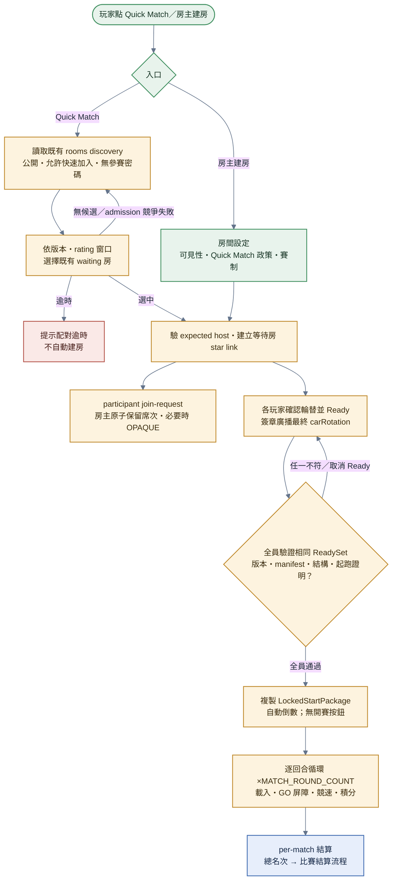

# 配對

> participant 與 spectator 的私房 credential 都是 CSPRNG 產生的 192-bit invitation，加入只以 RFC 9807 OPAQUE 完成，不接受自訂低熵密碼。participant succession 只傳加密 OPAQUE server state，spectator succession fail closed（[D-20260806-01](../decisions/D-20260806-01-OPAQUE角色邀請驗證.md)）。

> **本檔角色**：玩家從點「配對」到開賽倒數的完整流程。
> TrueSkill 演算法見 [../算式表.md §20](../算式表.md)；房間規範見 [../賽內機制.md §1](../賽內機制.md)。

## 1. 詳細流程



**步驟細目**：

1. **房主建房設定**——明確設定 visibility 與 quickMatchEnabled；受保護角色由 UI 產生 invitation 並提供 fragment 分享連結。Quick Match 只考慮 public、quick-match-enabled、participant open 的 waiting 房。
2. **Quick Match discovery**——讀取 rooms topic 已驗證的既有房公告；不廣播玩家配對請求，也不產生新房。公告的 player count／state／rating 中位數由房主週期更新；`signalingEndpoint` 提供可用 WSS 候選，`gossipSignaling` 只宣告 scoped Gossip signaling 能力。
3. **候選選擇**——版本相容後套用 rating 窗口：初始 ±5，每 10 秒 +5，上限 ±30；依 rating 距離、現有人數較多、RoomId 固定排序。discovery 不承載整場 `mode`／`rulesKey`；逐回合 `disallowChip` 只從入房後的 `RoundConfig` 顯示與執行。公開廣告不含 participant roster；個人封鎖由房主 admission 拒入，或 client 接受 room-state 後顯示本機房內衝突警示（[../賽內機制.md §1.7](../賽內機制.md)・[../程式架構/matchmaking.md §3.1](../程式架構/matchmaking.md)）。
4. **participant admission**——加入端先從已驗簽公告／presence 找出 expected host 並建立 star link，再送 join-request。房主原子保留席次；受保護角色完成 OPAQUE 與綁 RoomId／role／epoch／雙方 PeerId 的雙向 confirmation。錯誤、逾時或斷線釋放席次。
5. **Ready 與集合驗證**——每位 participant（含 host）選妥逐回合車輛後按 Ready，簽署房間、設定 digest、membership epoch、完整 ClientVersionInfo 與 `carRotation`。全員 Ready 後才形成 ReadySet；各端獨立載入實際 admitted manifests，驗簽、版本、結構、資產版本與同一 digest，再參與可驗算起跑證明。全驗證完成才複製 `LockedStartPackage` 並自動倒數；沒有「開始比賽」按鈕。
6. **進入既有 room**——沿用原 host、RoomId、MatchConfig 與 access policy；加入端從開始即監聽 scoped GossipSub，並依玩家順序逐一嘗試 WSS candidates，只有非本機精確 roster、已驗簽 room announcement／presence 或 signaling 入站才算找到。以首個有效路徑交換 ICE candidate（必要時走 TURN），建立等待房 star link；開賽後才建立 race mesh。
7. **個人／集合失效規則**——取消 Ready 後才可換車。加入或 host 移除玩家只重建集合驗證，其他人的個人 Ready 保留；場地、賽制或回合設定改變才使全員未 Ready。host Ready 時須先取消才能移除玩家。
8. **逐回合循環 ×MATCH_ROUND_COUNT**——等待房倒數到期後進 preloading；RaceSession 只消費 LockedStartPackage，不重讀車庫。載入該回合場地與鎖定 `carRotation[i]`，再通過每回合 GO 前 race-ready 屏障與 3 秒 STARTUP countdown。
9. **比賽結束 → per-match 結算**——總名次（N 回合積分加總 → tiebreak）→ 獎金 / TrueSkill / 信譽（比賽結算流程）。

## 2. 配對模式

| 模式 | 說明 | 觸發 |
|---|---|---|
| Quick Match | 依 TrueSkill 動態窗口加入既有公開、允許快速加入且無參賽密碼的 waiting 房；逾時不建房 | 玩家點「配對」|
| 私人房間 | 房主邀請；不套 Quick Match rating 搜尋窗口，正式結算與 TrueSkill 規則不變 | 房主建房 + 分享連結 / 邀請 |

## 3. TrueSkill 配對窗口

```text
MATCH_RATING_WINDOW_INITIAL: 5
MATCH_RATING_WINDOW_GROWTH_PER_10SEC: 5
MATCH_RATING_WINDOW_MAX: 30
```

範例：等 30 秒未配到 → 窗口擴張到 ±20（`5 + ⌊30/10⌋×5`）。權威見 [賽內機制.md §1.2](../賽內機制.md) / [protocol.md §6](../程式參數/protocol.md#6-protocolmatchmaking配對)。

## 4. 新手保護

新人 σ 大、配對窗口自然較寬（見 [§3](#3-trueskill-配對窗口)），不另設新手 rating 加成。信譽下限 400（註冊 < 7 天）保護詳見 [../信譽系統.md §4.1](../信譽系統.md)。

## 5. 版本相容性

詳見 [../版本規範.md §5](../版本規範.md)：

```typescript
checkCompatibility(my, peer): boolean {
  client_version.major 必須相同
  protocol_version 必須相同
  derive_logic_version 必須相同
  builtin_assets_version 必須相同
  rapier_version 必須相同            // 物理引擎版本，影響 determinism
  economy_config_version 必須相同   // 即使 client 版本同，治理升級不一致仍拒
}
```

不符 → 提示玩家升版。

## 6. Signaling transport

配對請求本身只走 GossipSub；配對完成後的 WebRTC 握手，Gossip scope 從開始即監聽，
加入端並依設定順序嘗試 WSS candidates，跳過只含自己的空 room roster。只有已驗證的
room／peer discovery 或 signaling 入站才算找到；回覆沿最後入站 transport，冷啟動 WSS
roster 不含目標時走 Gossip，跨 transport 重複訊息以 signed nonce 去除。WebRTC 建立後
立即關閉 signaling session。詳見
[../程式架構/signaling-service.md §1](../程式架構/signaling-service.md)。

## 7. NAT Traversal

| 情境 | 處理 |
|---|---|
| 兩端皆 Open NAT | 直接 P2P |
| 一端 Symmetric NAT | TURN relay（`TURN_TOKEN_TTL_SEC: 300`）|
| 兩端 Symmetric NAT | 走 TURN 中繼 |

## 8. 房主切換規則

**僅房間等待階段才有繼任問題**（比賽中與結算階段房主皆無作用）。

| 階段 | 房主離開處理 |
|---|---|
| **房間等待** | 由進房順序的下一位玩家接任房主 |
| **比賽進行中** | **無人接任**（房主在比賽中本來就無作用；計圈 / 多簽 / settlement 流程皆 P2P 平等）|
| **結算** | **無人接任**（純顯示排名）|

**比賽中無踢人權限**（避免被當作戰術工具）。

## 9. 房間等待頁 UX（`/room/:roomId`）

| 模組 | 內容 |
|---|---|
| P2P 診斷 | 顯示各 peer 連線狀態（綠 / 黃 / 紅）、NAT 類型、TURN 是否啟用 |
| 資源載入 | 顯示車輛 / 場地 GLB 從 IPFS 拉取進度（含 pinning fallback 嘗試）|
| 房主切換通知 | 房主離開時 UI 即時提示「新房主：XXX」|
| 觀戰政策 | 所有人看 allow／capacity／password 狀態；只有 host＋waiting 顯示編輯器，開賽後凍結 |
| 初始／後續 roster 含封鎖對象 | 以本機封鎖交集顯示持續警示＋一鍵離開（**不自動退**、進退自主、相同 roster 不重複提示；房主可拒其加入見 [§1](#1-詳細流程)，[../賽內機制.md §1.7](../賽內機制.md)）|
| 開賽前揭露提示 | 場內含**廢止材質**絕版品（玩家件 / 場地）→「絕版材質揭露」軟提示（[../材質表.md §11.3](../材質表.md)）；含降版 / schema 差異資產 → 對應提示（[../版本規範.md §21](../版本規範.md)）。**續留房 = 默認認同該場公平**（開賽前退出無懲罰）|
| Ready／倒數 | 所有人只見準備／取消準備；全 Ready 後先顯示驗證中，再顯示集中參數倒數。絕版材質提示由本機掃描實際 ReadySet manifests 產生，不把材質清單、理由或布林宣告放進共識 wire。|

### 9.1 倒數中斷線

- participant admission 鎖定，不接受新玩家或補位。
- room link 失效必須再有 signaling presence 離開佐證；host 單方面關閉 link 不足以判定玩家斷線。
- 真正斷線者本場不重連，原起跑格留空且不重抽；剩餘者至少 2 人、並占原鎖定 roster 嚴格多數才繼續。
- 不足嚴格多數時取消本輪、移除已確認斷線者，剩餘者全部回未 Ready。
- host 斷線只有決定性繼任者能重驗同一 LockedStartPackage 時才沿用原 deadline；否則不續倒數。

## 10. 配對失敗 / 取消

| 情境 | 處理 |
|---|---|
| 配對超時（未找到可加入房）| UI 提示配對逾時；可返回 Race Config 或自行建房 |
| 玩家主動取消 | 從 matchmaking topic 退出 |
| 版本相容性檢查失敗 | 提示「升級」+ 重新進入配對 |
| ICE 握手失敗 | 自動 fallback 到下一個 signaling provider |
| active signaling session 意外關閉 | 原子停用舊 session、釋放 transport，單次重跑已設定 provider chain 並換綁同一 room presence；重連期間握手操作回 offline，離房／明示關閉不重連 |
| 載入資產失敗（IPFS unavailable）| 自動 retry + pinning fallback |

## 11. 跨模組對接

| 模組 | 內容 |
|---|---|
| `matchmaking/` | TrueSkill 演算法 |
| `signaling-service/` | 握手 + provider fallback |
| `peer-discovery/` | libp2p DHT + GossipSub |
| `network-sync/` | mesh DataChannel |
| `key-manager/` | PeerId + Race Sign Key |
| `versioning/` | ClientVersionInfo 交換 |
| `ledger/` | economy_config_version 取值 |
| IPFS / Helia | 資產載入 |
