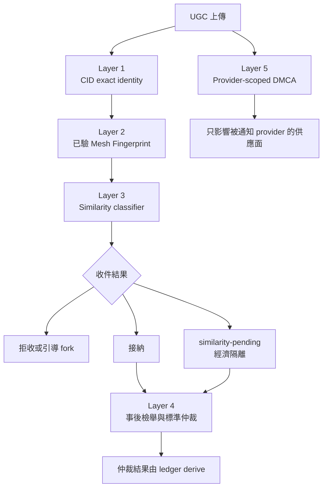
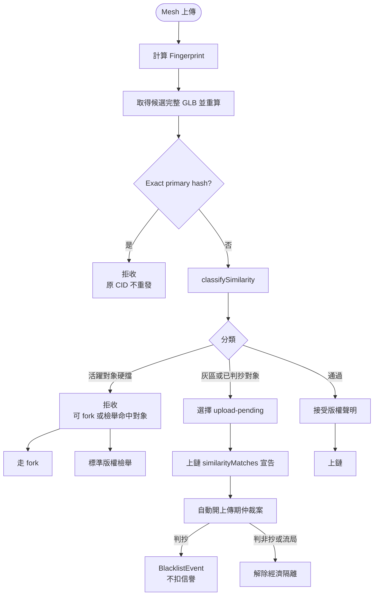
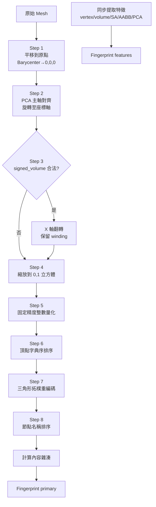
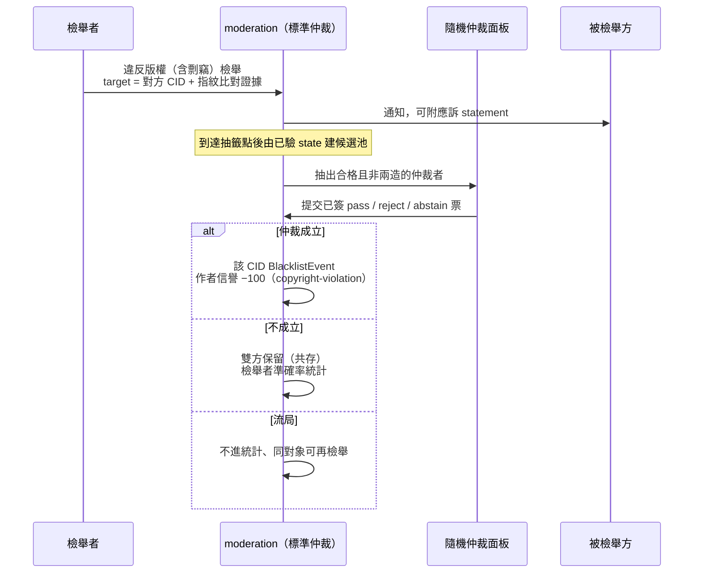
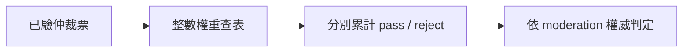
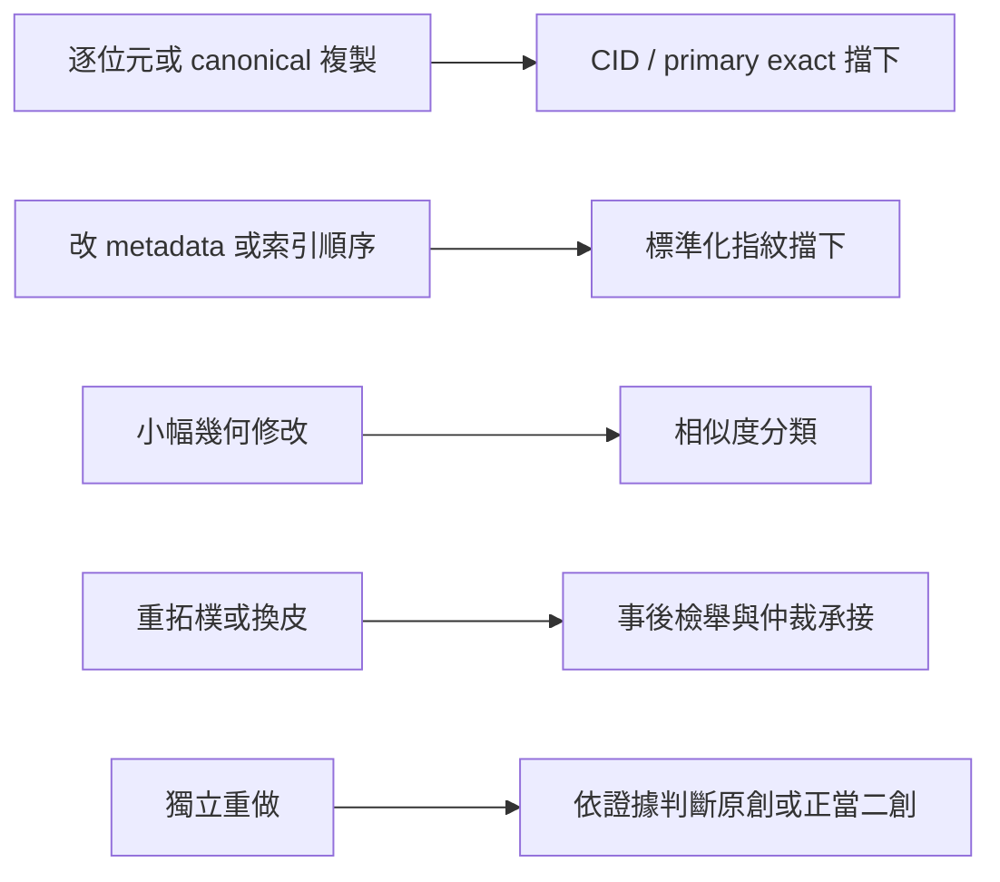

# Anti-Piracy

<!-- generated:impl-flow-header:start -->
> **文件角色**：implementation flow 投影；圖與步驟不得另建產品規則或參數 authority。

| Implementation authority | 產品 canon／流程 | 全域索引 |
| --- | --- | --- |
| [anti-piracy.md](../anti-piracy.md) | [版權](../../版權.md) · [檢舉與仲裁](../../流程/檢舉與仲裁.md) | [流程.md §2](../../流程.md#2-各模組流程圖索引) |
<!-- generated:impl-flow-header:end -->
## 五層防禦堆疊

五層各自處理內容同一性、幾何相似、上傳分類、鏈上社群裁決與 provider 法遵；上傳時間不形成
自動勝負。相似度門檻數值以 [版權.md §5.3](../../版權.md) 為唯一權威，圖中不重列。

## 上傳檢查流程

`similarity-pending` 直接使用標準仲裁機器；其案錨就是含 `similarityMatches` 的
`UgcUploadEvent`。硬擋、灰區與通過的門檻，以及仲裁黑名單對象的降級規則，以
[anti-piracy.md §5.1](../anti-piracy.md) 為準。

## 標準化演算法

## 仲裁流程（走標準純仲裁）

候選人必須同時通過信譽、完賽、註冊時間、**非全域玩家黑名單**與非兩造條件。面板大小、
quorum、票權與成立門檻只引用 [moderation.md §5](../moderation.md)，不在圖中複製數值。
上傳期灰區同走標準仲裁但**無檢舉者**：判抄 → 下架（`BlacklistEvent`、不扣信譽）／
判非抄或流局 → 解除隔離、經濟開始（[anti-piracy.md §5](../anti-piracy.md)）。

## 信譽加權投票

合格門檻、整數權重表與成立條件分別由 [moderation.md §5](../moderation.md)、
[reputation.md §6.1](../reputation.md) 與 [算式表.md §17](../../算式表.md) 定義。

## 攻擊成本評估

