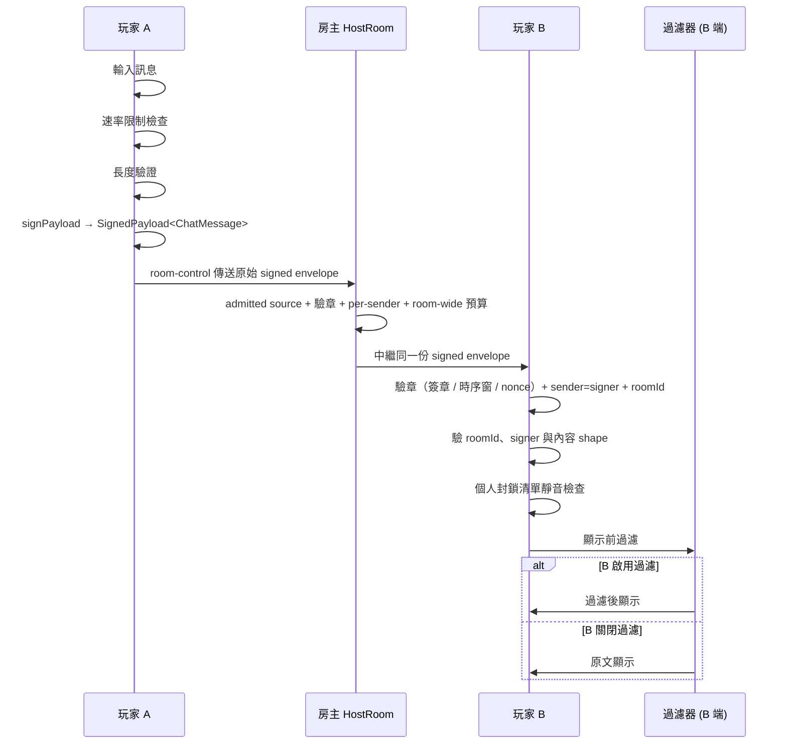
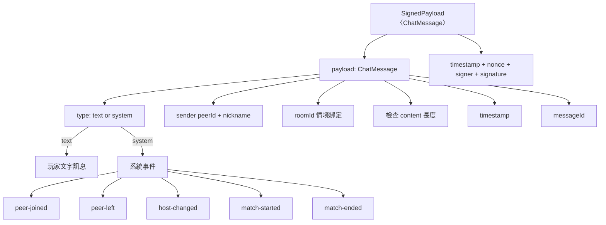
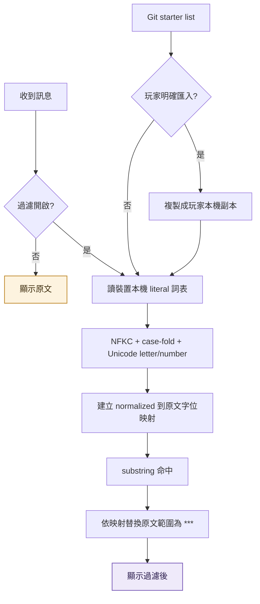
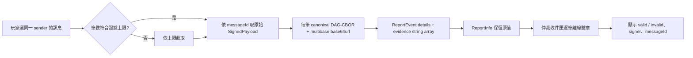
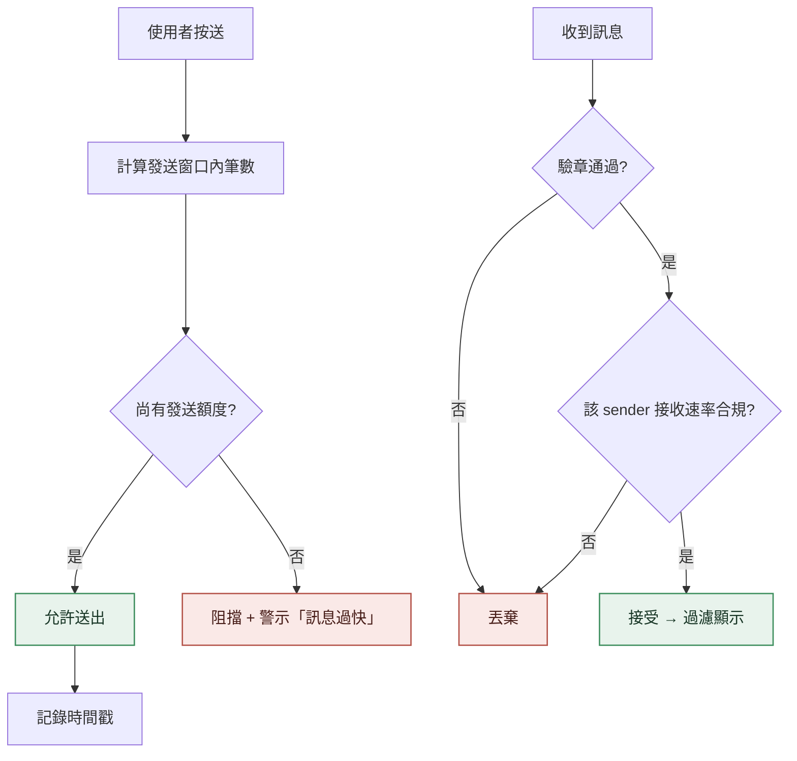
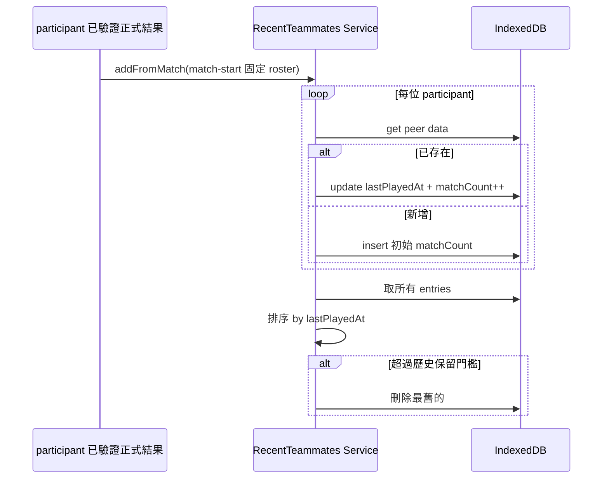
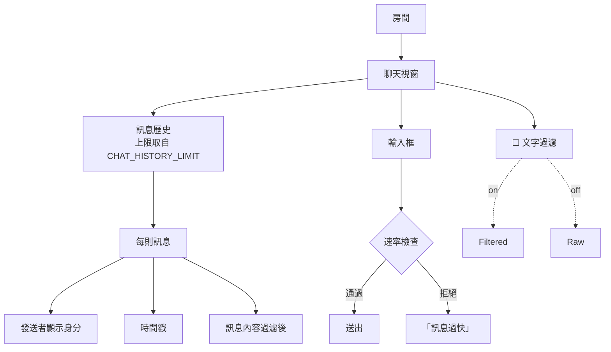
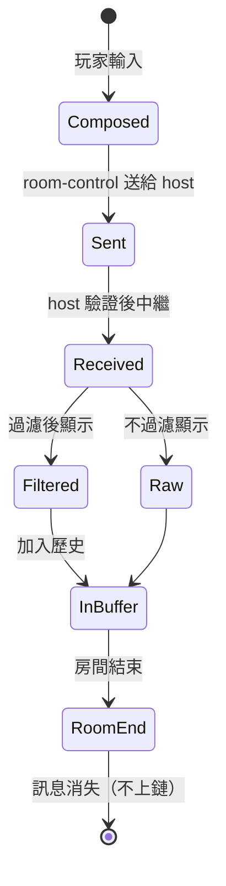

# chat-system

<!-- generated:impl-flow-header:start -->
> **文件角色**：implementation flow 投影；圖與步驟不得另建產品規則或參數 authority。

| Implementation authority | 產品 canon／流程 | 全域索引 |
| --- | --- | --- |
| [chat-system.md](../chat-system.md) | [賽內機制](../../賽內機制.md) · [配對](../../流程/配對.md) | [流程.md §2](../../流程.md#2-各模組流程圖索引) |
<!-- generated:impl-flow-header:end -->
> 等待房共用文字聊天的**技術流程圖**（訊息傳送／結構／過濾／速率／最近隊友／生命週期）。模組實作見 [chat-system.md](../chat-system.md)；賽內改用 [race-messages.md](../race-messages.md)。

## 訊息傳送

## 訊息結構

## 過濾流程

## 騷擾檢舉證據

單一騷擾檢舉至多收錄同一 sender 的 16 筆訊息；完整逐筆大小與編碼限制見
[流程/檢舉與仲裁.md §1](../../流程/檢舉與仲裁.md)。

## 速率限制（雙端）

送端自律是 UX、收端強制是防線（惡意 client 可跳過送端檢查）。

## 最近隊友更新

開賽失敗、賽前取消、單純 teardown 與 spectator 不進入此流程。設定頁隱私區讀取這份本機
清單，供玩家辨識最近隊友並直接加入個人封鎖清單；資料不建立好友關係且不上鏈。

## 房內聊天 UI

發送者顯示為暱稱加空格與 `#` 後 8 位 hex 指紋；缺暱稱時只顯示該穩定指紋。

## 訊息生命週期

