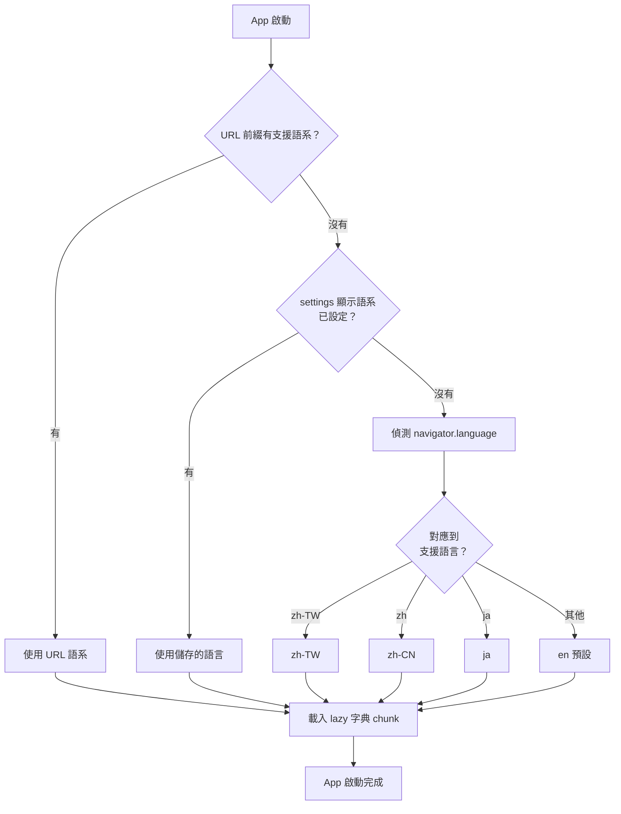
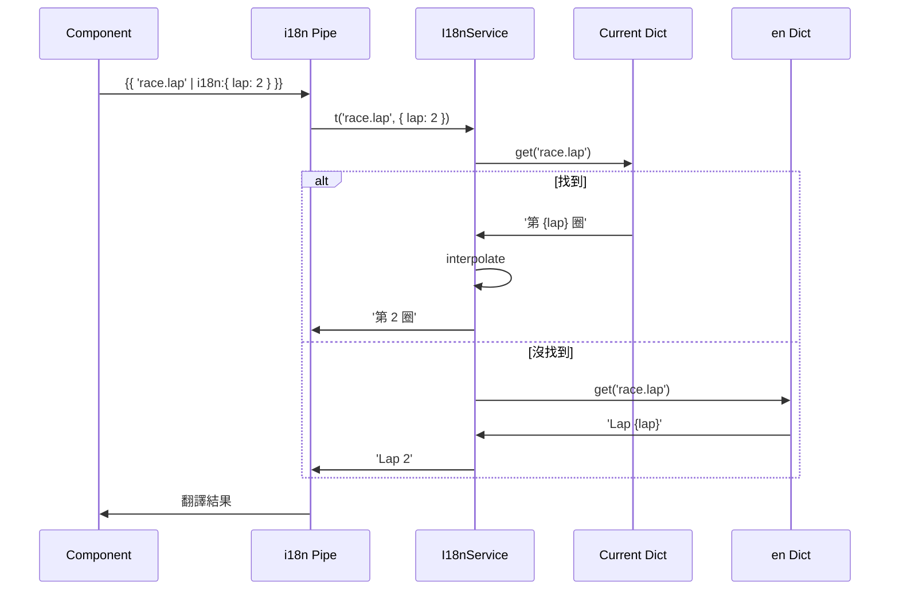
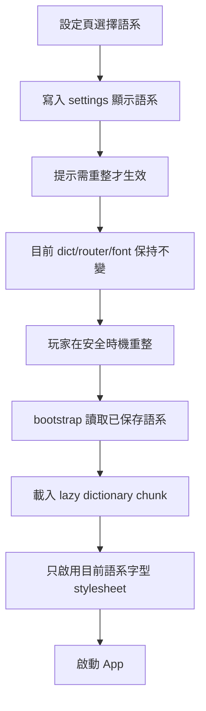
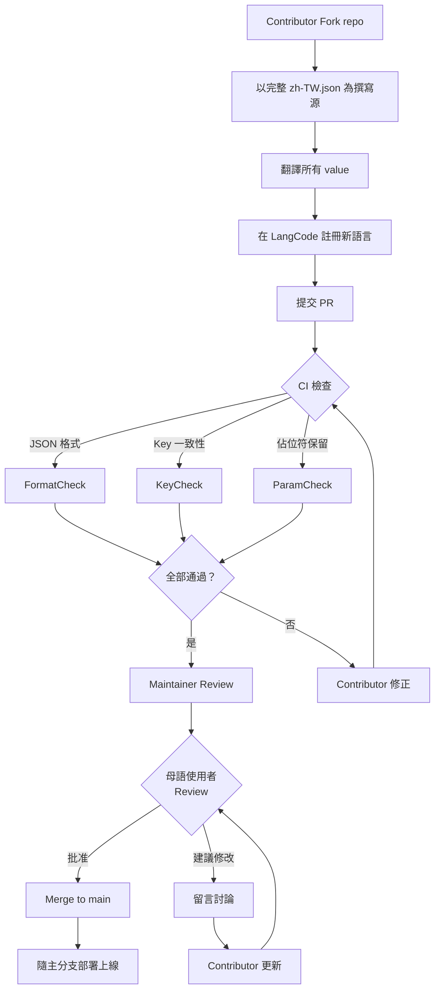
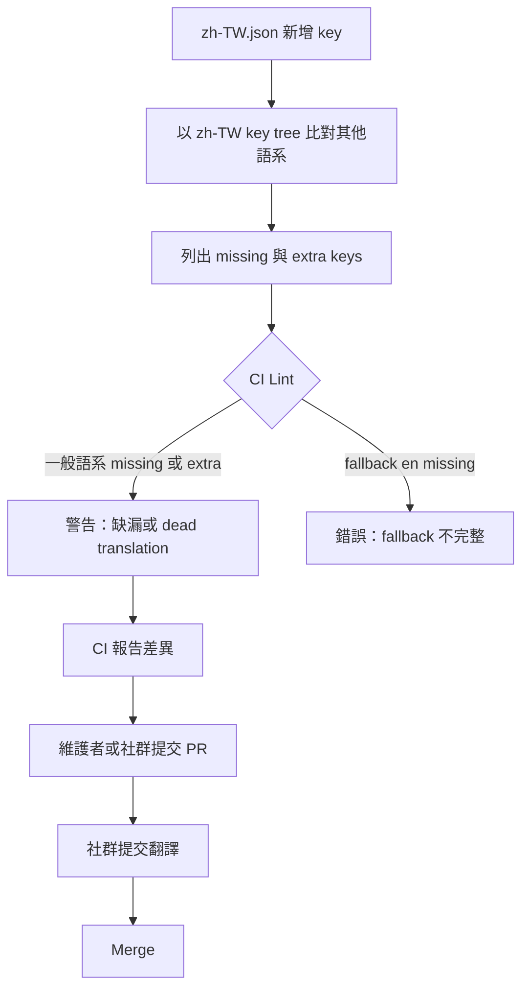
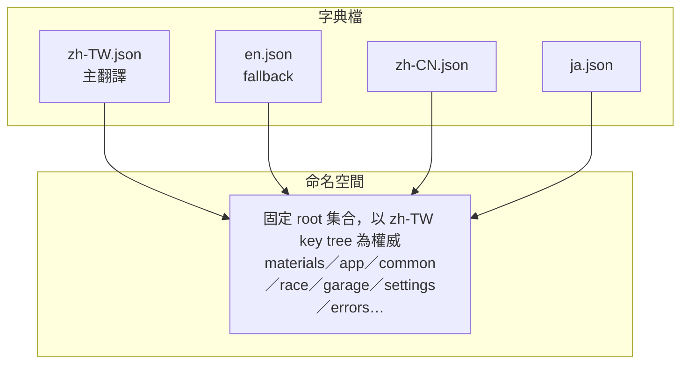
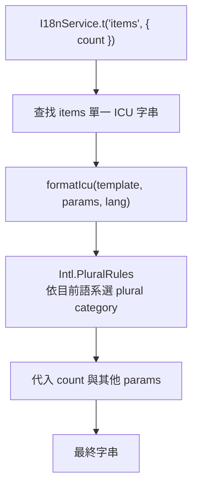
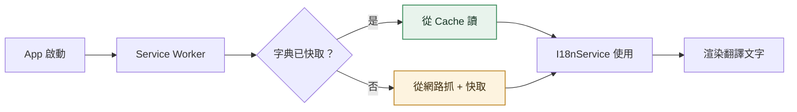

# i18n

<!-- generated:impl-flow-header:start -->
> **文件角色**：implementation flow 投影；圖與步驟不得另建產品規則或參數 authority。

| Implementation authority | 產品 canon／流程 | 全域索引 |
| --- | --- | --- |
| [i18n.md](../i18n.md) | [語系清單](../../語系清單.md) | [流程.md §2](../../流程.md#2-各模組流程圖索引) |
<!-- generated:impl-flow-header:end -->
## 啟動時語言偵測

## 翻譯查找流程

## 語言切換

## 社群 PR 流程

## 字典缺漏處理

## 字典結構

## 複數處理

## PWA 字典快取

