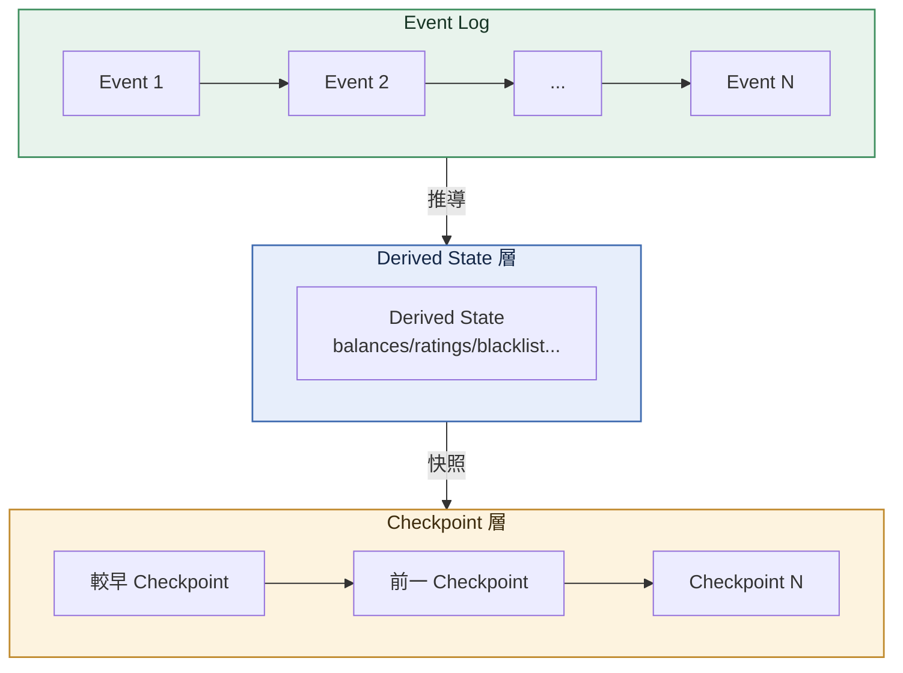
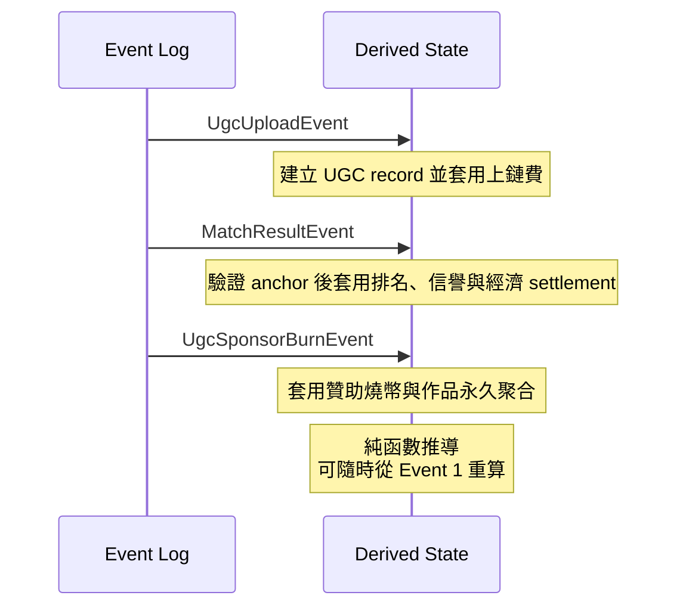
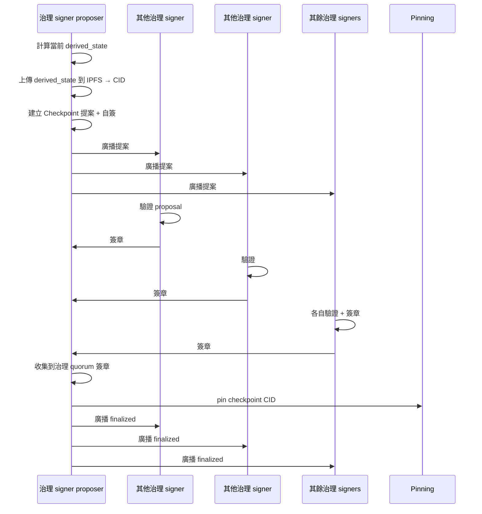
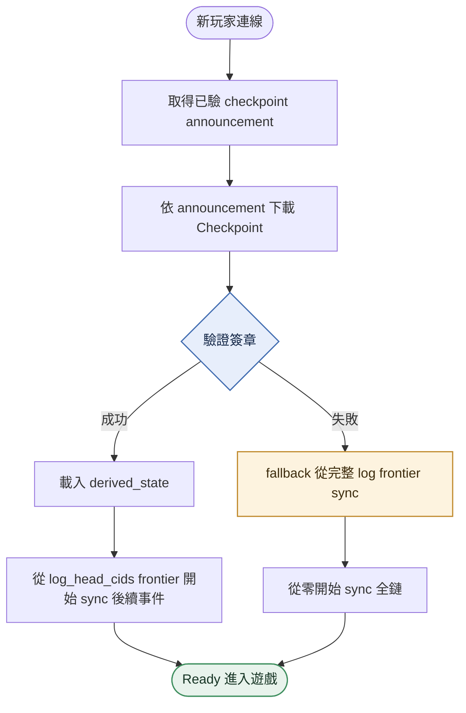
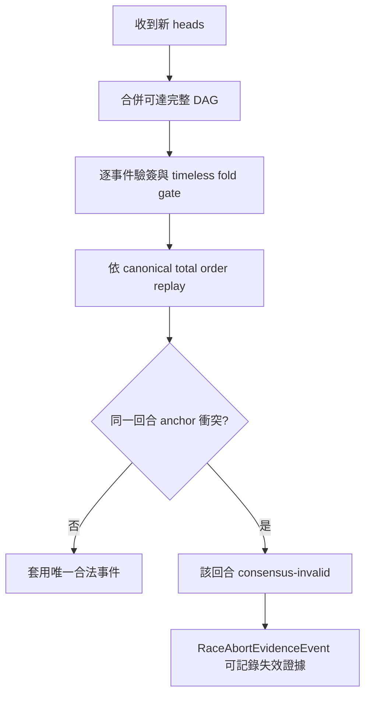
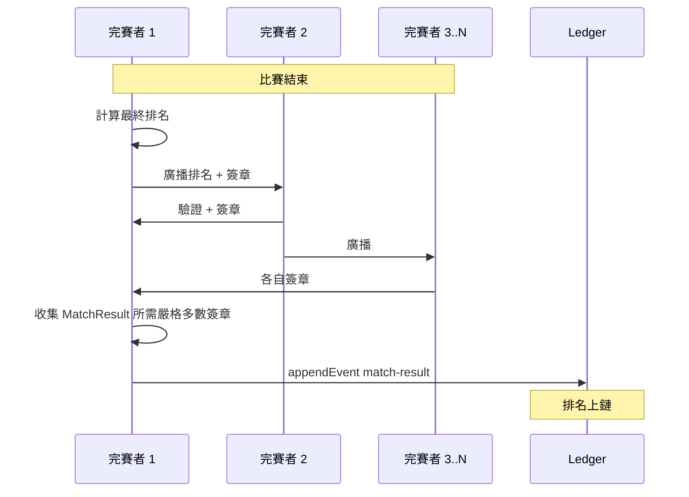
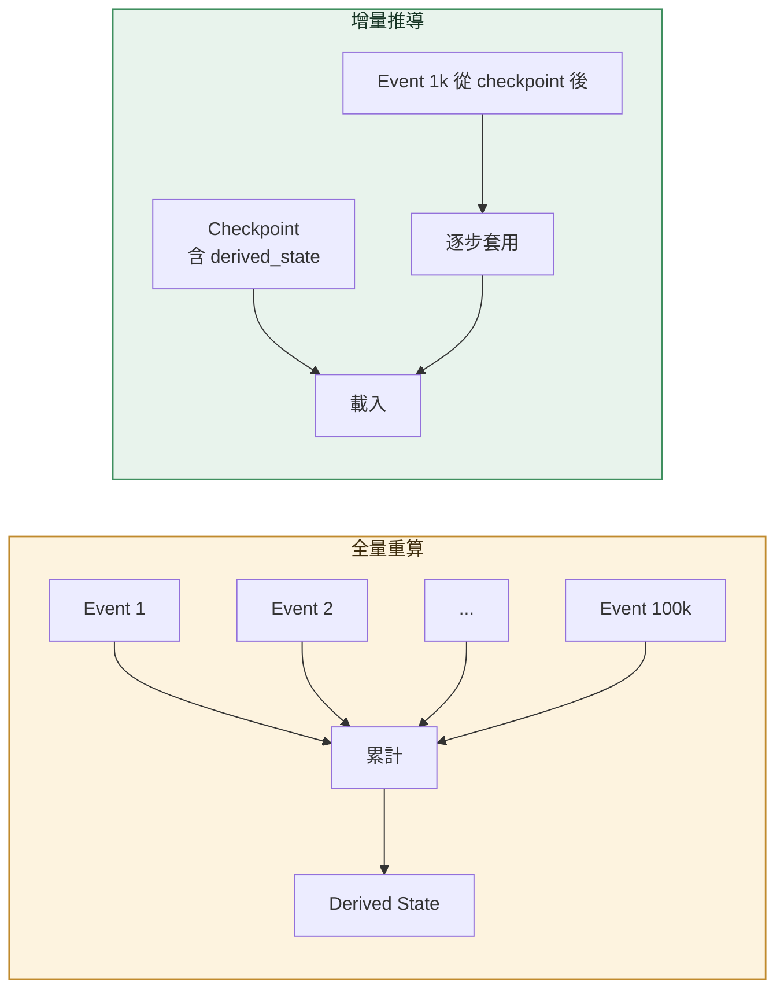
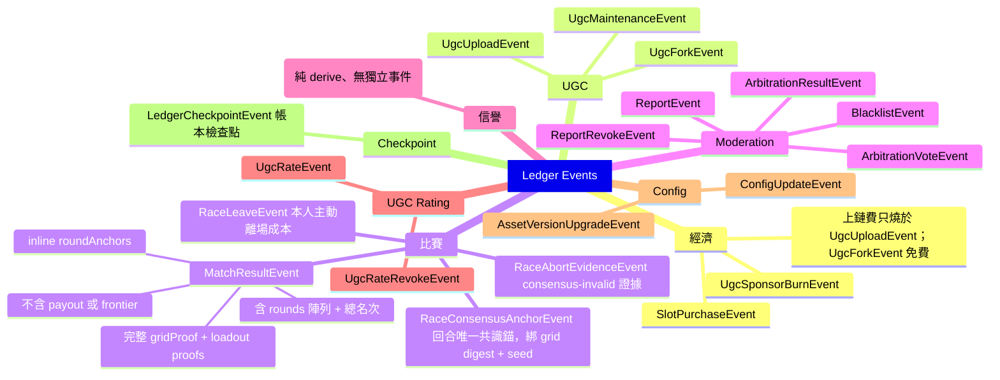

# Ledger

<!-- generated:impl-flow-header:start -->
> **文件角色**：implementation flow 投影；圖與步驟不得另建產品規則或參數 authority。

| Implementation authority | 產品 canon／流程 | 全域索引 |
| --- | --- | --- |
| [ledger.md](../ledger.md) | [資料系統](../../資料系統.md) · [比賽結算](../../流程/比賽結算.md) | [流程.md §2](../../流程.md#2-各模組流程圖索引) |
<!-- generated:impl-flow-header:end -->
## 三層架構

## 事件溯源範例

## Checkpoint 提案流程

## 新玩家 Sync 流程

## DAG 合併與衝突失效

## 比賽結果簽章

## DerivedState 推導效能

## 事件分類

