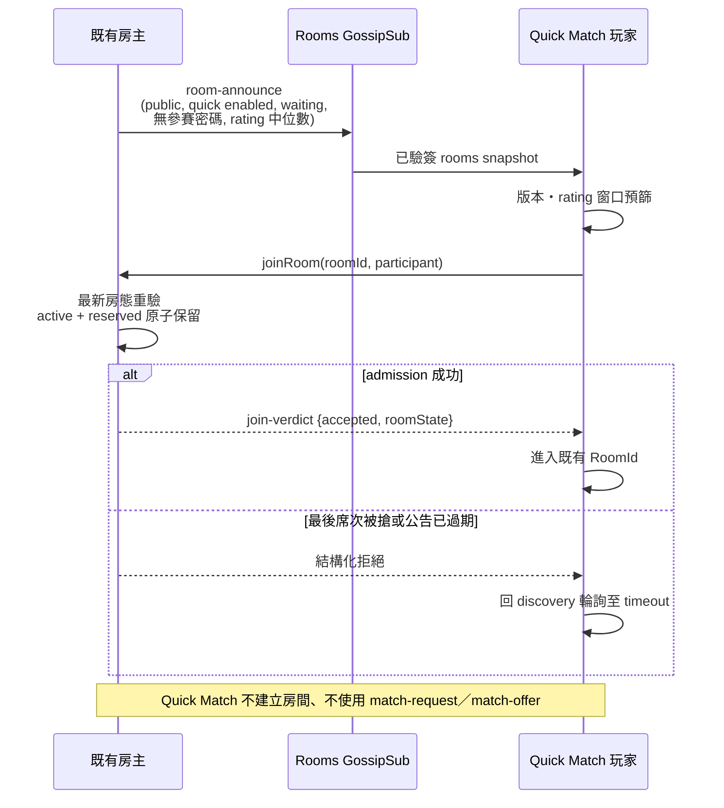
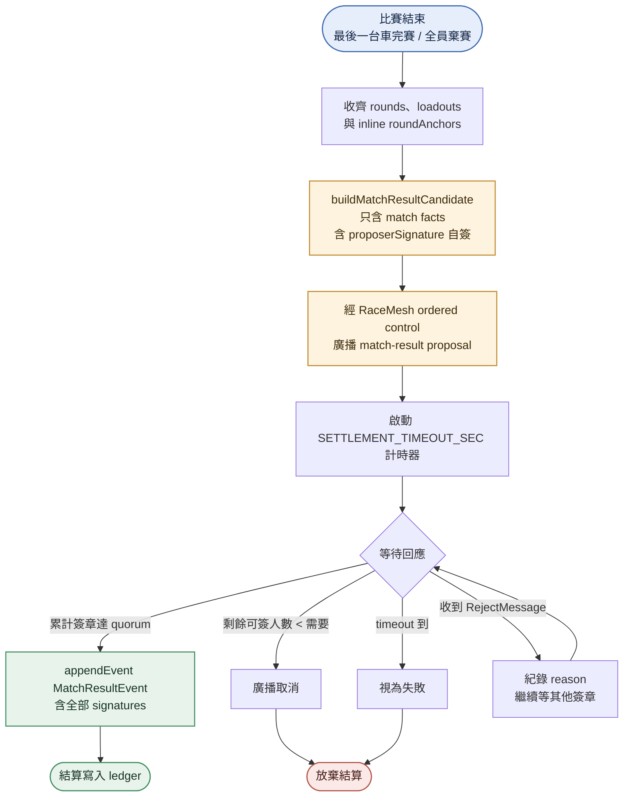
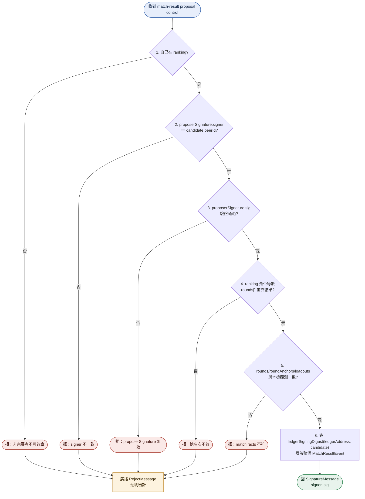
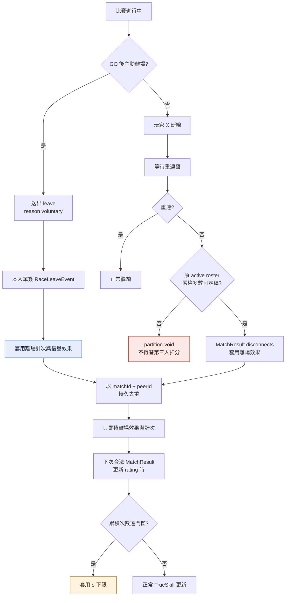
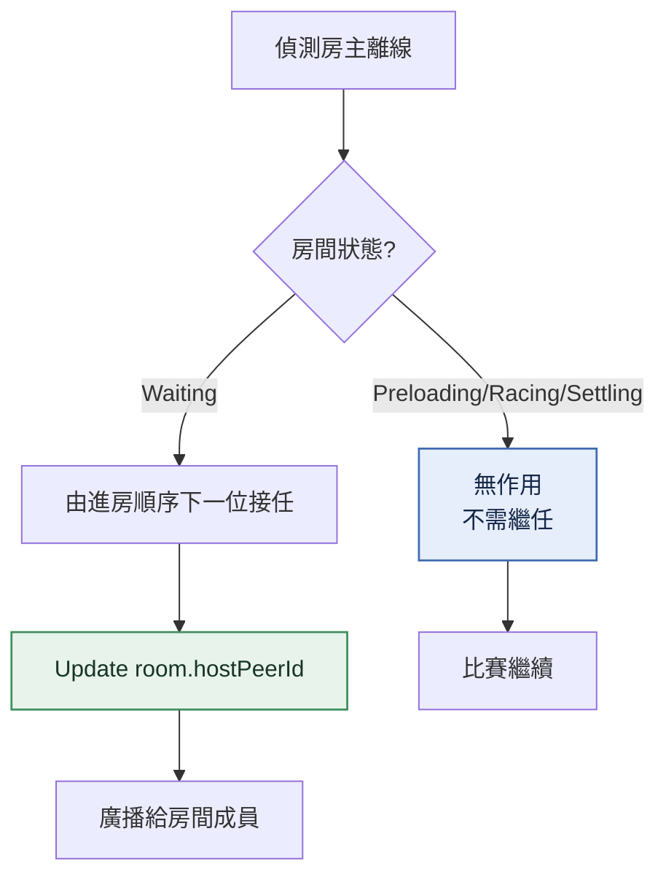

# matchmaking

<!-- generated:impl-flow-header:start -->
> **文件角色**：implementation flow 投影；圖與步驟不得另建產品規則或參數 authority。

| Implementation authority | 產品 canon／流程 | 全域索引 |
| --- | --- | --- |
| [matchmaking.md](../matchmaking.md) | [配對](../../流程/配對.md) · [比賽結算](../../流程/比賽結算.md) | [流程.md §2](../../流程.md#2-各模組流程圖索引) |
<!-- generated:impl-flow-header:end -->
> 配對 / 結算的**技術流程圖**（訊息流 / 賽後簽章 / 斷線計分 / 房主繼任）。模組實作見 [matchmaking.md](../matchmaking.md)；配對遊戲流程（TrueSkill / 配對等待 / 房間）見 [流程/配對.md](../../流程/配對.md)。

## Quick Match 既有房流程

## 主 peer 賽後流程

`proposerSignature` 算 quorum 1 票，主 peer 自身也是完賽者之一。

## 完賽者驗算+簽章（reviewAndSignMatchResult）

任一驗證失敗 → 拒簽 + 廣播 RejectMessage 給所有 peer（含主 peer 與其他完賽者），達到透明審計效果。

## 中途斷線計分

`RaceLeaveEvent` 只立即形成本人離場成本，不產生排名、TrueSkill、經濟或完賽效果，也不縮小 MatchResult quorum；正式 MatchResult 的其餘效果仍依原 active roster 的合法定稿正常套用。

## 房主繼任

