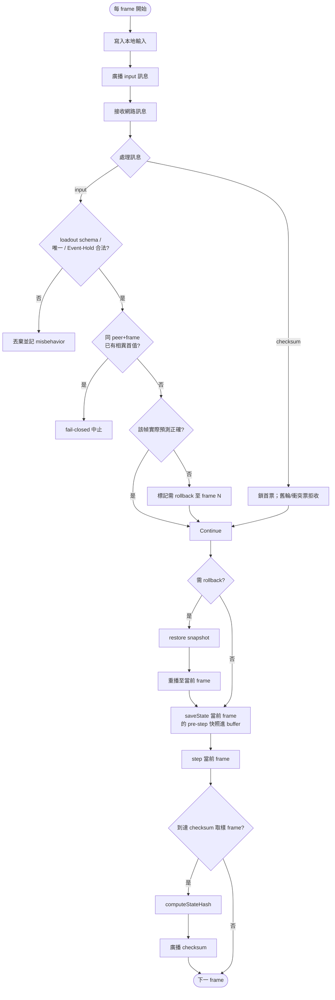
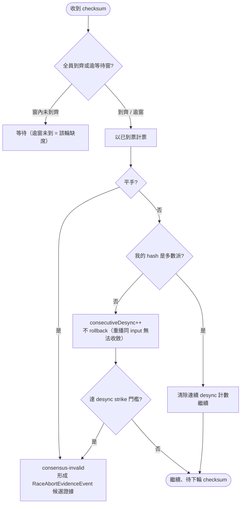
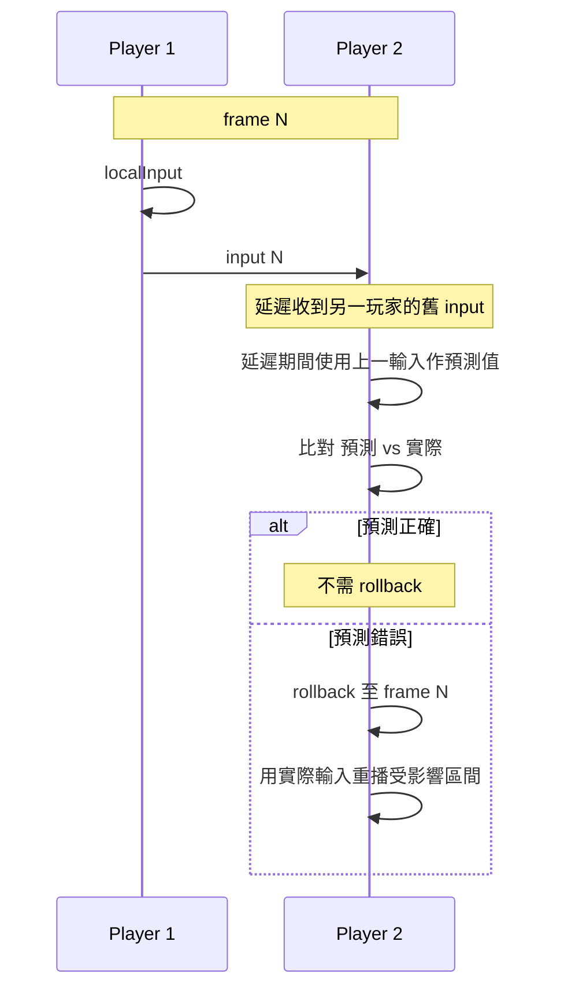
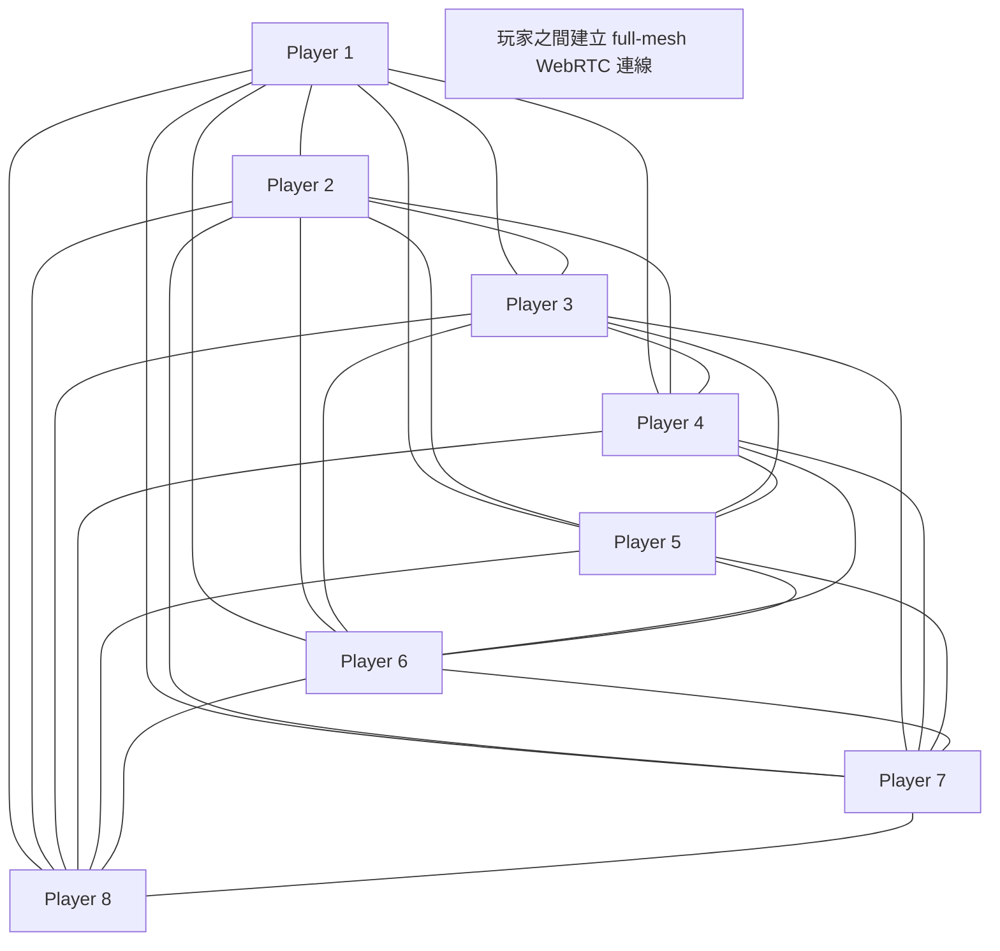
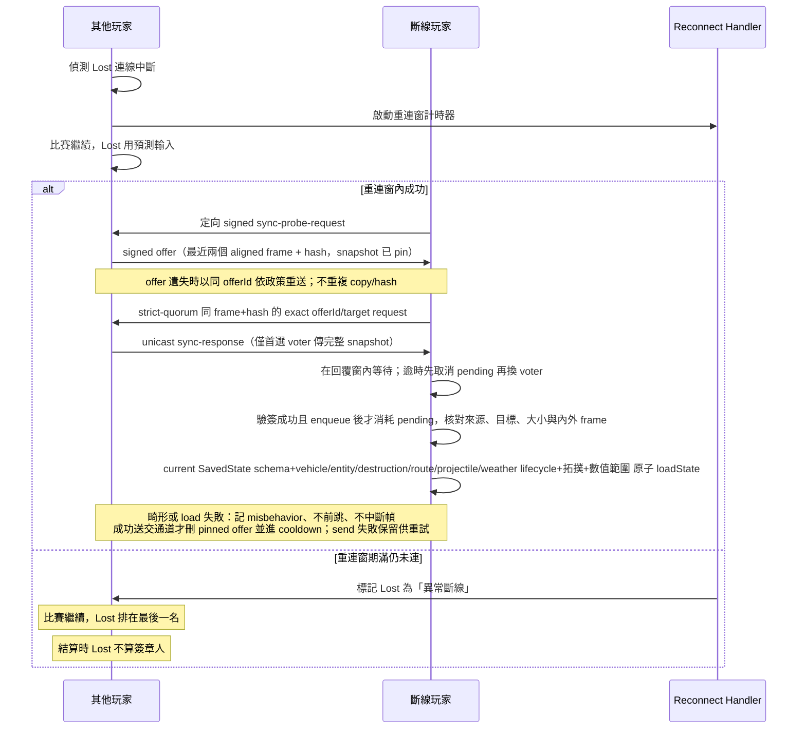
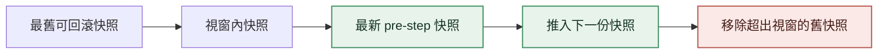

# Network Sync

<!-- generated:impl-flow-header:start -->
> **文件角色**：implementation flow 投影；圖與步驟不得另建產品規則或參數 authority。

| Implementation authority | 產品 canon／流程 | 全域索引 |
| --- | --- | --- |
| [network-sync.md](../network-sync.md) | [比賽進行](../../流程/比賽進行.md) | [流程.md §2](../../流程.md#2-各模組流程圖索引) |
<!-- generated:impl-flow-header:end -->
## Rollback 主迴圈

## Checksum 解決流程

## Input Prediction 流程

## 8 玩家 Mesh 拓樸

## Reconnect 流程

## Snapshot Buffer 滑動視窗

Buffer 精確保留 12 個 pre-step 快照，rollback acceptance 固定為 8 frames 且不可協商；
視窗推進與接納門檻以程式參數 authority 為準。
