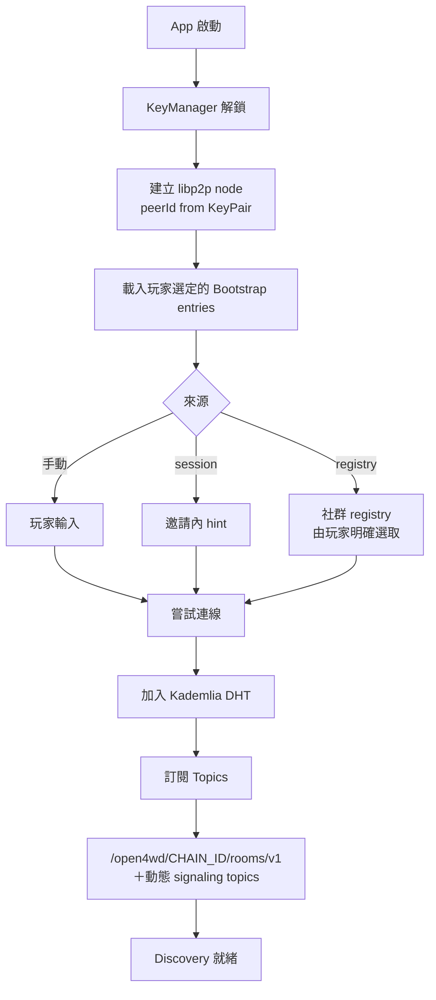
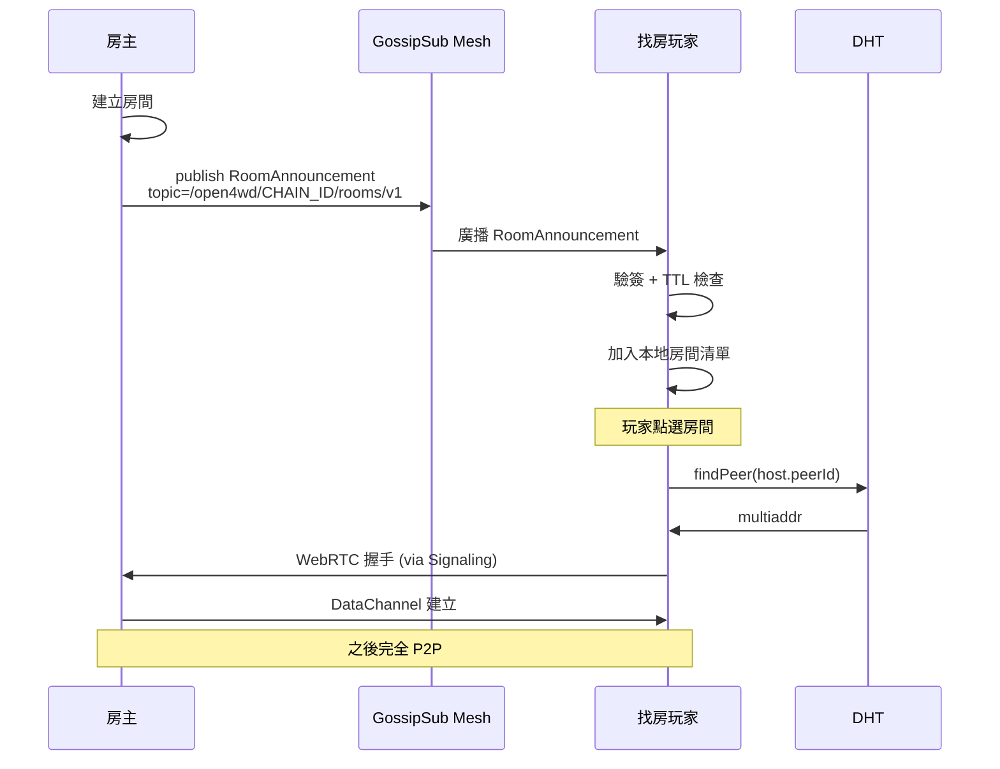
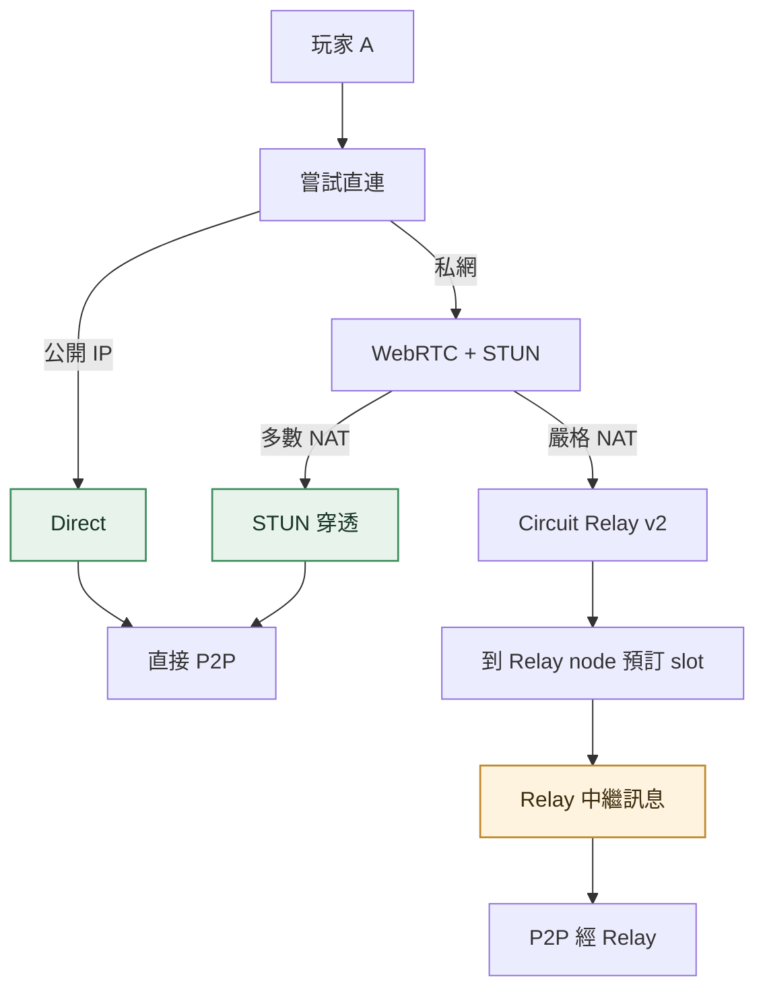
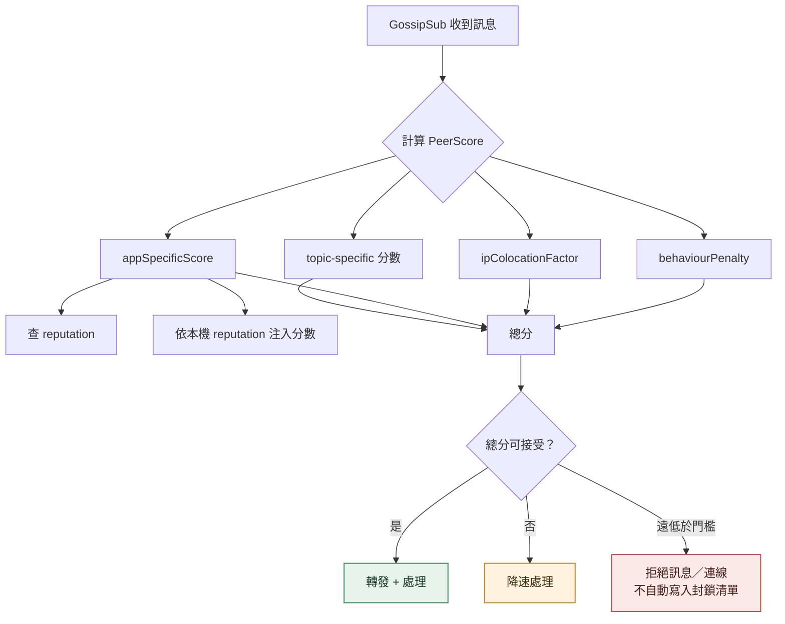
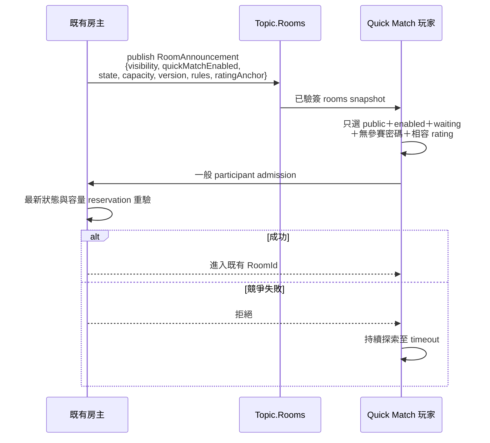
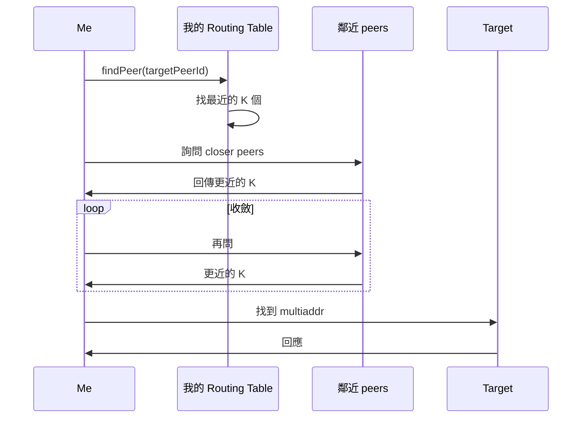
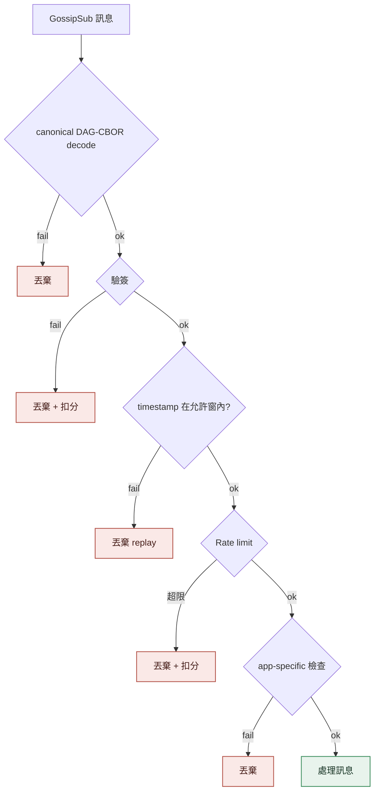
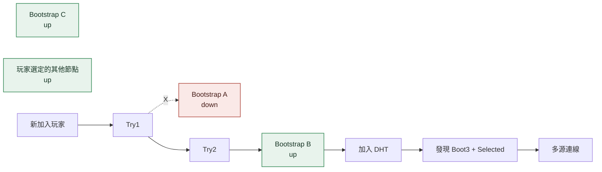
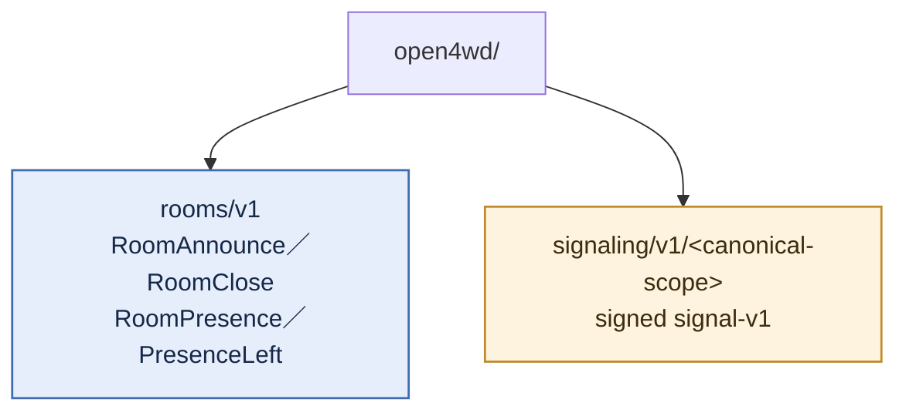

# Peer Discovery

<!-- generated:impl-flow-header:start -->
> **文件角色**：implementation flow 投影；圖與步驟不得另建產品規則或參數 authority。

| Implementation authority | 產品 canon／流程 | 全域索引 |
| --- | --- | --- |
| [peer-discovery.md](../peer-discovery.md) | [配對](../../流程/配對.md) | [流程.md §2](../../流程.md#2-各模組流程圖索引) |
<!-- generated:impl-flow-header:end -->
## 啟動探索

## 房間發現流程

## NAT 穿透三層

## Peer Scoring 流程

## Quick Match 房間探索

## DHT 查找

## Topic 訊息驗簽

## Bootstrap 故障切換

## Topic 結構

