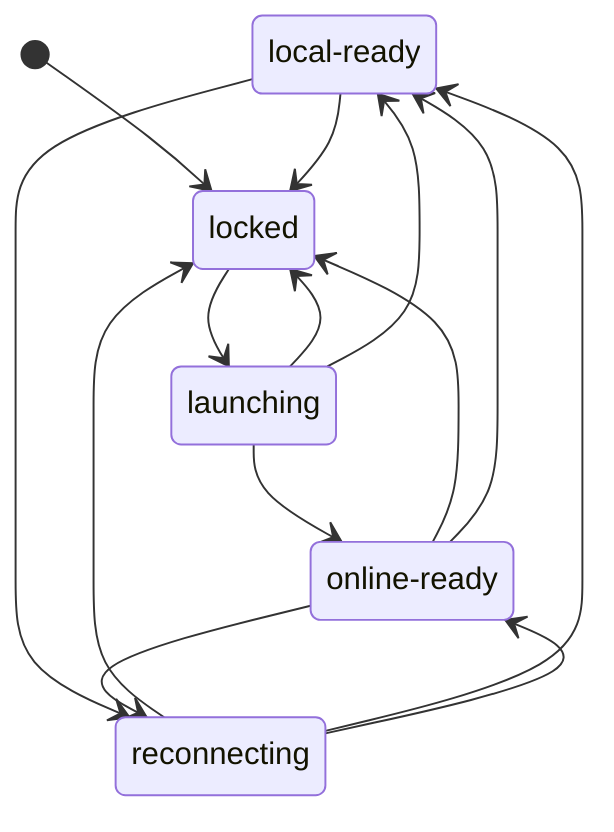
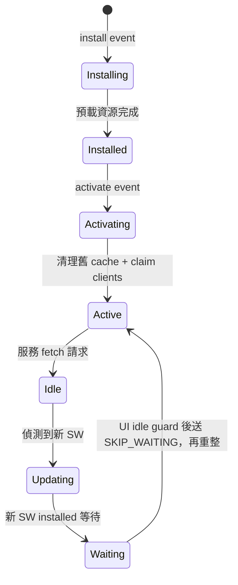
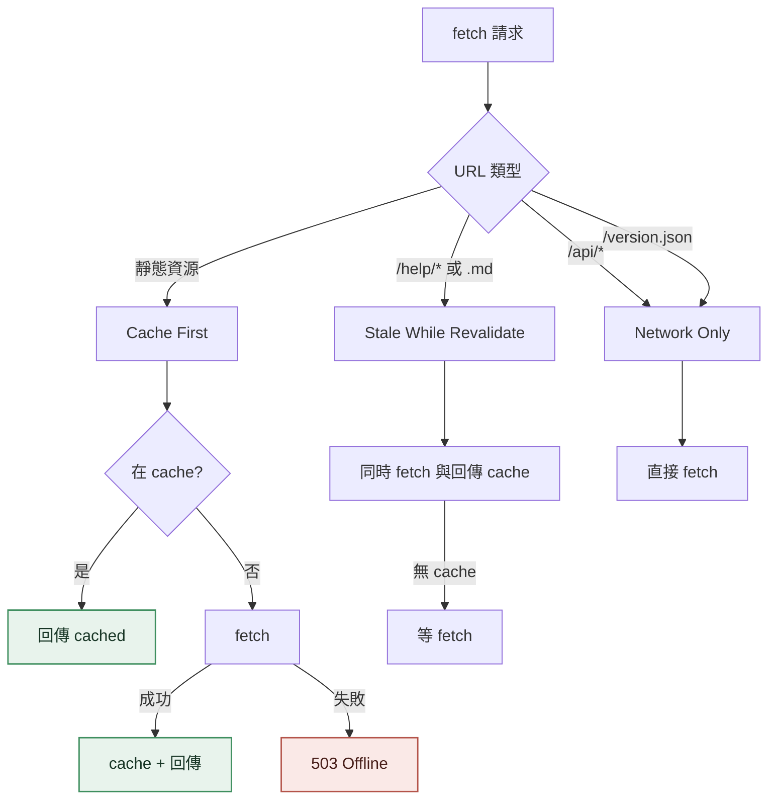
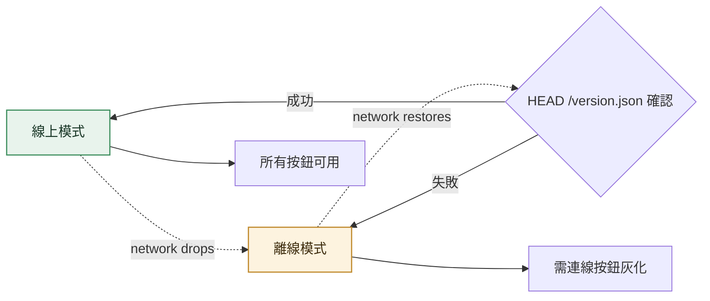
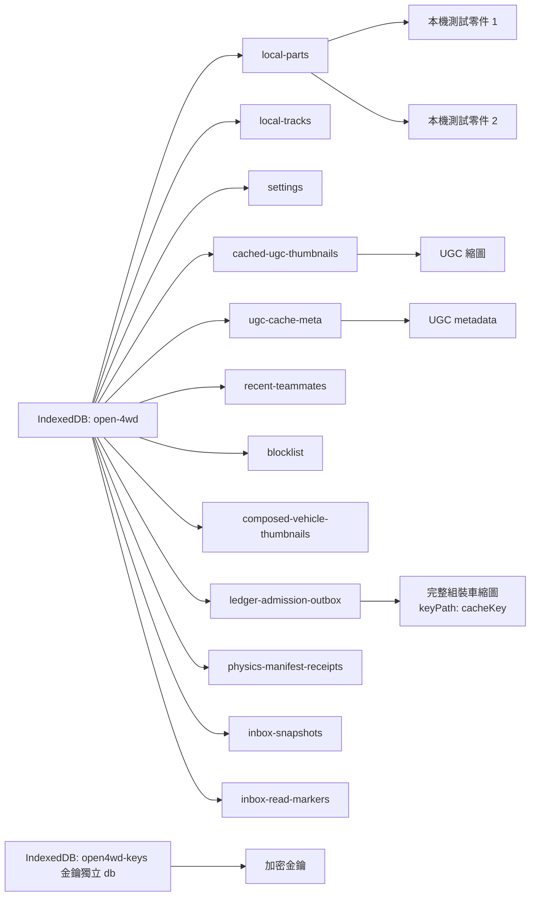
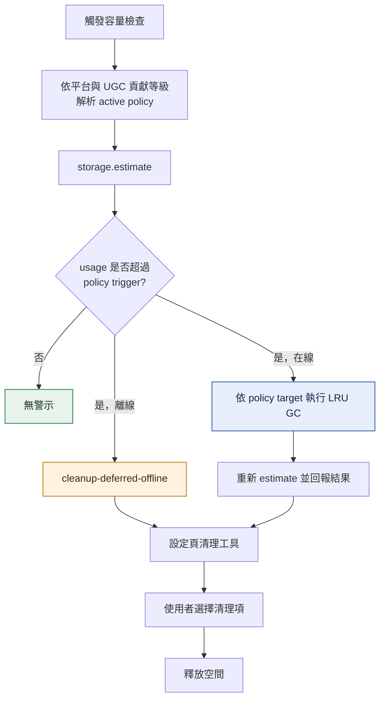
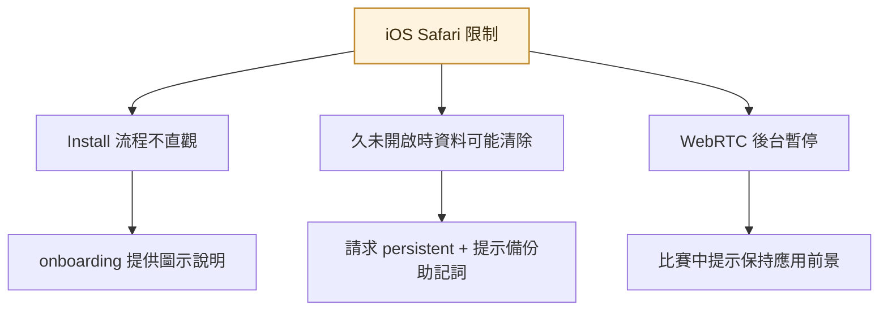

# PWA Offline

<!-- generated:impl-flow-header:start -->
> **文件角色**：implementation flow 投影；圖與步驟不得另建產品規則或參數 authority。

| Implementation authority | 產品 canon／流程 | 全域索引 |
| --- | --- | --- |
| [pwa-offline.md](../pwa-offline.md) | [玩家整體旅程](../../流程/玩家整體旅程.md) · [遊戲機制](../../遊戲機制.md) | [流程.md §2](../../流程.md#2-各模組流程圖索引) |
<!-- generated:impl-flow-header:end -->
## App Shell 狀態與功能可用性

每次轉移原子產生 `{ revision, onlineEpoch, phase, capabilities, failure }` snapshot。
`capabilitiesFor` 直接依 phase 與 service availability 推導：`locked` 只有 `identity` 為 true；
`launching`、`local-ready`、`reconnecting` 開啟 onboarding、本機車庫、資產、UGC 編輯／匯入匯出
與本機比賽；`online-ready` 再依各服務可用性開啟 ledger、發布、配對、房間、聊天、觀戰、TURN、
評分、檢舉與仲裁。元件只讀能力 flag，不以五態名稱自行維護第二份矩陣。

## Service Worker 生命週期

## Cache Strategy 決策

## 線上/離線切換

## IndexedDB 結構

`open-4wd` 的 schema 版本為 **1**，新建資料庫必須一次建立完整 stores。runtime 不得用 `indexedDB.deleteDatabase()` 自動清資料；缺少必要 store 時 fail closed 並交由產品內明示的重設流程處理。獨立的 `open4wd-keys` 不屬此資料庫生命週期。

## 容量警示流程

## iOS 限制與緩解

