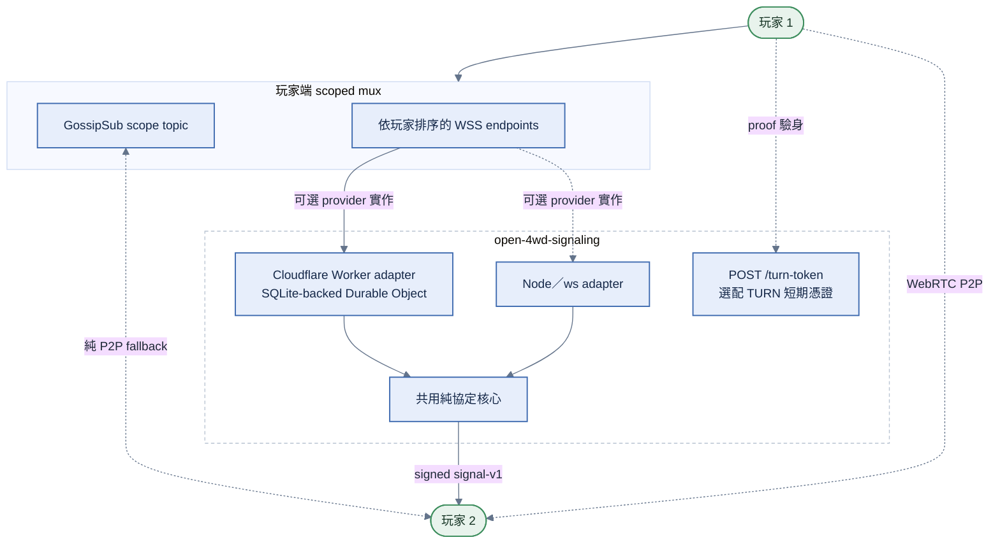
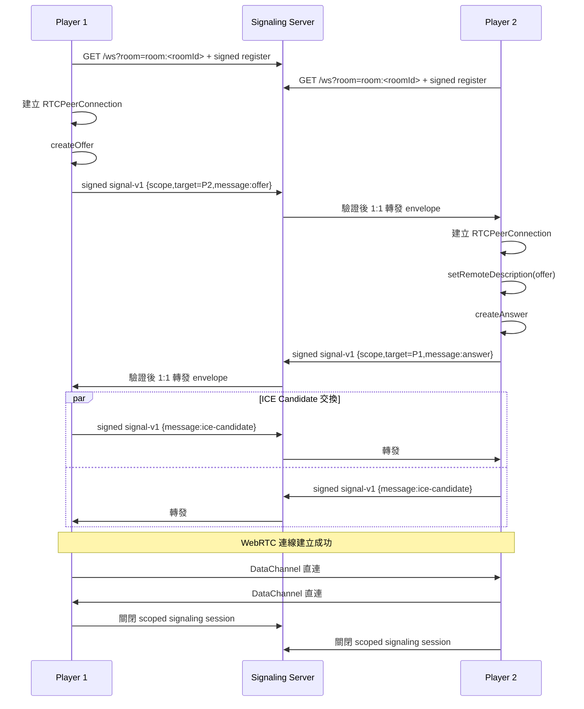
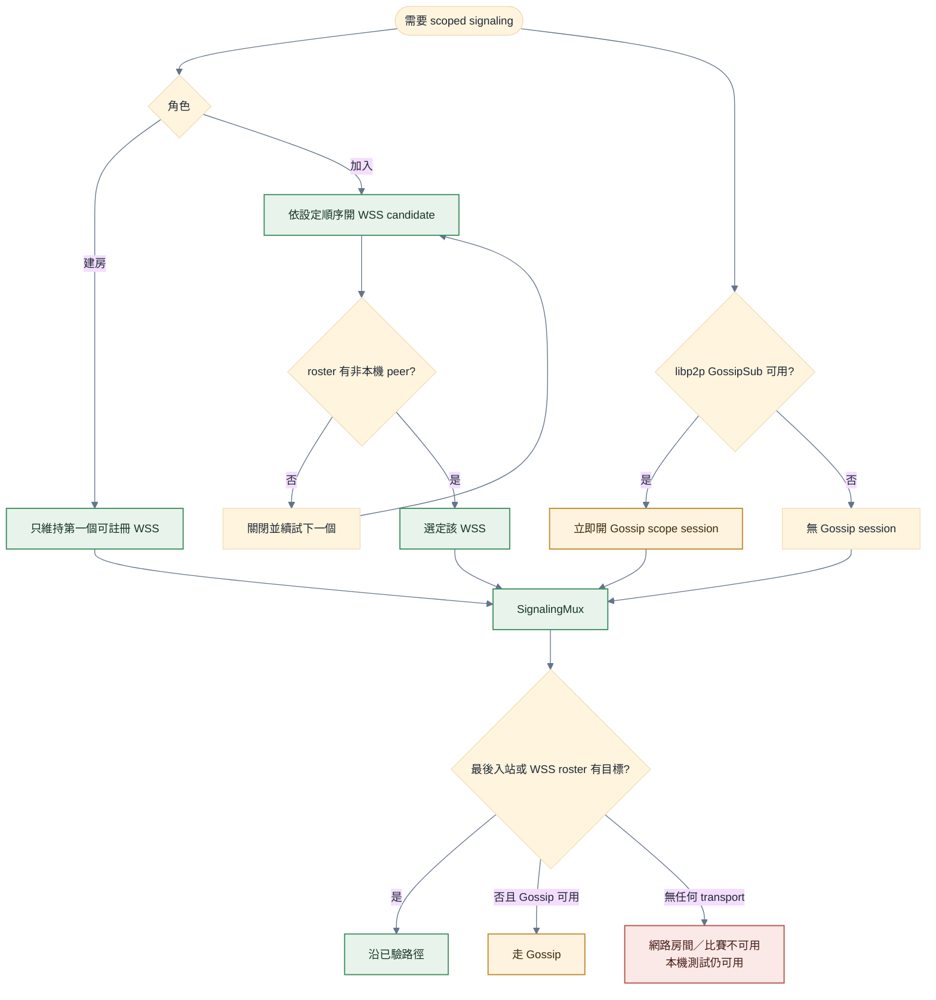
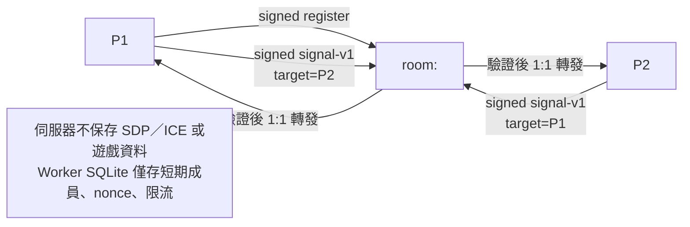
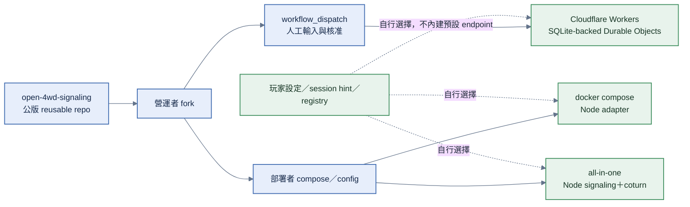

# Signaling Service 架構圖

<!-- generated:impl-flow-header:start -->
> **文件角色**：implementation flow 投影；圖與步驟不得另建產品規則或參數 authority。

| Implementation authority | 產品 canon／流程 | 全域索引 |
| --- | --- | --- |
| [signaling-service.md](../signaling-service.md) | [配對](../../流程/配對.md) · [資安規範](../../資安規範.md) | [流程.md §2](../../流程.md#2-各模組流程圖索引) |
<!-- generated:impl-flow-header:end -->
## 整體架構

架構權威見 [signaling-service.md §3](../signaling-service.md)（協定核心 ＋ 傳輸適配器、伺服器義務、安全規則）。

## WebRTC 連線建立流程

## 多 transport（client 端）

GossipSub scope 從 rendezvous 開始即監聽。建房端只維持第一個可註冊 room scope 的 WSS；
加入端依使用者順序嘗試 WSS candidates，只有精確 roster 含非本機 peer 才停止，否則關閉該
session 並續試。冷啟動 WSS roster 不含目標時走 Gossip；入站後沿該 transport sticky，跨
transport 以 signed nonce 去重。配對流程本身只走 GossipSub，見
[matchmaking.md](../matchmaking.md)。

## 訊息流

## 部署形狀

部署細節與其他平台評估見 [signaling-service.md §4](../signaling-service.md)、
[部署資訊/open-4wd-signaling.md §5](../../部署資訊/open-4wd-signaling.md)。

所有部署皆由各維護者獨立負責；專案不指定營運節點、預設清單或必須持續運作的部署。
