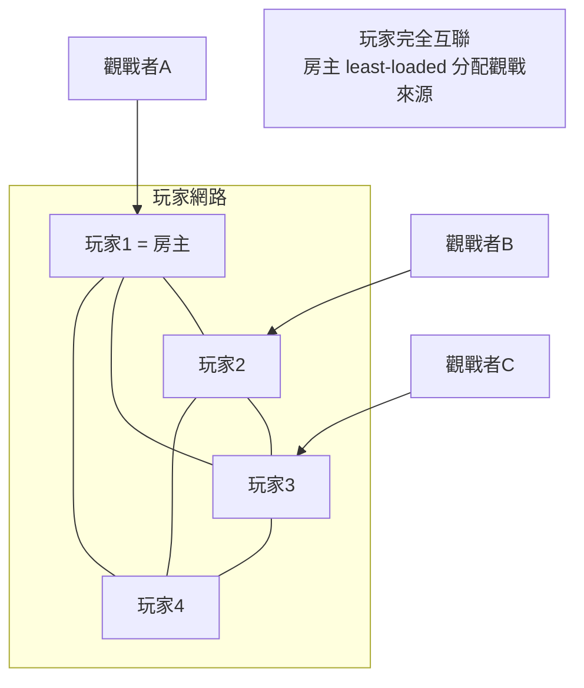
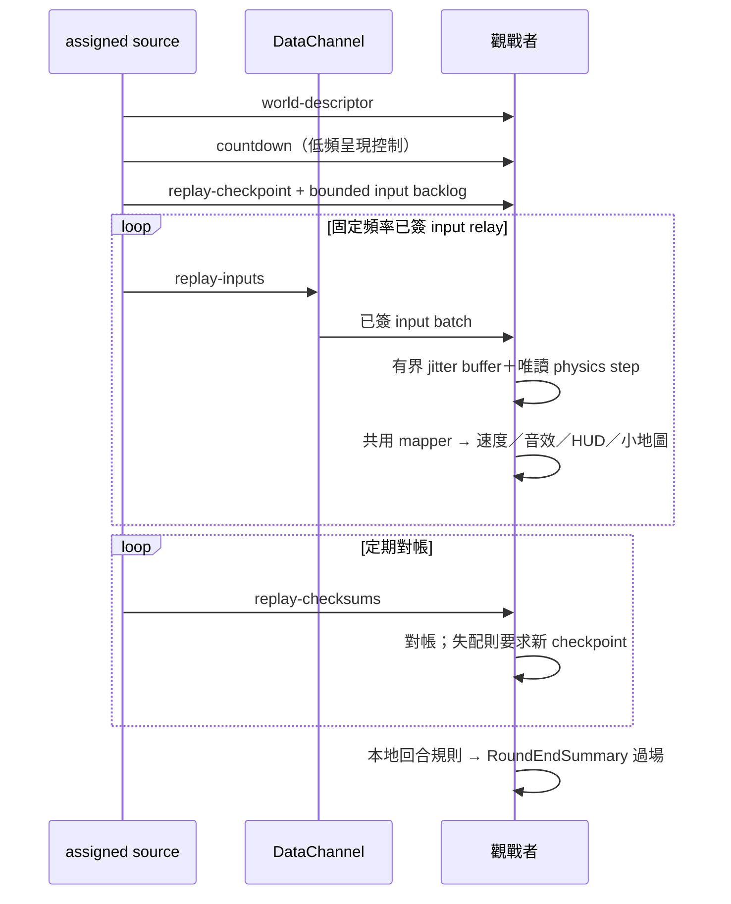
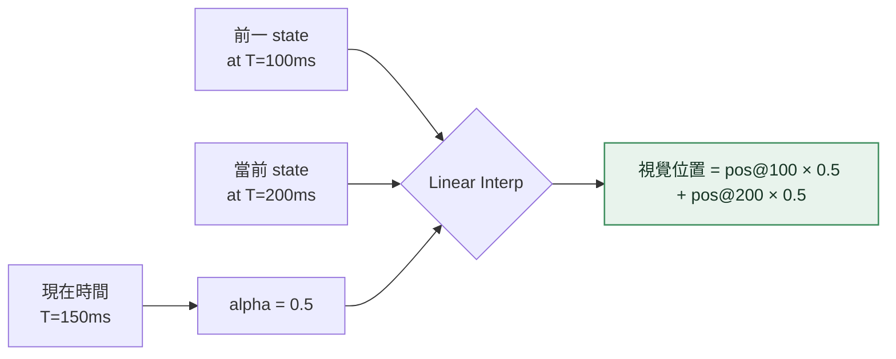
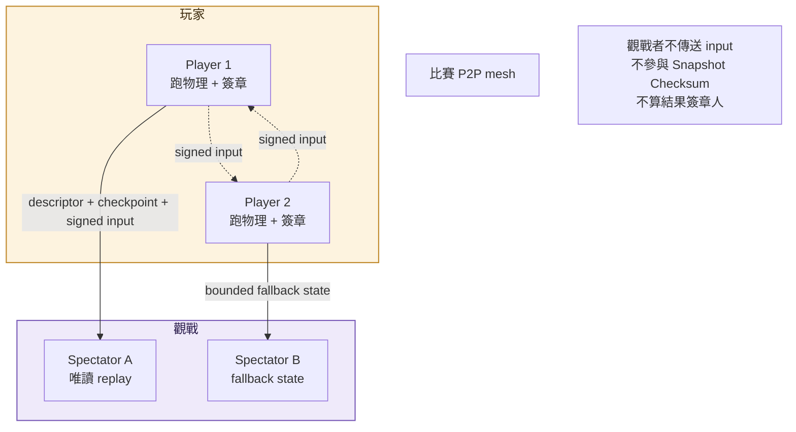

# spectator

<!-- generated:impl-flow-header:start -->
> **文件角色**：implementation flow 投影；圖與步驟不得另建產品規則或參數 authority。

| Implementation authority | 產品 canon／流程 | 全域索引 |
| --- | --- | --- |
| [spectator.md](../spectator.md) | [觀戰](../../流程/觀戰.md) | [流程.md §2](../../流程.md#2-各模組流程圖索引) |
<!-- generated:impl-flow-header:end -->
> 觀戰的**技術流程圖**（來源分配 / deterministic replay / fallback / 不影響共識）。模組實作見 [spectator.md](../spectator.md)；觀戰加入 / 淘汰 / 視角等流程見 [流程/觀戰.md](../../流程/觀戰.md)。

## 觀戰連線拓樸（assigned participant-source star）

房主只做 least-loaded assignment；每位觀戰者主動撥被分配的 participant source。participant 都持有完整 input，故 source 可中繼相同資料；觀戰者不互聯、也永不成為 source。

## Deterministic Replay

觀戰 UI 依實際階段顯示 `building-world → waiting-checkpoint → catching-up → live`；無法建立 replay 時顯示 `reduced`。倒數不能由首個 replay frame 回推，因 descriptor 可能在 readiness 等待後才到達，所以由單一低頻控制訊息承載。

## 精簡 Fallback 視覺插值

## 觀戰者不影響共識

