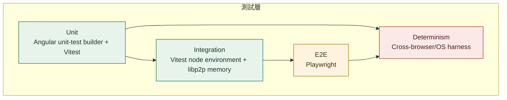
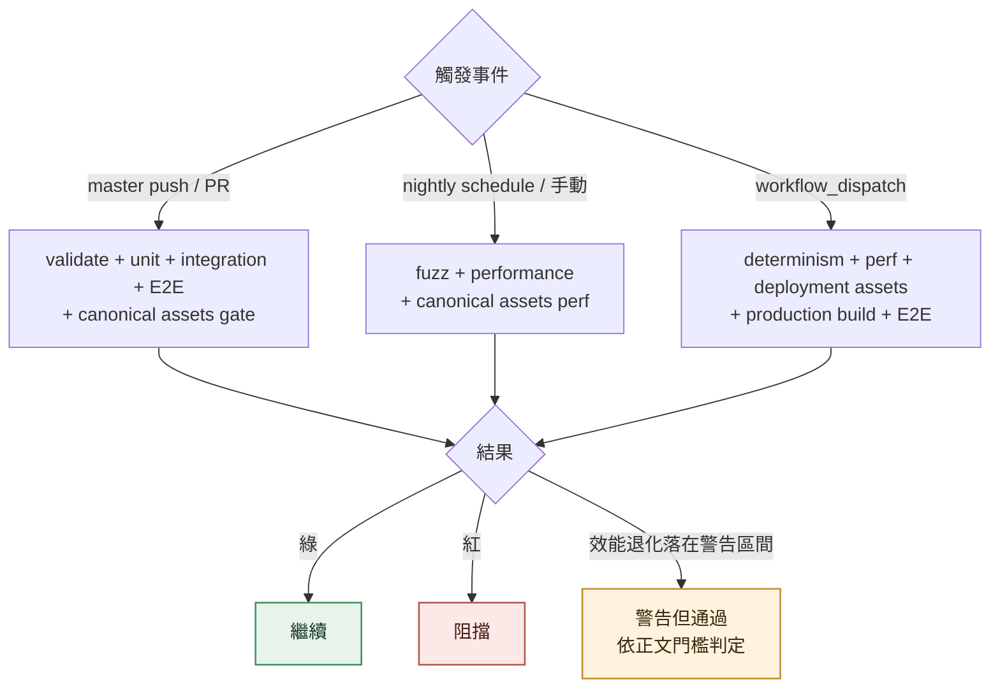
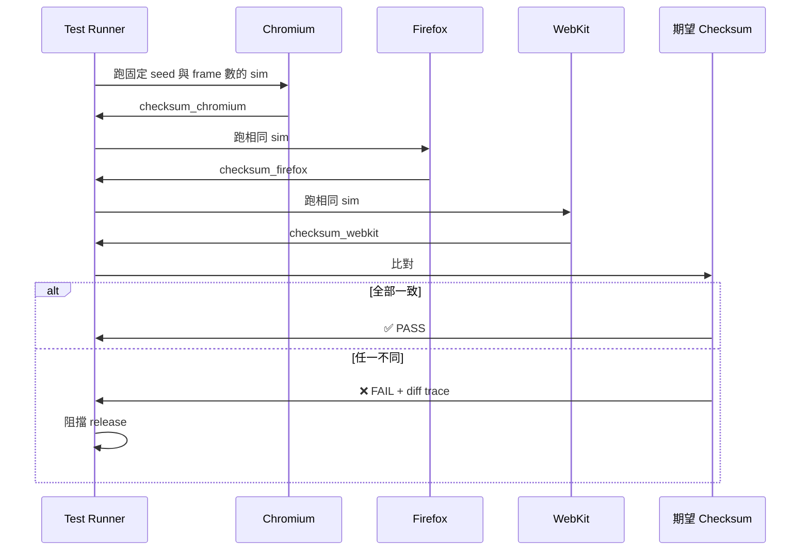
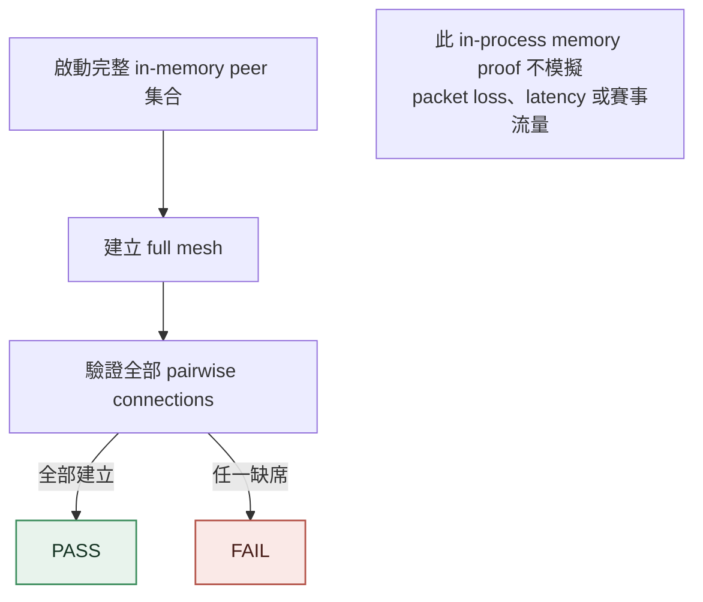
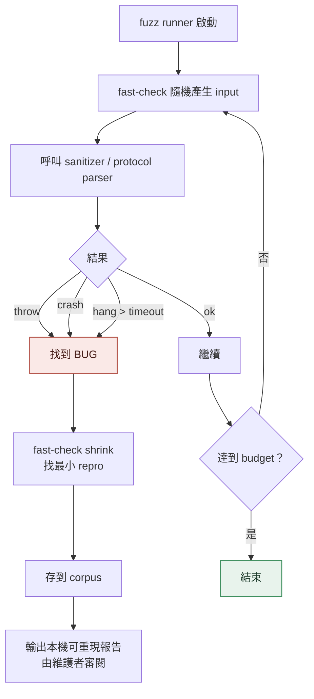
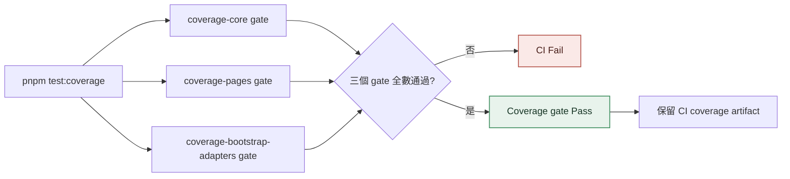
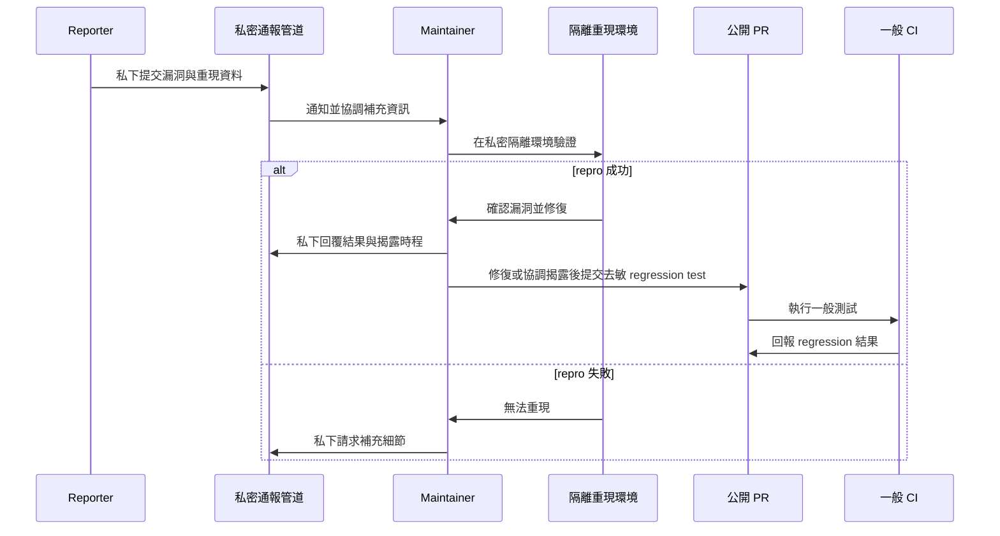
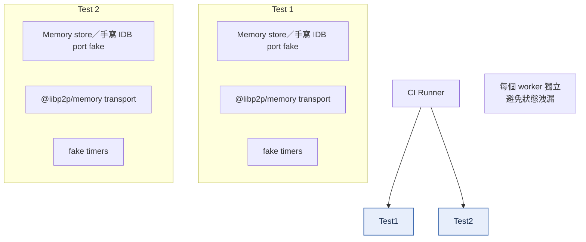
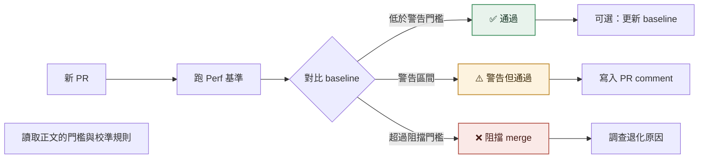
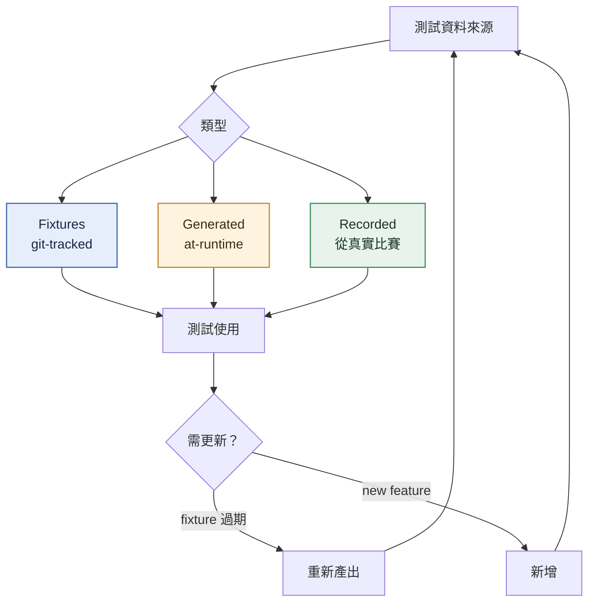

# Testing

<!-- generated:impl-flow-header:start -->
> **文件角色**：implementation flow 投影；圖與步驟不得另建產品規則或參數 authority。

| Implementation authority | 產品 canon／流程 | 全域索引 |
| --- | --- | --- |
| [testing.md](../testing.md) | [程式架構](../../程式架構.md) · [升版](../../流程/升版.md) | [流程.md §2](../../流程.md#2-各模組流程圖索引) |
<!-- generated:impl-flow-header:end -->
## 測試層與 runner

## CI 觸發流程

## 確定性測試流程

## 8 Peer Mesh 壓測

## Fuzz 流程

## Coverage 門檻流程

## 私密漏洞重現與公開 regression test

## 測試環境隔離

## Perf Baseline 比對

## 測試資料生命週期

