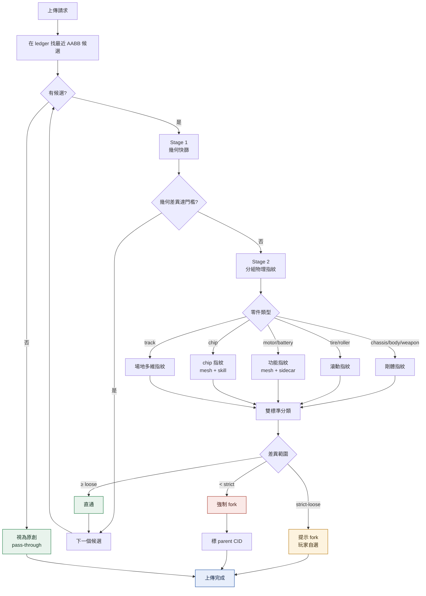
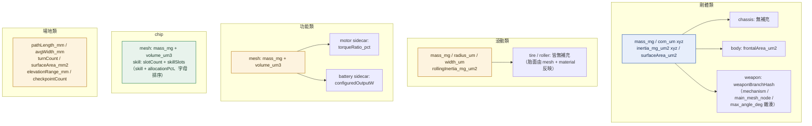
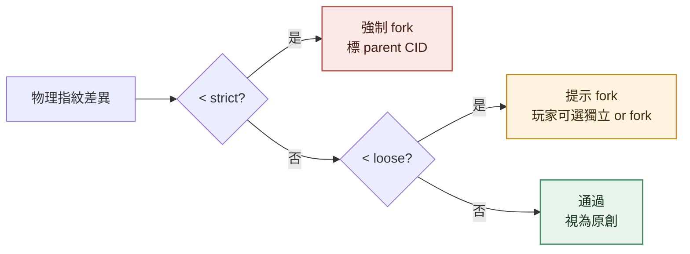
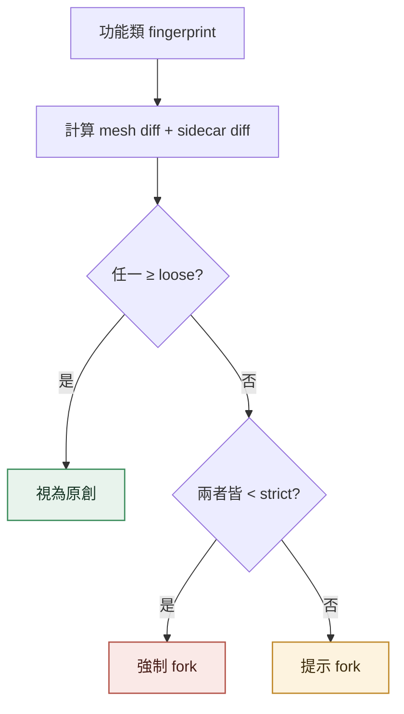
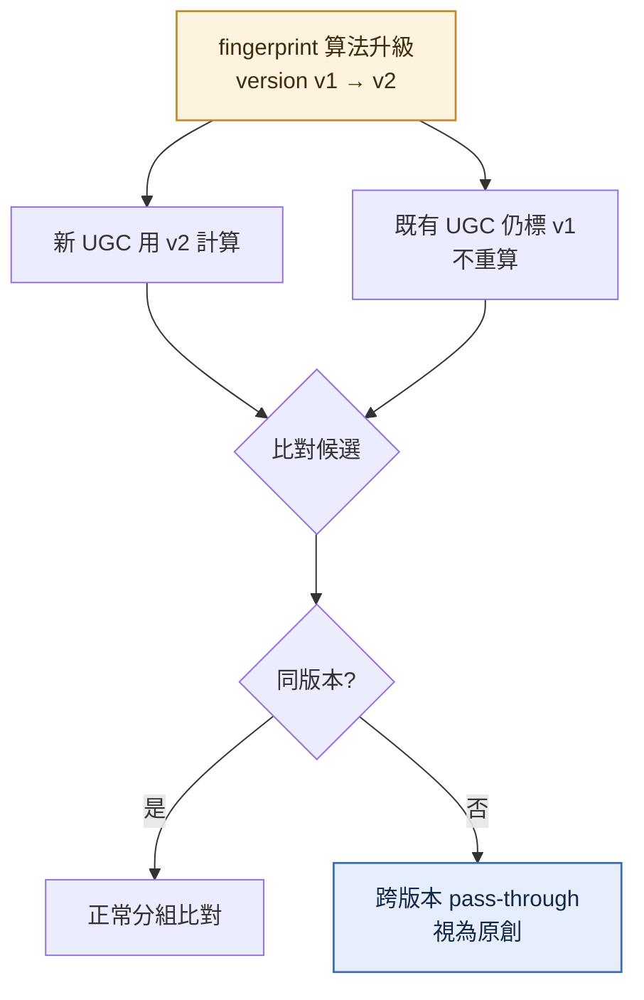

# ugc-fork

<!-- generated:impl-flow-header:start -->
> **文件角色**：implementation flow 投影；圖與步驟不得另建產品規則或參數 authority。

| Implementation authority | 產品 canon／流程 | 全域索引 |
| --- | --- | --- |
| [ugc-fork.md](../ugc-fork.md) | [UGC 機制](../../UGC機制.md) · [衍生](../../流程/衍生.md) | [流程.md §2](../../流程.md#2-各模組流程圖索引) |
<!-- generated:impl-flow-header:end -->
> Fork 偵測的**技術流程圖**（兩階段判定 / 物理指紋對照 / 決策樹 / 指紋版本）。模組實作見 [ugc-fork.md](../ugc-fork.md)；Fork 衍生樹 / 分潤等業務流程見 [流程/衍生.md](../../流程/衍生.md)。

## 兩階段判定流程

## 5 組指紋對照

> 欄位定義與差異計算（rigidDiff 取最大分量 / functionalDiff・chipDiff OR 邏輯）見 [程式架構/ugc-fork.md §3](../ugc-fork.md)；物理量一律整數量化（mg / μm / μm² / μm³）。

## 雙標準決策樹（單一指紋類型）

## OR 邏輯（功能類、chip）

## fingerprint version 流程

