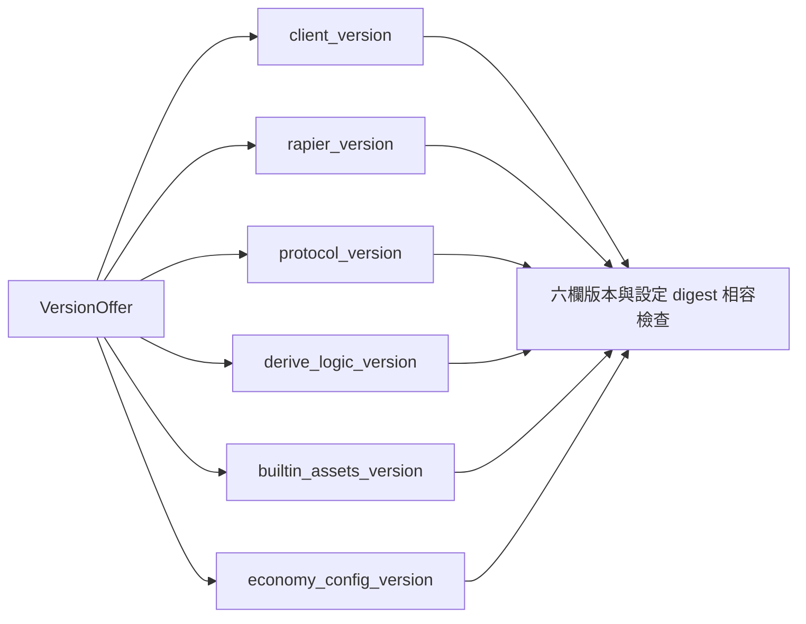
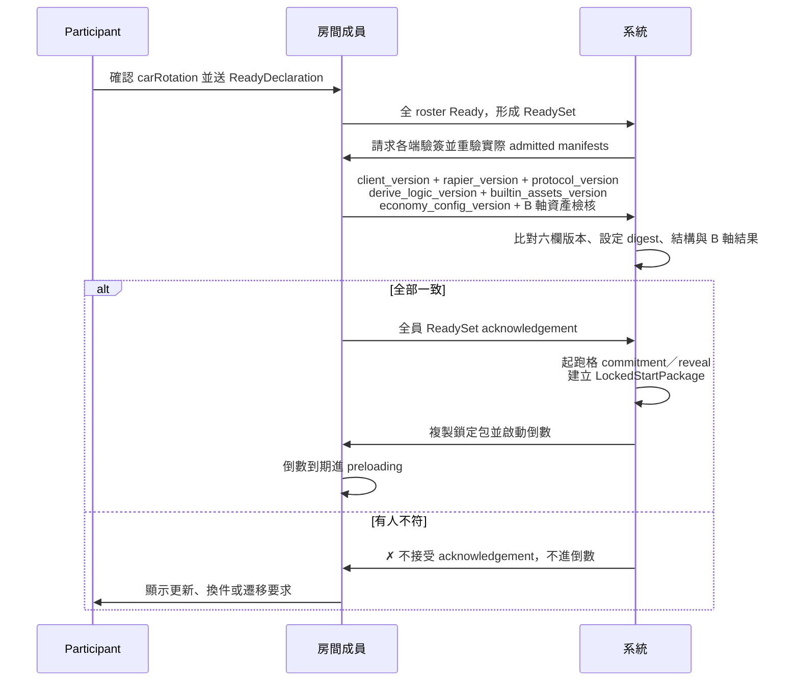
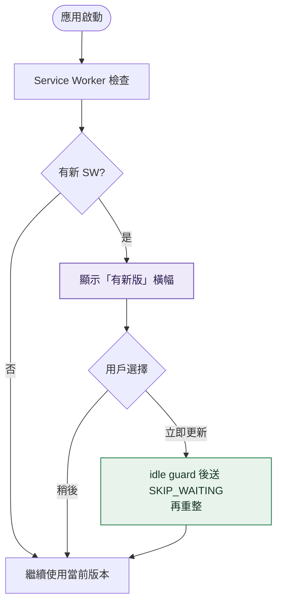
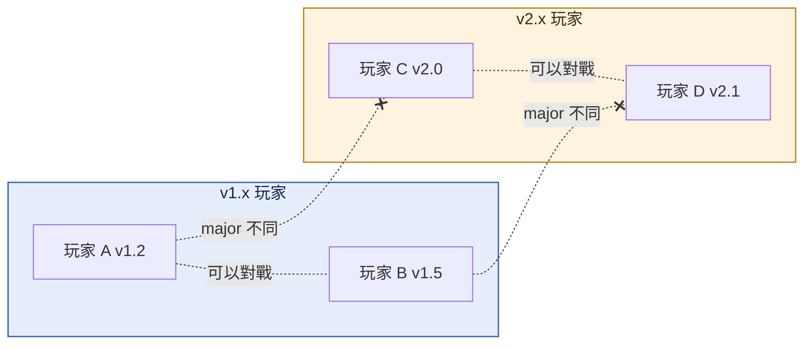
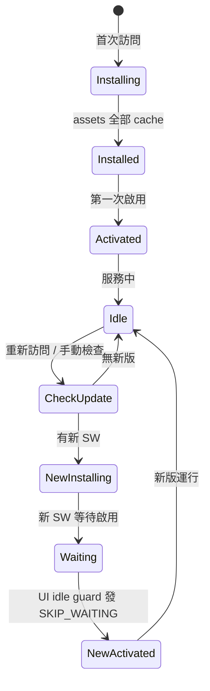
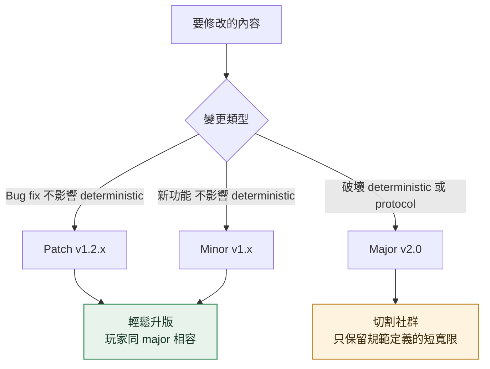

# Versioning

<!-- generated:impl-flow-header:start -->
> **文件角色**：implementation flow 投影；圖與步驟不得另建產品規則或參數 authority。

| Implementation authority | 產品 canon／流程 | 全域索引 |
| --- | --- | --- |
| [versioning.md](../versioning.md) | [版本規範](../../版本規範.md) · [升版](../../流程/升版.md) | [流程.md §2](../../流程.md#2-各模組流程圖索引) |
<!-- generated:impl-flow-header:end -->
## 六欄版本

## 開賽前版本檢查

## 升版提示流程

## 大版本切割

## Service Worker 生命週期

## 升版風險決策

